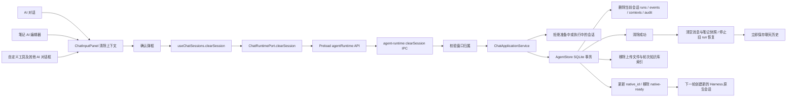

# AI 对话上下文清除

输入框「+ → 指令 → 清除上下文」位于「压缩」下方。用户确认后，清空当前逻辑会话的问答、引用快照及持久执行记录；会话标题、项目、模型、权限和其他会话保持不变。

所有 AI 输入框共用完整的「+」菜单：文件、知识库、目标、模式、压缩、清除上下文、权限、下载对话日志。笔记、自定义工具及其他对话框不再按场景隐藏入口；状态或能力不足时禁用对应选项。会话指令使用所在 ChatContext 的当前会话；独立编辑器传入的 `exportSession` 仅用于导出其最近一次生成快照。

`clearSession` 是可选运行端口能力；注入运行时但缺少该能力时禁用入口，普通文本流会话仅清空前端历史。主进程成功后才删除前端消息，失败保留记录并展示错误；清除期间阻止该会话继续发送。

SQLite 事务删除当前会话轮次及关联事件、上下文、审计和知识库检索状态，同时更新原生会话 ID 并移除历史附件索引。核心版本、智能体与模型绑定保留；下一轮不恢复旧原生 JSONL 上下文。旧原生日志及共享附件文件仍由运行时存储保留，本操作不做磁盘文件清理。

恢复轮询移除已清除会话的旧 run，并在异步补读返回后再次检查目标是否仍有效，避免迟到事件重新设置加载状态。游客历史立即保存，已配置云端同步的登录会话先删除云端记录。
