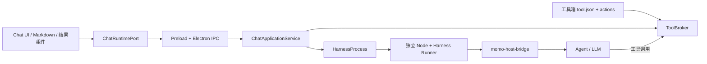
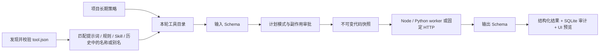

# AI 问答接入 DeepSeek Harness：设计与实施说明

日期：2026-09-18  
状态：已实施，验证结果见末节。  
上游：[deepseek-ai/deepseek-harness](https://github.com/deepseek-ai/deepseek-harness)。

## 1. 已确认范围

- 主 AI 问答使用官方 Harness 执行循环；现有系统继续提供结果渲染和业务服务。
- 核心独立部署，可重新安装固定 npm 包构建，也可导入完整运行目录更新。业务 UI 不依赖上游类型。
- 输入框移除“设置智能体”和右侧上传按钮。最左侧“+”提供搜索技能/命令与添加文件、图片；计划和权限按钮在其旁边。
- 保留现有 Skill、命令、规则、知识库、@笔记和工作区配置。
- 工具箱仅有一套无版本 action 格式，不支持旧工具格式，不提供格式兼容层。
- 本次不实施历史数据迁移、升级回滚和旧工具转换。

这里的运行包发布版本、宿主协议号以及文件完整性摘要与工具箱版本字段不同。工具箱的 tool.json 不含 version 或 packageVersion，出现这些字段直接报错。摘要仅用于校验被审批和被执行的文件一致。

## 2. 模块边界



主要目录：

| 目录 | 职责 |
| --- | --- |
| packages/momo-agent-contracts | 宿主输入、事件、追问、附件和工具契约；不导出上游类型 |
| packages/momo-harness-adapter | 匹配 Node 子进程、NDJSON 请求和事件、取消、超时、异常退出 |
| packages/momo-harness-runner | 固定依赖与独立锁文件、原生 profile、桥接插件、离线运行目录构建 |
| apps/skill-platform/src/main/agent-runtime | 运行服务、SQLite 日志、业务工具代理、附件和产物、完整性校验与真实契约验证 |
| apps/skill-platform/src/renderer/services/agent-runtime | UI 运行端口与原始文件上传适配 |
| packages/momo-aichat/src/runtime | 有序事件消费、实时正文/思考投影、断线补读 |
| packages/momo-aichat/src/components/RunTimeline | 执行过程、追问、审批、失败、产物入口 |

官方 dsh 的生产代码保持原样。扩展通过 ctx.agents、ctx.get、ctx.tools、ctx.userQuestions、ctx.approval、ctx.attachments 等公共服务及事件完成。没有用一段自制模型调用循环冒充 Harness。

## 3. 核心独立构建和更新

固定 npm 发布版本为 0.1.6-alpha.2；core-lock.json 记录发布版本和审阅源码 referenceCommit。referenceCommit 仅标识审阅源码，不宣称 npm 编译产物等同于该提交。

构建命令：

```powershell
pnpm harness:build
pnpm harness:check
pnpm harness:test
```

运行目录 packages/momo-harness-runner/dist 包含匹配的 Node 可执行文件、官方依赖、独立 package-lock、momo 插件、profile 与 runtime.json。运行时无需用户安装 Node 或 npm。构建需要 Node >=22.19 <23 或 >=24；运行包与当前平台/架构一致。

更新包时：修改 core-lock.json 中发布版本，重新构建独立目录，运行契约测试，然后在输入框“权限”窗口导入该目录。导入依次检查协议范围、平台、关键文件、所有声明文件摘要和包标识，并用真实 dsh 启动本机无密钥模型测试服务完成流式回答、工具、追问、计划审阅、附件、停止和恢复验证，成功后启用。

已有会话绑定自己的核心目录、原生会话 ID 和模型；新会话使用新启用目录。缺失绑定目录时明确失败，不擅自切换核心。此机制保持会话一致性，不提供升级回滚入口。

Windows Electron 打包通过 extraResources 放置 harness-builtin，原生核心位于 asar 外。Electron 的数据库原生模块与运行核心的 Node 环境彼此独立。

## 4. 输入框和会话流程

已核对上游 packages/client/ui-conversation/src/client/skeleton/InputBar.tsx 和 apply.ts：左侧“+”打开命令目录，文件选择是目录中的 file action；计划、权限是独立的相邻插槽。

本系统沿用相同组织方式：

| 控件 | 行为 |
| --- | --- |
| 最左侧 + | 搜索当前业务范围的技能、命令；选中插入带资源标识的现有行内 token；添加文件/图片打开文件选择 |
| 计划 | 切换真实 Harness plan-mode；执行过程中由原生计划审阅请求退出计划；宿主另行禁止有副作用的工具 |
| 权限 | 本项目工具白名单、撤销记忆授权、导出工具清单；同一窗口提供运行核心导入与状态 |
| 模型 | 使用现有配置；已绑定的会话保持原模型，新对话可选模型 |
| 知识库 | 保留当前启用和集合选择控件 |
| 发送/停止 | 创建原生 turn，停止通过 AbortSignal 和原生 cancel 协作执行 |

菜单来自实际启用资源。本 profile 不加载终端、任意文件写入、goal、自动上下文压缩等可选上游插件，因此不会展示不可执行的按钮。不能把未启用插件的示例菜单项当作当前 core 的功能。

发送只在宿主展开 Skill/命令并解析规则、显式引用的笔记、知识库证据和原始附件。UI 不重复展开内容。宿主验证项目目录与已注册业务配置一致，再生成 run、冻结上下文清单，交给原生 agent。

- API Key 从宿主现有设置传入私有内存凭证提供者，不进入会话日志、IPC 事件或工具进程环境。
- 既有 localStorage 会话存储保持现有键，不进行历史迁移。
- 新原生会话采用 UUID 和官方 JSONL 会话持久化；宿主 SQLite 保存绑定、上下文、规范化事件、授权和审计。
- 同一会话禁止同时执行两轮；其他会话保持独立身份和取消控制。
- 轮次具有 idempotencyKey；重复请求返回已创建 run。
- 温度通过公共 agent/request 配置传递。当前上游 Pi-AI 适配未提供 topP 映射，当前主输入框也没有该设置，不添加虚假的 topP 控件。

## 5. 事件与结果渲染

事件包含 projectId/sessionId/turnId/runId、seq、eventId、时间和 payload。实时 assistant-stream 与 session/event 分别处理：实时正文和思考用于反馈，官方提交事件用于最终对齐。通过 attemptId、revision、chunk index 和 native seq 去重，避免流式内容与提交内容重复。

规范化事件涵盖 run、assistant、thinking、tool、interaction、evidence、usage、artifact；原生事件另存为 runtime.event。

订阅在 start 之前建立，随后补读持久事件；丢帧通过序号缓存和定时补读恢复。页面恢复后继续补读已存在 run，不只读取一次快照。终态保留部分输出；错误、取消、进程中断不伪装成成功。

正文继续进入已有 Markdown 组件，思考进入原思考区域，证据进入现有引用卡片。新增 RunTimeline 渲染工具状态、追问和审批；计划内容也使用已有 Markdown renderer。产物通过现有按钮保存到用户选择的位置，不自动启动文件中的程序。

追问支持单选、多选、自由填写和批量问题。答复必须匹配当前 run/request 与问题 ID；终态请求不能再次回答。审批支持允许本次、拒绝和符合条件的精确记忆授权。代码执行每次审批，不允许记忆绕过。

## 6. 附件

上传保存原始字节至 SHA-256 内容存储并校验文件名、编码和大小。图片进入原生 saveImages；其他文件进入 admitEncodedFile。宿主现有知识库 worker 继续解析文档为派生文本，原始文件不会被派生文本替代。

每个附件最多 10 MiB，一轮最多 10 个、总计 50 MiB。附件分文件准备并缓存原生引用，start 只携带紧凑引用，避免大轮次超过进程消息上限。图片需原生验证通过才标记可发送；上传或解析失败明确返回，不静默丢弃附件。

## 7. 可调用工具确认清单

运行时“权限 → 导出工具清单”导出当前项目真实清单，包括 action ID、输入/输出 schema、副作用、启用状态和无效工具原因。以下是内建分类，实际 ID 以导出结果为准。

| 分类 | 能力 | 默认边界 |
| --- | --- | --- |
| 工作区 | read/list/search | 当前项目明确注册的目录，拒绝越界和符号链接逃逸 |
| 业务资源 | resources.list/load | 当前资源应用与目录；加载需匹配资源标识及摘要 |
| 笔记 | notes.read | 本轮用户通过 @ 明确引用的笔记快照 |
| 附件 | attachments.read/extract/search | 本轮已上传附件及其派生文本 |
| 知识库 | knowledge.search/chunk | 本轮启用的集合；每轮最多 5 次检索，chunk 限制在已有证据范围 |
| 产物 | artifacts.create/open | 绑定当前 run；写入需审批，打开仅展示保存卡片 |
| 工具箱 | toolbox.<工具ID>.<actionID> | 提示词、规则、Skill/Command 或对话历史点名后本轮自动开放，也可由项目策略长期开放；执行和网络等副作用仍由宿主审批 |
| MCP | mcp.<服务与工具稳定标识> | 项目勾选后开放，保留结构化结果与原始 content |

不把工具页面 DOM、截图或按钮文本当作调用接口。不将所有磁盘目录、所有笔记或所有知识库自动暴露给模型。

## 8. 工具箱单一格式

工具包使用 tool.json：kind=tool、稳定 id、可选的 name/description/aliases、页面/后端元信息以及 actions 数组。名称、别名、目录名、action id/title 会形成 AI 可识别名称。每个 action 必须提供：

- id/title/description；对象根 inputSchema 和 outputSchema；可校验的 examples。
- executor：node/python 的代码文件和 export，或 http 的固定 URL 和 GET/POST method。
- capabilities：允许嵌套调用的精确工具 ID。
- effects：read/write/network/execute；Node/Python 必须声明 execute，HTTP 必须声明 network。
- timeoutMs（100～300000）、retry（0～2）、parallelSafe、idempotent。

生成器要求页面和 action 共用 lib 业务函数，Node 使用系统内置模块，Python 使用标准库；不把模型生成的代码当成已安装依赖。AI 生成结果至少要有一个有意义的 action，主进程发布时再次强制校验，不允许把 `actions: []` 的页面工具标记为生成成功。发布前同时校验 manifest、schema、examples、文件引用和生成 JavaScript 语法。

参考工具见 docs/examples/harness-calculator：页面与 action 共用同一求和函数，可复制为一个独立工具目录。此示例也用于验证真实 action 的输入输出。

调用执行顺序：



代码执行子进程具有独立生命周期，工具界面预览服务不会被启动或停止。子进程是生命周期隔离，不是操作系统安全沙箱；执行用户安装的代码须审批。

嵌套 context.callTool 只能调用 action 声明的 capabilities，并经过同一代理、范围和审批；深度上限 4。默认项目内串行，声明 parallelSafe 才允许并行。每轮最多 50 次工具调用、累计输出 16 MiB，单次 JSON 输入输出 2 MiB。仅对声明幂等的确定 HTTP 429/503 错误按策略重试；中断或未知副作用不得盲目重试。

工具包无版本字段、无旧格式检测后降级、无旧工具转换。手工创建阶段可以保留无 actions 的页面工具，但它不能供 Harness 调用；AI 生成发布路径会直接拒绝这种结果。旧版本字段或格式不满足要求时列为需修复。

## 9. 验证与后续维护

主契约测试使用真实官方 dsh CLI、匹配 Node、官方原生服务和本机固定模型响应，不消耗真实 API Key。覆盖流式正文、思考/提交投影、真实工具代理、结构化追问、计划审阅、图片与原文件、停止后继续、进程重启后的原生 JSONL 恢复。

宿主工具测试覆盖输入/输出校验、审批拒绝、计划只读、共享代码快照、防修改、嵌套能力、取消与未知结果。另有附件完整性、工具生成规范和原工具页面运行服务验证。

原生工具 Schema 使用上游支持的结构投影；长度、数值范围、引用等完整约束同时提供给模型，并始终由宿主 Ajv 强制执行。Python action 需要宿主可用的 Python；运行包提供 Node，Python 使用系统解释器。

维护更新只需要更改独立 core 锁定依赖或替换完整运行包；如果公共插件 API 发生破坏，修复 runner 中的桥接插件并通过真实契约验证后发布。业务资源协议与结果组件无需跟随上游内部类型修改。

完整 Electron 安装包与用户真实模型联调需在目标发布流程验证；不得将本机无密钥契约测试描述为所有模型提供商验证。

本次本机验证：8 个相关测试文件、38 项测试通过；真实 dsh 另外校验了思考流、温度、带范围约束的工具 Schema 和独立会话停止。生产 Vite 构建包含 renderer/main/preload/knowledge-worker；全量 TypeScript 检查仍存在 7 个改动范围外的既有错误（工作流备份测试数据、AI 类型导入及 Markdown 编辑器测试类型），此次集成未新增类型错误。尚未生成或安装 NSIS 安装包。

另已运行应用全量测试：30 个测试文件、123 项通过；最后的审批等待/工具超时映射修改后，真实 dsh 契约再次通过。打包验收脚本检查运行核心全部声明文件摘要并实际启动随包 Node；完整 NSIS 安装包仍未生成。
