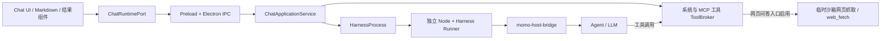
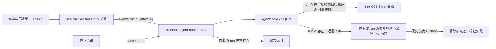
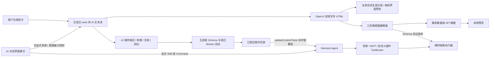
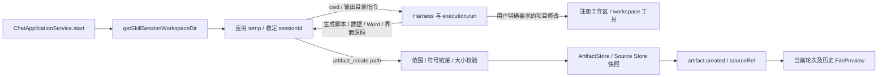

# AI 问答接入 DeepSeek Harness：设计与实施说明

日期：2026-09-18  
状态：已实施，验证结果见末节。  
上游：[deepseek-ai/deepseek-harness](https://github.com/deepseek-ai/deepseek-harness)。

## 1. 已确认范围

- 主 AI 问答使用官方 Harness 执行循环；现有系统继续提供结果渲染和业务服务。
- 核心独立部署，可重新安装固定 npm 包构建，也可导入完整运行目录更新。业务 UI 不依赖上游类型。
- 输入框移除“设置智能体”和右侧上传按钮。最左侧“+”提供搜索技能/命令与添加文件、图片；计划和权限按钮在其旁边。
- 保留现有 Skill、命令、规则、知识库、@笔记和工作区配置。
- 自定义工具分为界面、AI 插件与网页；通过校验的 AI 插件以 Cordis 插件动态注册，由宿主 ToolBroker 执行。
- 本次不实施历史数据迁移、升级回滚和旧工具转换。

运行包发布版本、宿主协议号以及文件完整性摘要只用于 Harness 本身；自定义 AI 插件独立保存在 data/tools，通过版本校验与热更新接入，不修改运行包本体。

## 2. 模块边界


```mermaid
flowchart LR
  UI[Chat UI / Markdown / 结果组件] --> Port[ChatRuntimePort]
  Port --> IPC[Preload + Electron IPC]
  IPC --> Service[ChatApplicationService]
  Broker[系统与 MCP 工具 ToolBroker]
  Service --> Broker
  Broker -->|网页问答入口启用| WebFetch[临时沙箱网页抓取 / web_fetch]
  Service --> Adapter[HarnessProcess]
  Adapter --> Runner[独立 Node + Harness Runner]
  Runner --> Bridge[momo-host-bridge]
  Bridge --> Agent[Agent / LLM]
  Agent -->|工具调用| Broker
```

主要目录：

| 目录 | 职责 |
| --- | --- |
| packages/momo-agent-contracts | 宿主输入、事件、追问、附件和工具契约；不导出上游类型 |
| packages/momo-harness-adapter | 匹配 Node 子进程、NDJSON 请求和事件、取消、超时、异常退出 |
| packages/momo-harness-runner | 固定依赖与独立锁文件、原生 profile、桥接插件、离线运行目录构建 |
| apps/skill-platform/src/main/agent-runtime | 运行服务、SQLite 日志、业务工具代理、附件和产物、完整性校验与真实契约验证 |
| apps/skill-platform/src/renderer/services/agent-runtime | UI 运行端口与原始文件上传适配 |
| packages/momo-aichat/src/runtime | 有序事件消费、实时正文/思考投影、断线补读 |
| packages/momo-aichat/src/components/RunTimeline | 执行过程、追问、审批、失败、产物入口 |

官方 dsh 的生产代码保持原样。扩展通过 ctx.agents、ctx.get、ctx.tools、ctx.userQuestions、ctx.approval、ctx.attachments 等公共服务及事件完成。没有用一段自制模型调用循环冒充 Harness。

## 3. 核心独立构建和更新

固定 npm 发布版本为 0.2.1-alpha.1；core-lock.json 记录发布版本和审阅源码 referenceCommit。referenceCommit 仅标识审阅源码，不宣称 npm 编译产物等同于该提交。

0.2.1-alpha.1 将原来的目录扫描型 `dsh-agent-presets` 拆分为 `dsh-agent-preset-registry` 和声明式 `dsh-agent-preset`。Momo profile 在顶层注册 `momo-default` 空子组合，业务工具、提示词和 Skill 仍由 `momo-host-bridge` 在 Agent 作用域内按会话注入，不再从 `profile/agent-presets` 扫描文件。

构建命令：

```powershell
pnpm harness:build
pnpm harness:check
pnpm harness:test
```

运行目录 packages/momo-harness-runner/dist 包含匹配的 Node 可执行文件、官方依赖、独立 package-lock、宿主桥与模型凭证插件、profile 和 runtime.json；不再包含自定义工具 action worker。构建器会在复制插件和 profile 前清理对应输出目录，并校验源码资源与运行包清单完全一致。运行时无需用户安装 Node 或 npm。构建需要 Node >=22.19 <23 或 >=24；运行包与当前平台/架构一致。

更新包时：修改 core-lock.json 中发布版本，重新构建独立目录，运行契约测试，然后在输入框“权限”窗口导入该目录。导入依次检查协议范围、平台、关键文件、所有声明文件摘要和包标识，并用真实 dsh 启动本机无密钥模型测试服务完成流式回答、工具、追问、计划审阅、附件、停止和恢复验证，成功后启用。

已有会话绑定自己的核心目录、原生会话 ID 和模型；新会话使用新启用目录。缺失绑定目录时明确失败，不擅自切换核心。此机制保持会话一致性，不提供升级回滚入口。

Windows Electron 打包把完整 Harness 运行目录收敛为单个 `resources/harness-builtin.asar`。首次真正使用 Agent 时，主进程按 `runtime.json` 清单将其原子释放到用户数据目录下的不可变 `builtin-cache/<bundleId>`，独立 Node 只从该真实目录启动。安装目录不再复制 Harness 的 `node_modules` 散文件；Electron 的数据库原生模块与运行核心的 Node 环境仍彼此独立。详见 [Electron Windows 打包拓扑](./electron-windows-packaging.md)。

## 4. 输入框和会话流程

已核对上游 packages/client/ui-conversation/src/client/skeleton/InputBar.tsx 和 apply.ts：左侧“+”打开命令目录，文件选择是目录中的 file action；计划、权限是独立的相邻插槽。

本系统沿用相同组织方式：

| 控件 | 行为 |
| --- | --- |
| 最左侧 + | 搜索当前业务范围的技能、命令；选中插入带资源标识的现有行内 token；添加文件/图片打开文件选择 |
| + → 指令 → 清除上下文 | 位于压缩下方，确认后清空当前会话问答和运行记录，下一轮使用新的 Harness 原生会话；生成中拒绝清除 |
| + → 模式 → 计划 | 切换真实 Harness plan-mode；执行过程中由原生计划审阅请求退出计划；宿主另行禁止有副作用的工具 |
| + → 模式 → 界面 | 无显式资源时使用普通样式生成和预览；显式 Skill/Command 进入 Harness 并遵循技能输出契约；展示全部历史 |
| 权限 | 本项目 MCP 工具白名单、撤销记忆授权、导出宿主工具清单；同一窗口提供运行核心导入与状态 |
| 模型 | 使用现有配置；已绑定的会话保持原模型，新对话可选模型；首轮完成后生成会话摘要标题 |
| 知识库 | 保留当前启用和集合选择控件 |
| @ 引用 | 无工作区时沿用笔记树；有工作区时按笔记与工作区文件分类，只读取当前项目注册目录内的显式选择 |
| 发送/停止 | 创建原生 turn，停止通过 AbortSignal 和原生 cancel 协作执行 |

菜单来自实际启用资源。本 profile 不加载终端、任意文件写入、goal、自动上下文压缩等可选上游插件，因此不会展示不可执行的按钮。不能把未启用插件的示例菜单项当作当前 core 的功能。

发送只在宿主展开 Skill/命令并解析规则、显式引用的笔记或工作区文件、知识库证据和原始附件。UI 不重复展开内容。宿主验证工作区文件引用属于项目已注册目录且路径不越界，再生成 run、冻结上下文清单，交给原生 agent。

`RuntimeTurnInput.apiInput` 可选传入界面入口预处理后的输入，Main 优先以它展开业务资源，再作为 Harness 本轮 `prompt`。`displayInput` 保留可见问题，`rawIntent` 保留原始意图；旧入口没有 `apiInput` 时沿用原有行为。Renderer 对 Harness 输入保留行内资源 token，资源仍只在宿主展开。网页入口将当前正文与问题冻结于请求快照，并通过 `webBrowsing: true` 单独启用 `web.fetch`，ToolBroker 按现有网络权限执行；详见 [网页工具 AI 对话](./webpage-assistant.md)。

清除上下文经过 `ChatRuntimePort.clearSession`、Preload 与 IPC 的窗口归属检查，在 SQLite 事务中删除当前会话运行记录并更新原生会话 ID；成功后前端才清空消息并立即持久化。链路与存储边界见 [AI 对话上下文清除](./ai-chat-context-reset.md)。

- API Key 从宿主现有设置传入私有内存凭证提供者，不进入会话日志、IPC 事件或工具进程环境。
- 既有 localStorage 会话存储保持现有键，不进行历史迁移。
- 新原生会话采用 UUID 和官方 JSONL 会话持久化；宿主 SQLite 保存绑定、上下文、规范化事件、授权和审计。
- 同一会话禁止同时执行两轮；其他会话保持独立身份和取消控制。
- 轮次具有 idempotencyKey；重复请求返回已创建 run。
- 温度通过公共 agent/request 配置传递。当前上游 Pi-AI 适配未提供 topP 映射，当前主输入框也没有该设置，不添加虚假的 topP 控件。

## 5. 事件与结果渲染

事件包含 projectId/sessionId/turnId/runId、seq、eventId、时间和 payload。实时 assistant-stream 与 session/event 分别处理：实时正文和思考用于反馈，官方提交事件用于最终对齐。通过 attemptId、revision、chunk index 和 native seq 去重，避免流式内容与提交内容重复。

规范化事件涵盖 run、assistant、thinking、tool、interaction、evidence、usage、artifact；原生事件另存为 runtime.event。

订阅在 start 之前建立，随后补读持久事件；丢帧通过序号缓存和定时补读恢复。页面恢复后继续补读已存在 run，不只读取一次快照。终态保留部分输出；错误、取消、进程中断不伪装成成功。


```mermaid
flowchart LR
  History[渲染端历史消息 / runId] --> Recovery[useChatSessions 恢复轮询]
  Recovery -->|events runId / afterSeq| IPC[Preload / agent-runtime IPC]
  IPC --> Store[AgentStore / SQLite]
  Store -->|run 存在：校验窗口归属后返回事件数组| Replay[按序投影并恢复消息]
  Store -->|run 不存在：返回 null| Missing[停止该 run 的恢复轮询 / 保留历史内容]
  Missing -->|历史仍为 running| Failed[清除加载态 / 标记失败]
  Stop[停止请求] -->|cancel runId| IPC
  IPC -->|取消的 run 已不存在| Noop[幂等返回]
```

`ChatRuntimePort.events` 与 preload 使用相同契约：空数组表示 run 存在但没有新增事件，`null` 表示持久执行记录已不可用。历史消息可来自导入或同步，生命周期可能长于主进程 SQLite；缺失记录不再以 `UNKNOWN_RUN` 异常反复重试。新轮次执行遇到 `null` 则明确失败并停止轮询；临时 IPC 异常在历史恢复中仍可重试。停止已不存在的 run 幂等返回，已有 run 的窗口归属校验以及追问答复的 run 存在校验保持生效。

正文继续进入已有 Markdown 组件，思考进入原思考区域，证据进入现有引用卡片。新增 RunTimeline 渲染工具状态、追问和审批；计划内容也使用已有 Markdown renderer。产物通过现有按钮保存到用户选择的位置，不自动启动文件中的程序。

追问支持单选、多选、自由填写、文件选择和批量问题。文件问题使用 `[file]` header 或宿主 `inputType=file`，原文件经过 Source Store 校验后绑定到等待中的当前轮并持久化至会话附件索引。答复必须匹配当前 run/request 与问题 ID；终态请求不能再次回答。审批支持允许本次、拒绝和符合条件的精确记忆授权；工作区权限下代码执行逐次审批，不允许记忆绕过。切换完全权限会放行当前会话中的宿主与原生待审批项，并继续原轮执行；普通追问与计划审阅不受影响。链路见 [文件选择与执行续接](./chat-file-interactions.md)。

## 6. 附件

上传保存原始字节至 SHA-256 内容存储并校验文件名、编码和大小。图片进入原生 saveImages；其他文件进入 admitEncodedFile。宿主现有知识库 worker 继续解析文档为派生文本，原始文件不会被派生文本替代。

每个附件最多 10 MiB，一轮最多 10 个、总计 50 MiB。附件分文件准备并缓存原生引用，start 只携带紧凑引用，避免大轮次超过进程消息上限。图片需原生验证通过才标记可发送；上传或解析失败明确返回，不静默丢弃附件。

## 7. 可调用工具确认清单

运行时“权限 → 导出工具清单”导出当前项目真实清单，包括工具 ID、输入/输出 schema、副作用、启用状态和无效工具原因。以下是内建分类，实际 ID 以导出结果为准。

| 分类 | 能力 | 默认边界 |
| --- | --- | --- |
| 工作区 | read/list/search | 当前项目明确注册的目录，拒绝越界和符号链接逃逸 |
| 业务资源 | resources.list/load | 当前资源应用与目录；加载需匹配资源标识及摘要 |
| 显式引用 | notes.read / workspace read | 本轮用户通过 @ 明确引用的笔记快照或当前项目文件；拒绝越界及符号链接 |
| 附件 | attachments.read/extract/search | 本轮已上传附件及其派生文本 |
| 知识库 | knowledge.search/chunk | 本轮启用的集合；每轮最多 5 次检索，chunk 限制在已有证据范围 |
| 产物 | artifacts.create/open | 绑定当前 run；写入需审批，打开仅展示保存卡片 |
| MCP | mcp.<服务与工具稳定标识> | 项目勾选后开放，保留结构化结果与原始 content |

不把工具页面 DOM、截图或按钮文本当作调用接口。不将所有磁盘目录、所有笔记或所有知识库自动暴露给模型。

## 8. 自定义界面与 AI 插件

“界面显示”是本地 OpenUI 或 sandbox HTML 文档；“AI 工具”包含唯一标识、动态输入/输出 Schema、JavaScript 实现与断言测试。宿主仅发布已验证版本，momo-host-bridge 通过受信任的注册入口将其作为 Cordis 插件挂载到原生 agent context。


```mermaid
flowchart LR
  Prompt[用户生成指令] --> Generator[无宿主 tools 的 AI 文本流]
  Chat[AI 对话界面模式] -->|无显式资源 / 普通展示规则| Generator
  Chat -->|显式 Skill 或 Command| Agent
  Generator --> View[OpenUI 或单文件 HTML]
  View --> ChatHistory[当前会话全部记录 / 每轮界面预览]
  View --> Editor[工具箱视图编辑器]
  Editor --> Data[静态数据或 API 数据]
  Data --> Preview[本地预览]
  Generator --> Plugin[AI 插件描述 / 参数 / 实现 / 测试]
  Plugin --> Validate[主进程 Schema 与独立 Worker 测试]
  Validate --> Registry[已提交插件目录]
  Registry -->|updateCustomTools 实时增删改| Agent[Harness Agent]
  Agent --> Broker[系统 / MCP / 自定义插件 ToolBroker]
  Broker --> Worker[限时隔离执行器]
  Editor -->|Schema 验证表单| Worker
```

普通界面的 API 配置仍只服务当前视图。AI 插件生成、验证表单与对话调用共用执行器；活动会话同步释放旧注册并加载新版本，删除立即撤销。输出 Schema、超时和版本检查避免过期或不符合契约的结果继续传入模型。具体限制及数据流见 [自定义工具编辑器](./custom-tool-editor.md)。

## 9. 验证与后续维护

主契约测试使用真实官方 dsh CLI、匹配 Node、官方原生服务和本机固定模型响应，不消耗真实 API Key。覆盖流式正文、思考/提交投影、真实工具代理、结构化追问、计划审阅、图片与原文件、停止后继续、进程重启后的原生 JSONL 恢复。

宿主工具测试覆盖输入/输出校验、审批拒绝、计划只读、取消与未知结果。另有附件完整性、自定义工具视图生成和本地文档持久化验证。

原生工具 Schema 使用上游支持的结构投影；长度、数值范围、引用等完整约束同时提供给模型，并始终由宿主 Ajv 强制执行。

维护更新只需要更改独立 core 锁定依赖或替换完整运行包；如果公共插件 API 发生破坏，修复 runner 中的桥接插件并通过真实契约验证后发布。业务资源协议与结果组件无需跟随上游内部类型修改。

完整 Electron 安装包与用户真实模型联调需在目标发布流程验证；不得将本机无密钥契约测试描述为所有模型提供商验证。

当前验证覆盖请求核心、自定义工具视图生成与持久化、宿主 ToolBroker、附件工具以及 Harness 运行包完整性；生产 Vite 构建包含 renderer、main、preload 和 knowledge-worker。完整 Electron 安装包与用户真实模型联调仍需在目标发布流程执行。

## 会话临时输出与文档预览


```mermaid
flowchart LR
  Start[ChatApplicationService.start] --> Paths[getSkillSessionWorkspaceDir]
  Paths --> Temp[应用 temp / 稳定 sessionId]
  Temp -->|cwd / 输出目录指令| Harness[Harness 与 execution.run]
  Harness -->|生成脚本 / 数据 / Word / 界面源码| Temp
  Harness -->|用户明确要求的项目修改| Workspace[注册工作区 / workspace 工具]
  Temp -->|artifact_create path| Guard[范围 / 符号链接 / 大小校验]
  Guard --> Snapshot[ArtifactStore / Source Store 快照]
  Snapshot --> Event[artifact.created / sourceRef]
  Event --> Preview[当前轮次及历史 FilePreview]
```

执行当前目录始终复用 `<应用根>/temp/<sessionId>`，不再以第一个项目目录或 Harness 原生会话 workspaces 作为默认输出目录；切换模型不会改变逻辑会话输出目录。项目根目录仍用于授权、显式项目修改和工作区审阅，技能资源从其真实绝对路径读取。

artifact.create 支持在 name/mimeType 之外选择 path 或 encoding/content，二者不能混用。path 限定在当前会话 temp 内，拒绝越界、符号链接、非文件和超过 10 MiB 的内容；已有文本/Base64 调用保持兼容。返回值增加 sourceRef，并随 artifact.created 事件交给 Renderer，复用现有 Source Store 与 momo-file-editor。内部事件、原件及产物快照仍使用既有持久化存储，临时目录用于所有对话生成的工作文件。
