# AI 对话界面模式

所有 AI 输入框的“+ → 模式”统一显示计划和界面，未注入界面生成能力时禁用界面选项。计划沿用 Harness plan-mode。界面模式中显式选择的 Skill/Command 优先进入原有执行链路，遵循技能的资源、脚本、模板和输出契约；没有显式资源调用时才使用宿主注入的 `IAiChatServices.viewGeneration`。

```mermaid
flowchart LR
  Input["ChatInputPanel<br/>+ → 模式"] --> State["@momo/aichat<br/>useChatSessions"]
  State -->|计划 / 普通问答 / 显式 Skill 或 Command| Harness[ChatRuntimePort / Harness]
  Resources[选中资源的正文 / 技能目录] --> Harness
  Harness --> SkillOutput[技能规定的分析 / 产物 / OpenUI 围栏]
  State -->|技能界面轮次注入| RuntimeContract[通用组件与输出契约]
  RuntimeContract --> Harness
  SkillOutput -->|viewRequested| RuntimeProjector[projectRuntimeView / 通用校验]
  RuntimeProjector --> Message
  State -->|未调用技能或命令的界面请求| Adapter[createChatViewGenerator]
  Upload[uploadHarnessAttachments] --> Sources[原文件 Source Store / 显式引用快照]
  Sources --> Harness
  Harness --> Temp[应用 temp / sessionId 中的生成文件]
  Temp -->|artifact_create path| Artifact[产物快照与 sourceRef]
  Artifact --> Sources
  Artifact -->|artifact.created| Message
  Sources -->|按需提取全文 / 参考图片| Adapter
  Previous[本会话此前最近成功界面] --> Adapter
  Adapter -->|context=chat 生成与修复| Generator[generateCustomToolView]
  Toolbox[工具箱 CustomToolAiComposer] --> Generator
  ChatDesign[chat-view-generation 普通展示规则] --> Adapter
  ToolDesign[工具箱视觉规则] --> Toolbox
  Generator --> Model[AI HTTP IPC / 配置的对话模型]
  Model --> Validator[Renderer 视图校验]
  Validator -->|OpenUI 失败时一次| Repair[定向修复]
  Repair --> Model
  Generator -->|流式投影与最终结果| Message[本轮助手消息 generatedView]
  Message --> History[完整聊天列表 / 每轮界面快照]
  History --> Storage[既有会话 localStorage / session.json 导出]
  Message --> Preview[ChatGeneratedView]
  Preview --> OpenUI[CustomToolOpenUIPreview]
  Preview --> HTML[sandbox HTML iframe]
  Library[momoOpenuiLibrary<br/>生成与校验共用 schema] --> Generator
  Library --> RuntimeProjector
  Library --> OpenUI
  OpenUI --> FileInput[FileInput / 文件选择按钮]
  FileInput -->|attachFiles / 原文件| Composer[对话输入框待发送附件]
  Composer --> Upload
  OpenUI -->|onAction / 按钮说明与表单值| Submit[viewGeneration.render / submit]
  Submit --> State
  History -->|原任务资源与最近附件 / continuationOf| State
  OpenUI --> FilePreview[FilePreview / momo-file-editor]
  Sources -->|generatedView 准入 sourceRefs| FilePreview
```

普通界面生成默认 OpenUI，用户明确要求 HTML 时生成单文件 HTML。`context=chat` 让生成和修复都读取 `builtIn/chat-view-generation/SKILL.md` 的简洁展示规则，工具箱继续使用自身视觉规范。附件正文不参与格式选择；提取的全文和参考图片作为材料进入生成请求，无法读取时报错，不能用示例数据代替。此纯界面生成分支不调用 Harness、知识库检索或宿主 tools。

主对话在所有模式中通过 `uploadHarnessAttachments` 保留原文件；仅普通界面分支按需提取文本。显式资源请求由 Main 展开正文及技能目录，在 Harness 执行。技能界面轮次冻结 `agentMode=ask`、`viewRequested=true` 和通用输出提示；Renderer 将唯一 OpenUI 围栏投影为该轮 `generatedView`，不另调用纯界面生成器。校验失败保留源码并支持按冻结请求重试。

生成、最终校验和实际预览共用 `momoOpenuiLibrary`。通用能力包括支持嵌套及稳定选择的 Tabs、独立滚动的 SplitPane、字面 PlainText 和 FilePreview；业务页签、字段及显隐由技能约束。聊天预览采用浅色呈现，工具箱保留自身主题。FilePreview 只从本轮界面准入的附件或生成产物引用中选取 sourceId，经 Source Store 读取实际文件字节，交给 momo-file-editor；Worker/WASM 根地址使用系统配置。

文件上传字段使用 `FileInput`，经 `viewGeneration.render` 注入的 `attachFiles` 回调加入聊天待发送附件；历史上传文本字段兼容转为文件选择器。生成界面的 Button/Form 动作经 `onAction → submit` 进入聊天发送流程，携带表单值、原界面消息 ID 和待发送附件。上传或生成中按钮禁用，失败显示可重试提示。详见 [文件选择与执行续接](./chat-file-interactions.md)。

纯界面生成的每轮用户请求冻结 `agentMode=ui`，助手消息保存独立的 `generatedView`（类型、源码、生成状态及附件 sourceRefs）。后续修改携带此前历史、最近成功的界面源码和最近一批附件正文，只更新本轮助手消息。“请继续”和界面动作会恢复原任务资源；原任务为技能或命令时继续 Harness 执行，不会被重新路由为纯界面生成。请求快照保存 `continuationOf` 和实际复用的附件引用；显式新任务、新附件、切换会话及清除上下文保持各自边界。切换模式不清空或筛选聊天记录；历史预览与源码随原会话持久化，仍可复制和导出。

助手消息同时冻结本轮 requestSnapshot。`ChatFileChanges` 对 `agentMode=ui`、`viewRequested=true` 或已有 generatedView 的消息不加载或显示“已编辑 X 个文件”及修改记录；普通问答继续显示工作区变更。生成产物的 sourceRef 从宿主 artifact.created 事件进入当前预览及历史快照，重试、刷新与后续界面修改继续使用对应引用。

停止生成通过 AbortSignal 和会话 generation 令牌保留部分预览、拒绝延迟更新，并持久化停止状态。刷新遇到未完成界面时保留该轮记录并显示停止状态。失败重试复用首次请求的模式和附件，仅使用该轮之前的历史及界面，不新增或覆盖其他轮次。
