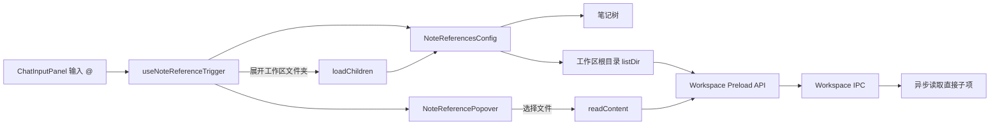

# AI 对话资源引用

AI 对话输入框的 `@` 面板由通用引用 Hook 管理展开状态，宿主应用负责提供笔记树与工作区目录数据。初次打开只加载一次资源根，并仅展开资源分类和工作区根目录。

工作区目录不会在输入 `@` 时递归扫描。根目录只返回直接子项，后续目录由用户展开时按需加载；在同一次 `@` 面板打开期间继续输入筛选文本不会重新请求资源根。笔记数据仍由笔记服务提供完整树，但默认只渲染第一层可见节点。

## 项目 Agent 多选与斜杠资源

项目编辑框只展示所选目录实际检测到的 Agent，以复选框保存 `agentAppIds`。新项目不自动勾选，全部取消以空数组持久化；项目存储 v3 将旧 `agentAppId` 单选值迁移为数组。显式空数组优先于旧单选字段。

```mermaid
flowchart LR
  Modal[ChatProjectModal 目录选择] --> Detect[Agent 探测 IPC / 已授权目录]
  Detect --> Checkboxes[检测到的 Agent 复选框]
  Checkboxes --> Projects[项目存储 v3 / agentAppIds]
  Draft[useChatSessions 草稿项目或当前会话] --> Bridge[ChatActiveProjectBridge]
  Projects --> Bridge
  Bridge --> Active[活动目录与 Agent 数组]
  Active --> Adapter[Agent chat adapters]
  Slash[ChatInputPanel 输入 /] --> Adapter
  Search[面板搜索框或 /关键词] -->|query| Adapter
  Adapter --> ListIPC[Preload / listSlash IPC]
  ListIPC --> Registry[Agent Profile / 按匹配目录扫描]
  Registry --> Local[各 Agent 项目及全局技能与命令]
  AppSkills[momo-ai 应用技能及分类] --> Menu[按来源及目录层级展示搜索结果]
  Local --> Menu
  Menu --> Selection[resourceId / revision 行内选择]
  Selection --> Turn[RuntimeTurnInput.resourceAgentAppIds]
  Turn --> Main[Harness 应用服务]
  Main --> Prepare[按来源展开资源 / 依次执行所选 hooks]
  Main --> Rules[合并所选 Agent 规则]
  Prepare --> Harness[Harness 本轮输入]
  Rules --> Harness
```

`currentProjectId` 同时覆盖已建立的会话和首次发送前的项目草稿，因此创建项目对话后立即按项目目录和 Agent 选择加载 `/`，无需先发送消息。切换项目、编辑选择和全部取消时同步更新面板；未选 Agent 时仍展示 momo-ai 应用技能。

主进程按所选 Profile 分别扫描其实际命中的项目目录与既有全局目录，资源携带 Agent 来源并保留独立 ID。多个 Agent 的同名资源均可展示，行内选择按 ID 和版本精确加载；直接手输同名命令产生歧义时提示从面板选择。已取消或版本失效的 Agent 资源拒绝加载。

斜杠面板标题统一为“技能与命令”。面板搜索框和 `/关键词` 共用 `listSlash.query`，主进程按名称、命令、描述、标签与目录筛选；列表项新增可选 `directoryPath`，仅携带资源根目录下的相对文件夹层级。momo-ai 技能使用原分类作为目录，Agent 技能与命令使用实际目录。搜索保留命中项的全部祖先，隐藏无匹配项的分支；键盘选择按树形展示顺序遍历。搜索框的关键词不写入用户问题，选择后替换原 `/` 触发位置。

运行契约新增可选 `resourceAgentAppIds`，兼容旧 `resourceAgentAppId`；规则按来源合并，声明式 hooks 按选择顺序执行，任一拒绝即停止发送。未增加 shell hooks 执行能力。
