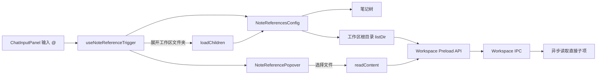

# AI 对话资源引用

AI 对话输入框的 `@` 面板由通用引用 Hook 管理展开状态，宿主应用负责提供笔记树与工作区目录数据。初次打开只加载一次资源根，并仅展开资源分类和工作区根目录。

工作区目录不会在输入 `@` 时递归扫描。根目录只返回直接子项，后续目录由用户展开时按需加载；在同一次 `@` 面板打开期间继续输入筛选文本不会重新请求资源根。笔记数据仍由笔记服务提供完整树，但默认只渲染第一层可见节点。
