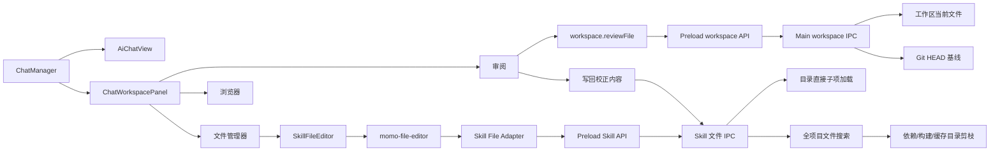
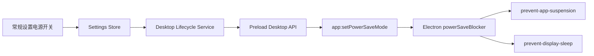

# AI 对话工作区面板

AI 对话页由 `ChatManager` 统一编排对话区与右侧工作区面板。右侧面板支持审阅、浏览器和文件管理器三种单实例标签页，并保持对话区最小宽度为 400px。

面板左边界负责调整宽度；最大宽度受容器宽度和对话区 400px 最小宽度共同约束。窄屏下，面板以覆盖层方式展示。浏览器标签页使用沙箱 iframe 隔离页面内容；文件管理器复用 Skill 文件编辑组件，首次只请求根目录直接子项，展开目录时再通过同一 IPC 契约按需加载。搜索使用独立的有界递归扫描，不依赖已展开节点，并跳过常见依赖、构建产物与缓存目录。审阅页根据当前对话中的 `workspace.write` 成功事件收集文件，并通过受工作区根目录约束的 IPC 获取当前内容和 Git 基线。

## 电源设置链路

常规设置中的电源选项通过桌面生命周期服务发送到主进程，由 Electron `powerSaveBlocker` 管理对应的系统阻止器。

两个选项持久化在设置存储中，并在设置初始化时重新同步到主进程。
