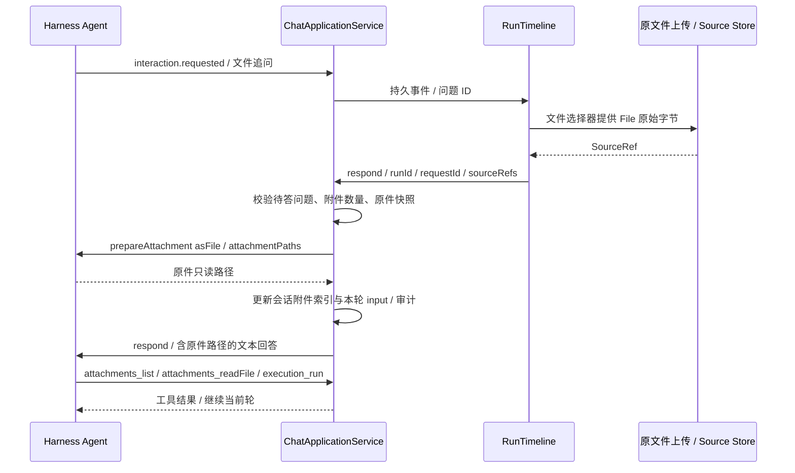
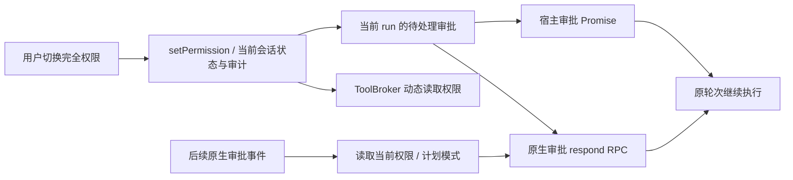
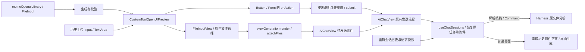

# AI 对话文件选择与执行续接

文件输入由 `QuestionItem.inputType=file` 或原生问题 header 的 `[file]` 标记声明。宿主兼容旧问题中明确的上传措辞；文件格式、名称等普通文本问题和计划审阅仍使用原控件。

追问上传复用主输入框的原文件上传服务，不接受用户手填路径代替文件。原生问题回答协议仍是文本；SourceRef 只在宿主边界内验证和绑定，再转成可读取的附件描述。图片在文件追问中以原文件形式准入。文件工具在无附件轮次也注册，以接收本轮稍后上传的首个文件；代码执行仍经过 ToolBroker 的权限、计划模式与审批检查。文件索引绑定会话并供后续轮次复用。

宿主统一追踪两种待审批请求；切换完全权限后放行当前会话的审批，同一请求的并发答复共享一次执行。文件追问、普通追问和计划审阅不会被权限切换代答，计划模式的工具限制保留。停止或终态会取消未完成的工具等待，过期追问不可继续绑定文件。

聊天生成界面的 `FileInput` 选择原文件后加入聊天输入框；点击同一 Form 中的 Button，经 Renderer 的 `onAction` 和宿主 `submit` 回调，提交按钮说明、表单字段、输入框补充内容和待发送附件。文件上传或提交期间禁用重复操作，失败在界面内显示并保留待发送文件。工具箱未注入聊天回调时明确提示无法提交；HTML 仍在原有 sandbox iframe 中，不注入宿主文件能力。

“请继续”等续接请求及界面按钮会在当前会话中找到原用户任务；旧版本生成的“未检测到附件”页面不会截断此前任务。续接技能保留资源 ID、revision 和行内 token，补入实际模型输入后仍由 Main 校验、展开并进入 Harness。纯界面请求也会读取此前附件的正文。`requestSnapshot.continuationOf` 和本轮实际 `sourceRefs` 随消息持久化，重开与重试复用冻结上下文；新选文件替换本次材料，显式新任务不自动继承旧技能。点击历史界面只从该界面及之前的消息恢复上下文，不读取其他会话或未来轮次附件。
