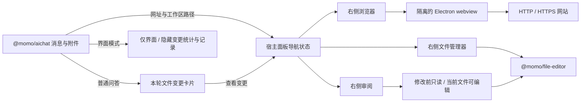
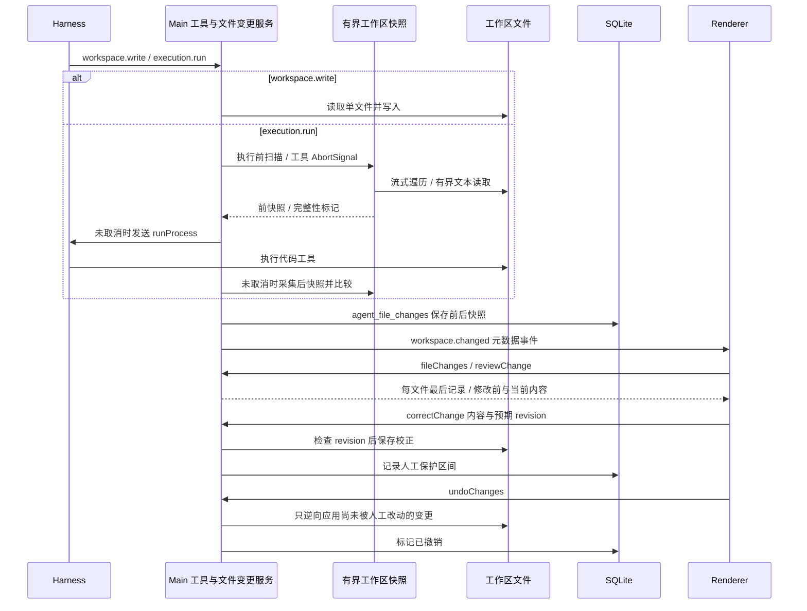

# AI 对话工作面板与文件审阅

对话里的 HTTP/HTTPS 链接通过宿主导航请求打开右侧浏览器；工作区路径按目录边界定位到文件管理器。`@momo/aichat` 通过助手消息底部插槽显示宿主提供的变更卡片，其他问答入口保持各自的打开行为。

界面模式按每轮请求快照或生成界面标记隐藏文件变更卡片，不订阅卡片的变更查询；底层真实项目变更仍保留可审阅记录。

桌面对话支持绝对路径、工作区相对文件名、文件引用 chip 和带行号的文件链接；相对路径在当前项目的多个根目录中检查存在性后打开。

浏览器使用独立持久化 partition，保留浏览登录状态。主进程检查附加地址和 partition，关闭 Node 集成、移除 preload，并限制导航为 HTTP/HTTPS。网站内容无法获得应用 IPC。

`agent_file_changes` 以 `(run_id, path)` 为键，保存真实工作区基线而不是 Git HEAD，保留用户预先存在的修改。同一文件连续 AI 写入合并；中间包含人工修改时保留独立操作用于逆向比较。`diff` 提供字符及行比较，复杂文本比较超时后使用更保守的范围，冲突范围保留当前内容。

显式 `workspace.write` 记录单文件；`execution.run` 在执行前后比较工作区内 UTF-8 文本，覆盖预算内的新建、修改、删除及未取消工具失败后已落盘的结果。其他 MCP 工具的外部副作用不属于这个文件快照链路。

`workspace-snapshot.ts` 使用流式目录遍历，每次快照最多保留 16 MiB 文本（按 UTF-16 两字节估算），最多检查 10,000 个条目、32 层目录，扫描时间预算为 10 秒；预算在文件系统操作间检查。不扫描依赖、缓存及构建输出目录，包括 `.git`、`node_modules`、`dist`、`build`、`out`、`target`、`.venv`、`logs`、`temp`，也不进入 `.asar` / `.asar.unpacked` 或符号链接。二进制及超过 1 MiB 的文件不进入文本审阅；读取前检查大小，并限制实际读取缓冲区，避免增长中的文件绕过限制。

达到预算或目录不可读时保留完整性标记并记录告警，代码工具仍可执行。前快照未覆盖的文件不会被当作新增文件；后快照缺失的文件必须确认实际不存在才记录删除，防止撤销误删已有文件。取消或超时通过同一 `AbortSignal` 停止扫描、释放已保留文本，并阻止迟到的 `runProcess`；已取消调用不继续采集后快照，已落盘的文件和已持久化的审阅记录保留。

审阅草稿保留在 Renderer，保存校正、撤销以及发送下一轮前统一提交；过期 revision 拒绝保存。开始新一轮时默认接受此前待处理变更，已接受或已撤销记录不会再次撤销。对话只在最后一条助手回复显示本轮汇总，每个文件仅一条记录；审阅仍可读取持久化快照。清除会话时一并清除文件变更记录。

文件修改 IPC 校验主窗口来源、会话所有者及记录所属文件；生成期间禁止人工校正和撤销。撤销前再次检查当前文件，避免覆盖并发修改，人工编辑与不确定冲突均保留。
