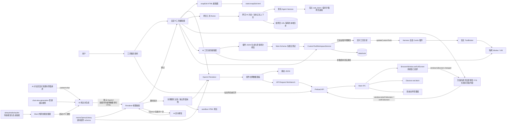
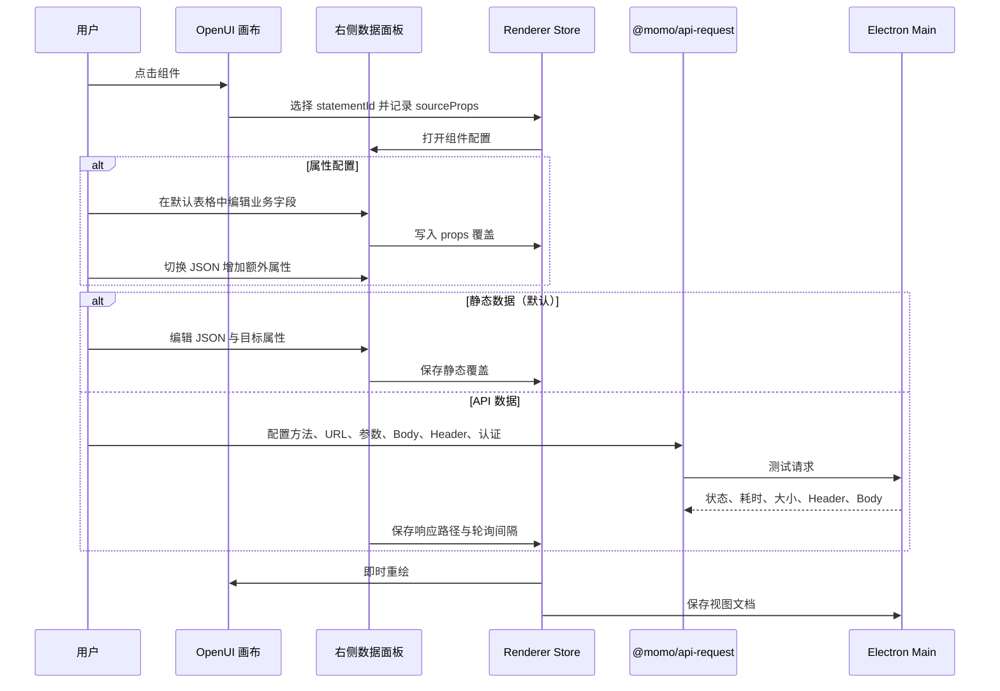
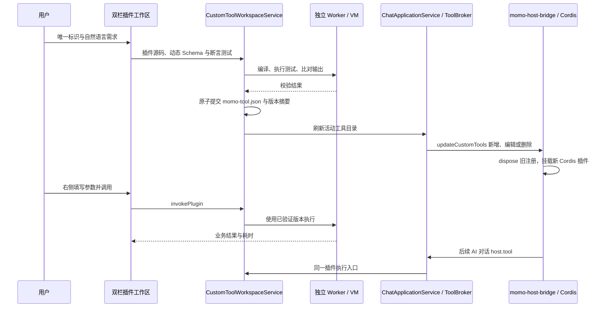

# 自定义工具视图编辑器

工具箱支持“界面显示 / AI 工具 / 网页”三种入口。界面显示保留 OpenUI 与 HTML 视图文档；AI 工具生成经过校验的 DeepSeek Harness / Cordis 插件，供验证表单与后续 AI 对话调用；网页保存快捷入口。旧版 tool.json 的 action 不恢复执行。

## 模块与数据流



AI 生成直接使用已配置的对话模型文本流，不进入 Harness，也不获得宿主工具或知识库能力。科技视觉规范维护在 `default/skills/builtIn/custom-tool-tech-design/references/generation-guidance.md`，HTML、OpenUI 与修复规则维护在 `custom-tool-generation`。Renderer 启动时经 Main / Preload 读取外部文件，构建默认值也来自同一目录；技术人员编辑后重启桌面应用即可生效。Cursor 技能入口引用同一规则源。`/custom-tool-tech-design` 命令默认路由到 HTML，以获得完整主题和构图能力；显式要求 OpenUI 时仍保持 OpenUI。Renderer 在保存前校验生成内容，OpenUI 首次校验失败时携带具体错误进行一次定向修复并重新校验；Main 再校验路径、大小和视图类型后写入本地目录。加载边界见 [技能资源](./skill-resources.md)。

## 本地文档契约

生成、校验和预览共用 `momoOpenuiLibrary`。扩展能力为嵌套 Tabs、SplitPane、PlainText 和 FilePreview；组件本身不包含技能业务字段。聊天通过 presentation=chat 使用浅色预览，工具箱保留科技主题。FilePreview 在宿主注入准入附件引用时读取原件，未绑定的工具视图只显示准确空状态。

`generateCustomToolView` 统一负责工具箱与主 AI 对话纯界面请求的生成、流式投影、校验和一次 OpenUI 修复。工具箱继续使用科技视觉规则并保存视图文档；聊天通过 `context=chat` 在生成和修复中使用 `chat-view-generation` 的普通展示规则，保存每轮独立界面，并复用 `CustomToolOpenUIPreview`。界面模式中显式调用 Skill/Command 时进入原有 Agent 执行链路，详见 [AI 对话界面模式](./ai-chat-interface-mode.md)。

自定义工具的查看和编辑模式共用内容区域右上角的系统全屏按钮。鼠标进入内容区域或键盘焦点进入时显示，离开时隐藏；触屏保持可见。桌面端经已有窗口 IPC 调用 `BrowserWindow.setFullScreen`，主进程支持 F11 切换和 ESC 退出，并将窗口状态回传 Renderer；浏览器环境使用 Fullscreen API。`ViewportPortal` 将同一挂载容器移至 `document.body`，展示布局以 `inset: 0` 覆盖整个屏幕。全屏只渲染页面预览，隐藏标题、“编辑”按钮、源码/画布切换、组件配置和 AI 输入；退出后恢复先前的编辑状态。页面内按钮可退出全屏。

OpenUI 图表通过 `MeasuredChart` 的 ResizeObserver 等待容器宽高大于零后挂载；图表容器保留最小高度，隐藏时卸载图表。工作区和聊天界面切到源码 Tab 后销毁隐藏预览，避免 Recharts 测量不可见容器。

工具目录以 momo-tool.json 为权威提交记录；界面保存视图入口，网页保存 URL，AI 插件另外生成可查看的文件：

```text
data/tools/<relative-path>/
├── momo-tool.json
├── view.openui       # kind=openui
├── index.html        # kind=html 时使用
├── index.mjs         # kind=plugin：受信任的 Cordis 注册入口
├── execute.js        # kind=plugin：AI 生成的 execute(input)
├── plugin.json       # kind=plugin：描述、输入/输出 Schema、测试
└── (无视图文件)      # kind=web，URL 保存在 momo-tool.json
```

`momo-tool.json` 当前为版本 1，包含名称、视图类型、网页 URL（仅 `kind=web`），以及按 OpenUI `statementId` 保存的组件配置。组件配置由三层信息组成：

- `sourceProps`：记录 OpenUI 生成的原始属性，供默认表格展示业务名称、属性键和当前值。
- `props`：覆盖模型生成的 OpenUI 组件属性。
- `data`：选择静态数据或 API 响应，指定写入的目标属性、响应取值路径以及轮询设置。

新建工具默认选择“界面显示”（OpenUI），说明为“AI 生成需求界面”。“AI 工具”说明为“工具将会录入系统，供后续 AI 对话调用”，图标为插件；“网页”说明为“网页快捷入口记录”，输入 HTTP/HTTPS 地址。网页工具统一使用 Ant Design 的 `IeOutlined` 图标，在整个右侧区域加载目标网页；右下角机器人打开高 75%、最小宽度 420px 的 AI 对话框，并可放大至整个网页区域。当前正文经受控 IPC 读取并作为实际模型输入，网页对话可按需调用宿主 `web_fetch` 抓取链接，历史按网页隔离持久化。详见 [网页工具 AI 对话](./webpage-assistant.md)。生成指令明确要求 HTML 或调用 `/custom-tool-tech-design` 时生成 HTML；显式要求 OpenUI 的优先级更高。HTML 使用打包的 `static/snapEdit.html` 在 sandbox iframe 中可视化编辑，源码与画布通过 `postMessage` 同步，不注入宿主 API。

OpenUI 组件设置默认展示面向业务人员的属性表格，并提供 JSON 视图用于新增或批量修改属性。底层渲染调试入口不面向产品用户，查看态与编辑态都只展示业务化工具界面和组件配置能力。

历史 `tool.json` 工具包作为兼容叶子节点显示，目录树不会递归暴露其 `actions`、`assets`、`backend` 等内部结构。编辑器仅按清单中的 `entry`（默认 `index.html`）读取和保存 HTML 视图；旧 action、后台服务、MCP、Skill 及权限声明均不恢复执行。工具节点菜单通过 `tool:openDirectory` IPC 请求 Main 进程解析受限于 `data/tools` 的目录，再交给系统文件管理器打开。

## 组件编辑链路



API 数据默认只请求一次；启用轮询后按组件配置的间隔刷新。请求配置和组件数据保存在本机工具定义中。

## 可复用接口请求包

`packages/momo-api-request` 独立提供：

- 与 UI 无关的请求配置类型、请求组装、认证、超时、响应截断和 JSON 解析。
- 可嵌入业务面板的 `ApiRequestWorkbench`，包含 Parameters、Body、Headers、Authorization、Settings 以及 JSON/Raw/Response Headers 结果区。
- 调用方注入的执行函数。桌面端通过 Preload/IPC 使用 `Electron net.fetch`，因此组件不依赖自定义工具，也可在后续页面复用。

IPC 边界会校验方法、URL、参数、请求头、认证、Body 和超时配置。只允许 HTTP/HTTPS；请求 Body 最大 2 MiB，响应正文最多读取 5 MiB，超时范围为 100 ms 至 300 秒。

## AI 插件生成、校验与热更新



标识采用跨模型可移植子集：1–64 字符，以英文字母开头，仅包含英文字母、下划线与连字符；不区分大小写检查整个工具树中的唯一性，草稿也预占名称。禁止系统保留名称及宿主工具前缀，创建后标识固定，名称与目录可改。隐藏目录和 Windows 保留目录名称不能作为新节点。

生成器按需求输出描述、JSON Schema、纯 JavaScript execute(input) 和测试；失败时把具体错误交给模型，最多修复两次。主进程编译源码、验证输入/输出 Schema，并执行 1–8 个带精确预期值的测试。只有通过后才提交版本摘要并发布；编辑失败保留上个可用版本。异步验证完成后重新检查提交记录，防止覆盖并发编辑或复活已删除工具。启动后从本地定义恢复目录，不依赖 Renderer 的校验标志。

源码在独立 Worker 的 VM 中运行，不注入宿主对象；目前提供标准 JavaScript 计算、数据转换能力，不提供文件、网络、进程、第三方依赖或宿主凭证。外部业务数据通过 Schema 参数传入。单次执行限制 5 秒、同步脚本 1.5 秒，Worker 内存与输入/输出大小受限。生成测试可发现契约、语法和已覆盖逻辑错误，不代表任意业务输入均已证明正确。

左侧文件管理器展示 index.mjs（自动注册入口）、plugin.json（描述/参数/测试）和 execute.js（实现）。右侧从同一输入 Schema 生成表单；只有已保存且通过校验的版本可运行，调用真实执行器并以业务字段展示结果。输出 Schema 在 ToolBroker 与执行器双重校验。运行中的工具目录同步刷新，排队调用若版本变化则拒绝旧调用；已开始的调用受原有超时控制。删除目录同时撤销所有子插件，刷新失败时销毁对应运行时，避免残留旧目录。注册入口由宿主模板构造，通过 Cordis agent context 挂载，模型源码不在 Harness 主进程执行。

每次加载新的已验证版本，右侧自动带入首个测试参数并真实调用；用户可以修改参数重复验证。损坏的本地工具保留为可删除的树节点，不进入 Agent 目录，工作区显示读取错误。

旧界面里的无语言、text、plaintext 或 ASCII 围栏以无代码工具栏的示意内容展示，保留排版。生成规则禁止以 ASCII 代码块冒充拓扑或 3D 可视化；显式编程示例仍可展示源码。
