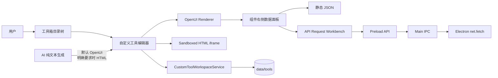
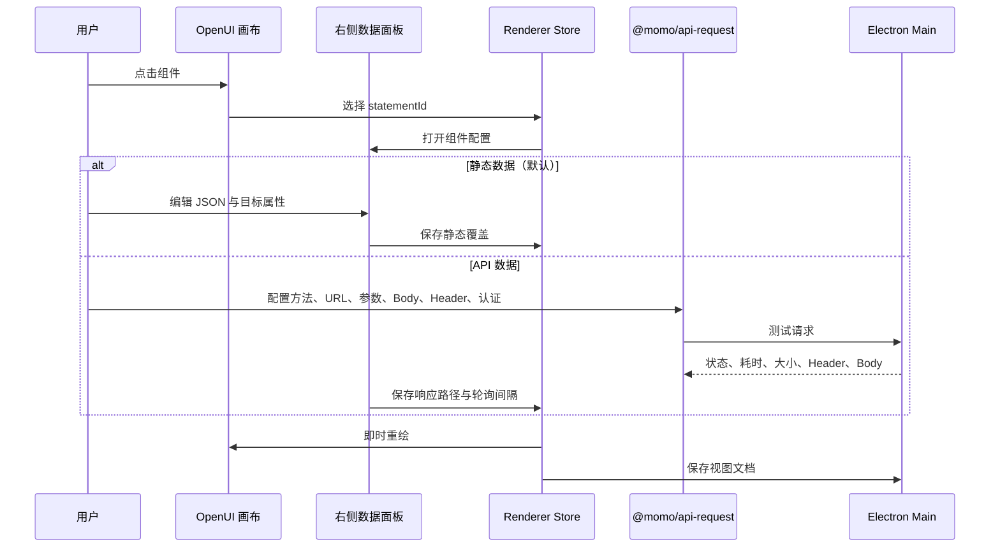

# 自定义工具视图编辑器

自定义工具保留工具箱中的现有目录树和工作区入口，但其系统边界已经收敛为“可生成、可配置、可预览的本地视图文档”。它不再注册 Agent 工具，不包含 action、后台服务、Node/Python 执行器、MCP/Skill 权限或 iframe 宿主桥。

## 模块与数据流



AI 生成直接使用已配置的对话模型文本流，不进入 Harness，也不获得宿主工具或知识库能力。Renderer 在保存前校验 OpenUI 或 HTML；Main 再校验路径、大小和视图类型后写入本地目录。

## 本地文档契约

每个工具目录只保存一个定义文件和一个视图入口：

```text
data/tools/<relative-path>/
├── momo-tool.json
├── view.openui       # kind=openui
└── index.html        # kind=html 时使用
```

`momo-tool.json` 当前为版本 1，包含名称、视图类型以及按 OpenUI `statementId` 保存的组件配置。组件配置由两层覆盖组成：

- `props`：覆盖模型生成的 OpenUI 组件属性。
- `data`：选择静态数据或 API 响应，指定写入的目标属性、响应取值路径以及轮询设置。

新建工具固定为 OpenUI。只有生成指令明确要求 HTML 时才生成 HTML；HTML 仅在 sandbox iframe 中预览，不注入宿主 API。旧 `tool.json` 工具包不迁移、不执行，也不被识别为新工具。

## 组件编辑链路



API 数据默认只请求一次；启用轮询后按组件配置的间隔刷新。请求配置和组件数据保存在本机工具定义中。

## 可复用接口请求包

`packages/momo-api-request` 独立提供：

- 与 UI 无关的请求配置类型、请求组装、认证、超时、响应截断和 JSON 解析。
- 可嵌入业务面板的 `ApiRequestWorkbench`，包含 Parameters、Body、Headers、Authorization、Settings 以及 JSON/Raw/Response Headers 结果区。
- 调用方注入的执行函数。桌面端通过 Preload/IPC 使用 `Electron net.fetch`，因此组件不依赖自定义工具，也可在后续页面复用。

IPC 边界会校验方法、URL、参数、请求头、认证、Body 和超时配置。只允许 HTTP/HTTPS；请求 Body 最大 2 MiB，响应正文最多读取 5 MiB，超时范围为 100 ms 至 300 秒。
