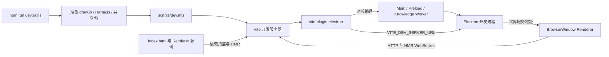

# Electron 开发启动

`npm run dev:skills` 调用 `AIM electron:dev`，先准备离线资源、Harness 和共享包，再由 `scripts/dev.mjs` 启动 Vite。生产打包继续使用原来的 `before:build` 链路。

- 依赖扫描只从 `index.html` 沿 import 解析，避免扫描 `out` 中的安装包副本、许可证和离线 draw.io HTML。
- Renderer 文件监听排除 `out`、`dist`、`logs`、`temp`。源码继续支持 HMR；静态资源的变更仍由复制插件同步到 `dist/static`。
- 启动器在加载 Vite（包括配置编译）前设置 esbuild 的 Go 运行时默认值：`GOMEMLIMIT=768MiB`，`GOMAXPROCS` 为可用逻辑处理器数减一，最小 1、最大 4。内存值是回收软目标，并非进程硬上限；显式环境变量优先。参考 [Go runtime 环境变量](https://pkg.go.dev/runtime#hdr-Environment_Variables)。
- 开发时不压缩 Main、Preload 和 Knowledge Worker；生产构建仍使用 esbuild 压缩。
- 主窗口优先加载插件传入的 `VITE_DEV_SERVER_URL`，适配 `--port` 和默认端口被占用的情况；无插件地址时保留原来的 `http://localhost:5173` 回退。生产模式仍加载打包页面。

排查启动时应同时检查终端的实际服务地址、依赖预构建是否完成和 Electron 页面是否已挂载。Vite 显示 ready 不代表首次依赖预构建已经结束。
