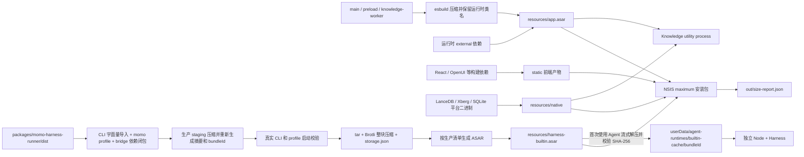

# Electron Windows 打包拓扑

Windows 产物以“少量归档 + 扁平原生文件”为边界，避免在安装目录的 `resources` 中展开依赖树。

- `app.asar` 关闭 smart unpack。应用 JavaScript 依赖保留在归档内；SQLite 使用既有显式 `nativeBinding`，Knowledge worker 在加载 LanceDB/Xberg 时将平台 binding 重定向到 `resources/native`。
- Harness 归档由不可变 `bundleId`、存储格式和压缩级别共同决定复用。`runtime.json` 的摘要始终描述解压后的文件，`storage.json` 标记 `brotli-tar-v1` 格式；压缩不改变运行包身份。外层 ASAR 只包含清单、存储描述和 `payload.tar.br`，共享字典的整块压缩避免逐文件编码增加安装器体积。
- 首次使用时 Node 内置 zlib 与编译进主进程的 `tar` 将 payload 流式解到 staging，不产生完整未压缩 ASAR 的临时副本；只允许清单内的普通文件，拒绝额外条目、重复路径和链接，校验全部 SHA-256 后原子改名。未知存储格式、解压失败或摘要错误会阻止使用并清理 staging。旧版无存储描述的归档仍按原文件复制；损坏缓存会被重建，已有有效缓存直接复用。
- `tar@7.5.13` 显式声明为构建依赖并由 Vite 打进主进程；它也是已有打包工具链使用的版本。运行缓存仍是独立 Node 可执行的普通文件，后续启动不重复解压。
- `afterPack` 校验 Harness 归档身份、解压后的全部文件摘要、内置 Node 可启动性以及知识库原生文件，并递归拒绝 `resources` 中出现可见的 `node_modules` 目录。还使用成品 Electron 的 ASAR 文件系统调用实际缓存生成器，在仓库外解压、验证冷/热缓存，并启动解出的 CLI/profile。
- 开发模式仍直接使用 `packages/momo-harness-runner/dist`，不会触发用户数据缓存。
- `beforePack` 在 electron-builder 清理输出目录前只读检查 Windows 文件占用；发现仍打开的 ASAR/可执行文件时提前失败，避免旧产物被删到一半。构建时仍应关闭该目录运行的程序，或使用独立输出目录。

## 生产包边界

- 根目录执行 `pnpm electron:build:win` 转发到 `AIM` 的 Windows 构建；`@momo/electron` 是共享 Electron 基础模块，其独立打包命令不等同于 AIM 产品构建。
- `dependencies` 只保留 Vite 外置的运行时模块及平台 binding；已经进入 bundle 的 OpenUI、工作区模块和通用库归入 `devDependencies`。主进程保留函数/类名，避免 TypeORM 未显式命名的实体表名发生变化。
- LanceDB 的必需 peer `apache-arrow` 显式声明为生产依赖，避免 electron-builder 的依赖收集遗漏；`afterPack` 使用成品 Electron 执行 SQLite 读写、LanceDB 向量写入/检索、Xberg HTML 提取和 TypeORM/log4js 加载，确认归档中的 JS 与 native 闭包可运行。
- Harness 的 npm 安装及锁文件维持完整上游依赖。生产阶段从根依赖、profile 插件名、桥接插件导入出发，递归保留 dependencies / peers / 已安装的 optional dependencies；仅 CLI carrier 使用其全部 JS 模块的字面量 import 代替上游默认 profile 集合。新的不透明动态导入或缺失的必需依赖会阻止打包。
- 生产 carrier 的 `package.json` 声明所保留的顶层依赖闭包，确保上游 profile resolver 在仓库外也能解析所有内置插件。未启用的上游独立 UI、调试器、语音和 Office profile 不随 AIM 分发；应用使用的模型提供方、附件、技能、进程与工具桥接依赖仍保留。
- 仅在 staging 中压缩 JS、排除 source map、类型声明、PDB、安装锁文件、包级测试/示例/历史目录和其他平台的 node-pty prebuild。许可证、README、运行时 Markdown 提示词、JSON/schema、TypeScript 运行代码和目标平台 native 文件保留。开发源目录不被裁剪。
- 压缩后重新生成每个文件的摘要和 `bundleId`，随后使用内置 Node 执行真实 `describe` / `listAgents` / `shutdown`。成功后才生成归档；`afterPack` 继续校验最终归档及知识库 binding。
- 保留 `LICENSE.electron.txt`、`LICENSES.chromium.html` 和 Electron 的 ICU、GPU/软件渲染、媒体运行库。许可证也由安装包压缩；不通过删除运行时能力换取体积。
- NSIS 使用 `maximum`，维持本地完整安装包；构建完成生成 `size-report.json`，分别记录安装目录、两份 ASAR、native、静态资源及安装器的字节数。ASAR 本身不压缩，Harness 的实际压缩来自归档内的 tar/Brotli 数据。

## 验证

`production-packaging.test.ts` 覆盖依赖闭包、嵌套版本、peer、缺失依赖、类名和文件摘要。`bundles.test.ts` 另覆盖整块流式解压、旧版原文件兼容、缓存复用与修复、篡改/截断数据、格式/路径拒绝和失败清理。现有 Harness 集成测试可用 `MOMO_TEST_HARNESS_BUNDLE` 指定解出的生产归档，检查真实流式问答、工具、追问、计划、取消、续聊、内置技能和原始附件。Windows 原生库仍通过打包门禁及成品运行检查验证。

2026-10-09，Windows x64 / Electron 39.8.2，同一份应用代码的优化前后构建实测（MiB，包含完整离线 draw.io）：

| 产物                 | 未优化同代码基线 | 上轮 optimized | 本轮 optimized-v2 |
| -------------------- | ---------------: | -------------: | ----------------: |
| NSIS 安装器          |           282.15 |         195.01 |            193.47 |
| 安装目录文件总量     |          1357.89 |         805.47 |            702.08 |
| app.asar             |           125.71 |          13.64 |             13.72 |
| harness-builtin.asar |           579.14 |         138.96 |             35.48 |

本轮安装目录比上轮减少 103.39 MiB（12.84%），安装器也减少 1.54 MiB。主进程新增约 85 KiB 的 tar 解码代码。最终产物位于 `apps/skill-platform/out/optimized-v2`，默认构建仍输出到 `out`；后续构建以对应的 `size-report.json` 为准。

历史 `out/win-unpacked` 曾显示 561.59 MiB：此前构建清理旧输出时遇到被占用的 `app.asar` 而失败，缺失了 `AIM.exe`、知识库 native、ICU 等文件。已从保留的旧安装器仅恢复缺失文件，恢复后为 2074 个文件、1,108,111,670 字节（1056.78 MiB），与旧安装器 payload 总量一致。历史版本的资源集合不同，不能把清理失败的残包或不同版本当作同代码基线。

最终归档解出的生产运行包通过 93 项 Agent 测试（17 个文件）。成品在隔离用户目录中成功加载完整主界面和 preload API，从界面经 IPC 调用实际 Agent 的 `describe/listAgents`，并通过 SQLite、LanceDB、Xberg 实际操作验证。

构建门禁实测完整缓存首次生成及校验约 19.8 秒，已有缓存校验约 1.7 秒；耗时受磁盘与杀毒扫描影响。安装目录数值不包含用户数据：首次使用 Agent 仍需约 136.4 MiB 的可执行缓存，与上轮相同，之后不重复解压。
