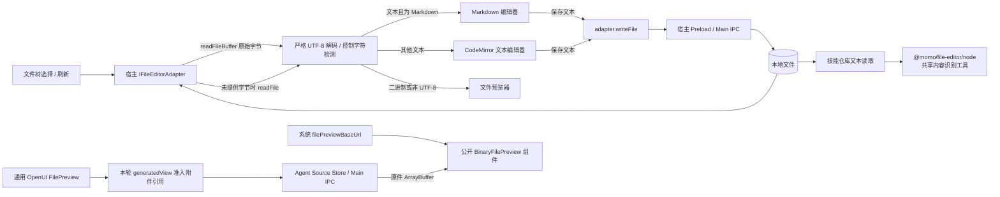

# 文件编辑器

`@momo/file-editor` 通过宿主适配器管理文件树与读写；文本识别不依赖后缀，语言后缀只用于高亮。

每次选择只读一次原始字节；可编辑文本归一化换行并同步保存基线，保留 UTF-8 BOM。`.log`、未知后缀和无后缀遵循同一规则；含二进制控制字符或无效 UTF-8 的内容进入预览，不暴露文本保存。后发读取使旧请求失效，防止快速切换时覆盖当前文件。读取失败显示重试提示。

技能仓库批量文本读取继续保留 1 MiB 上限；文件编辑器通过原始字节接口读取完整文件。未提供原始字节的适配器使用文本接口回退，二进制及过大文件占位符不进入编辑器。

`BinaryFilePreview` 作为公开组件供通用 OpenUI 原件预览复用。OpenUI 只保存 sourceId 与准入引用，宿主加载原文件字节和系统 Worker/WASM 资源地址；没有原件或加载失败时显示真实状态，不使用抽取文本替代。组件不绑定标书或其他业务技能。
