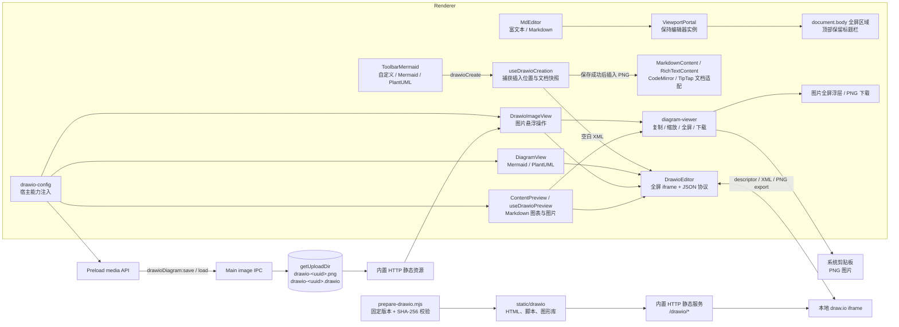
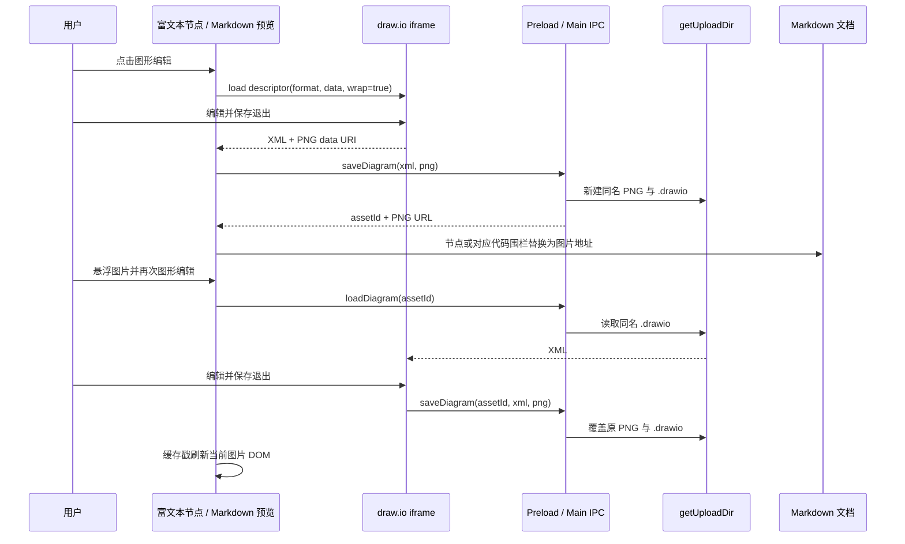
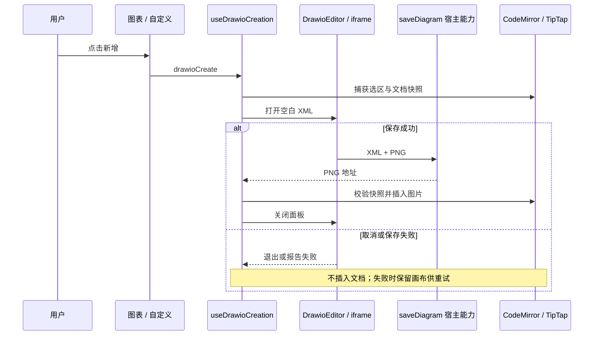

# Markdown draw.io 图形编辑

`@momo/markdown` 将 Mermaid / PlantUML 代码块转换为可在 draw.io 中继续编辑的图形。保存后，文档节点从代码块变为普通图片；可编辑 XML 作为旁路文件持久化，不进入 Markdown、DOM 可见文本或剪贴板序列化结果。

## 模块与持久化边界

draw.io iframe 只承担客户端转换与编辑，图形数据通过 `postMessage` JSON 协议传输。Mermaid 和 PlantUML 首次载入使用 `descriptor` 且启用 `wrap`，使原始文本保留在 draw.io XML 内；宿主只负责保存返回的 XML 和 PNG。

桌面端默认使用 `http://localhost:<httpPort>/drawio/index.html`，以 `stealth=1&local=1` 禁用远程存储集成。`prepare-drawio.mjs` 在开发和打包前下载官方 `draw.war` 的固定版本 32.0.2，校验 SHA-256 后提取前端资源；已有完成标记时复用本地文件。`static/drawio` 不提交到仓库，随现有 `static -> dist/static -> 安装目录/static` 链路打包；离线构建可用 `DRAWIO_ARCHIVE_PATH` 指定预先下载的同版本归档。非桌面宿主仍可通过 `editorExtensions.drawio.editorUrl` 指定自托管实例。

内置 HTTP 服务的 `security.frameAncestors` 显式允许 `file:` 和本机 HTTP 页面作为父页面，以 CSP 替代冲突的 SAMEORIGIN 响应头。PlantUML 普通预览使用本地 TeaVM 引擎，预览、下载与导出链路见 [Markdown 本地渲染](./markdown-rendering.md)。

宿主区分编辑器资源加载、图形转换与保存阶段。资源加载及保存等待 30 秒，图形转换等待 60 秒；错误或超时在画布中央显示重新加载／重试保存入口。只接受当前 iframe 且来源匹配的消息，重复导出事件不会重复持久化。

编辑器全屏使用 `ViewportPortal` 将同一个挂载容器移至 `document.body`，退出后移回原位置，保持编辑器实例和撤销历史。桌面 Chromium 使用原子移动保留焦点与 iframe 状态；全屏边界由标题栏发布的 `--app-titlebar-height` 决定，不受父容器毛玻璃或裁剪影响。

## 首次转换与再次编辑

图片文件名中的 `drawio-<uuid>` 是 PNG 与 XML 的关联键。再次保存沿用同一 `assetId`，因此覆盖原文件而不产生新图片；缓存戳只用于当前 DOM 刷新，不写入 Markdown。

保存后的 draw.io 图片在富文本与 Markdown 预览中共用 `diagram-viewer` 操作，按顺序提供复制图片、缩放、全屏、下载和图形编辑，不显示源码编辑。复制向系统剪贴板写入 PNG；全屏与下载使用图片本体，缩放状态在图片重新加载或节点卸载时清理。

Markdown 预览根据围栏行号定位完整源码，保存前后都校验源码未发生变化；异步保存不会覆盖用户后续修改的文本。富文本工具栏将链接、图片和图表作为 TipTap 节点／标记插入；自定义 Markdown 按完整文档解析，避免行内解析破坏代码换行或块结构。

## 新增自定义图形

自定义面板仅提供新增操作。两种编辑模式共用保存生命周期，各自通过文档适配器完成插入；绘图期间文档发生变化或编辑器变为只读时拒绝插入，避免覆盖后续编辑。

## 文档契约

- Markdown 只保存 ``。
- `.drawio` XML 不作为节点属性、隐藏文本或 HTML data 属性写入文档，因此源码视图和复制内容都不包含 XML。
- 主进程校验资源标识、XML 根节点、PNG 签名与大小，并把两个文件限制在 `getUploadDir` 下。
- 普通图片不匹配 `drawio-<uuid>.png` 命名时，不显示图形编辑入口。
