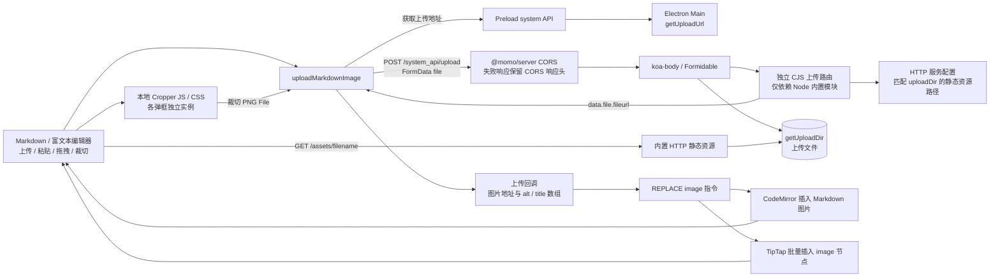

# Markdown 图片上传

上传、粘贴、拖拽与裁切共用 Renderer 的 `uploadMarkdownImage`。文件经内置 HTTP 服务持久化，文档只插入返回的图片地址。

裁切组件及样式随 `@momo/markdown` 打包，默认不加载 CDN。每个裁切弹框维护独立实例，图片准备好后才能确认；裁切结果通过同一上传回调插入，成功后才清空和关闭弹框。富文本接收字符串地址数组或包含 `url / alt / title` 的对象数组，过滤空地址，按顺序保留图片元数据；已有空图片节点不向 DOM 写入空 `src`。

系统动态路由由 `apps/electron/scripts/prepare.cjs` 单独编译，运行时通过 `require` 加载；上传路由从已配置的静态资源目录解析 URL 路径，不依赖未随路由输出的 Electron 源码模块。

Helmet 与 iframe 来源配置先于 CORS 执行。CORS 位于请求体解析和路由之前，预检请求直接结束；解析或路由抛错时将已有 CORS 与 `Vary` 响应头附加到错误对象，供 Koa 错误处理保留。上传地址、成功响应结构、持久化目录及跨域来源策略沿用原契约。
