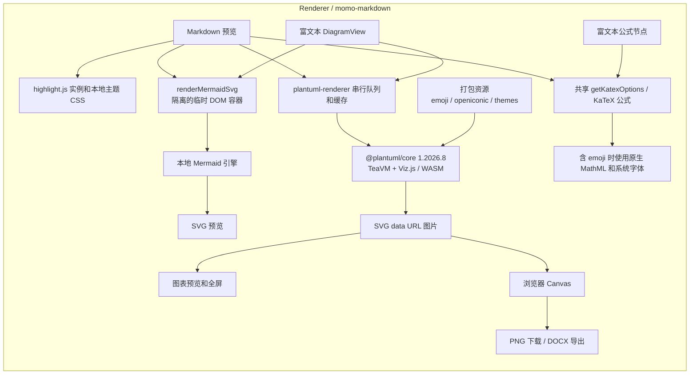
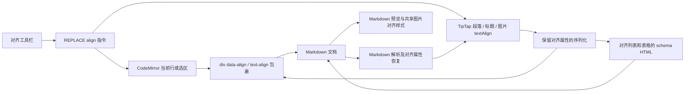
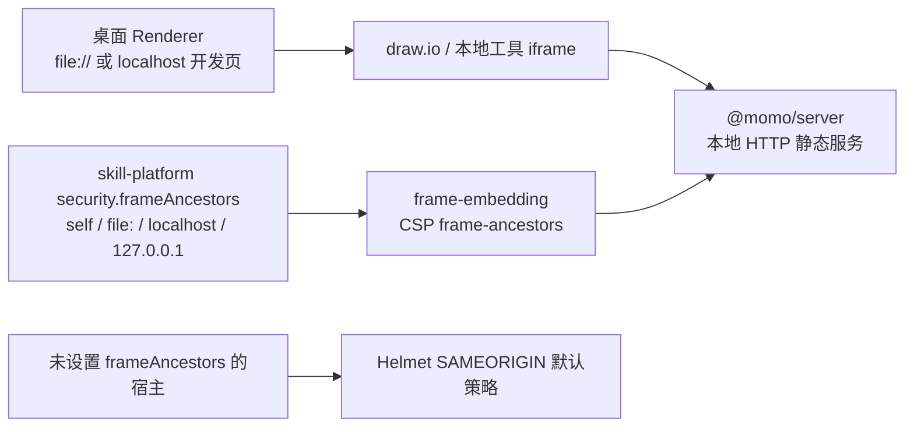

# Markdown 本地渲染

`@momo/markdown` 的代码高亮与 PlantUML 渲染资源随应用打包。Markdown 预览与富文本共用本地引擎，图表预览、PNG 下载与 DOCX 导出不调用公网 PlantUML 服务。

官方 TeaVM 引擎共享内部状态，因此所有渲染串行执行；相同源码复用 Promise，最多缓存 64 项。视图更新后忽略旧的异步结果。可选脚本只从已打包的资源映射加载，未包含的大型图形库返回错误，不尝试远程脚本；外部图片和远程 include 仍属于文档自身的外部资源，不属于本地图形库。

Mermaid 在专用临时容器内渲染，并始终清理容器；语法错误不向页面挂载错误 SVG，Markdown 预览仍通过错误事件报告诊断。富文本与 Markdown 公式共用 KaTeX 配置及预览主题样式，公式节点保留原始 LaTeX 用于编辑和 Markdown 序列化。

富文本图表由 `DiagramDeletion` 在默认代码块合并命令前按完整节点删除。链接通过 `LinkEditor` 捕获选区、在文本上方确认 URL，再向原文本添加 TipTap link 标记，保留已有文字格式。

## 编辑器对齐与 Markdown 存储

对齐设置随 Markdown 文档保存；顶层包裹内仍使用 Markdown，保留文字格式、公式和图表语法。包含对齐段落的列表和表格保存为 schema HTML，避免 Markdown 容器语法丢失属性或破坏节点结构。未指定对齐的图片默认居中，普通段落沿用主题默认值。富文本图片节点与 Markdown 预览共用对齐样式。

## 本地服务嵌入

skill-platform 显式配置允许嵌入的本地来源，服务移除冲突的 `X-Frame-Options` 并使用 CSP 限定父页面。其他宿主保留默认 SAMEORIGIN；Helmet 的其他响应头继续生效。
