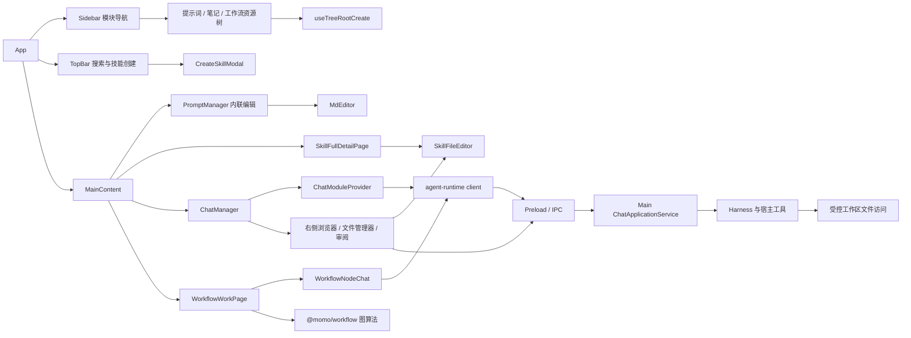

# Renderer 功能入口

以下图展示当前桌面应用的活动入口，用于核对清理未使用模块后的调用边界。

提示词和目录创建沿资源树及内联编辑器进入；顶栏保留技能创建事件、搜索导航和主题切换。旧的 `QuickAddModal`、`FolderModal`、侧栏标签弹层及其拖动逻辑没有可达的打开入口，已移除。

桌面聊天和工作流对话继续通过 `agent-runtime` 调用主进程。已移除无调用方的 Renderer 工作区检索拼接、旧聊天生图适配器、旧技能选择器及未使用的模型解析 Hook；工作区访问由当前 Harness 工具链承担。模型设置中的生图测试继续经 `testImageGeneration` 调用现有 AI 生图服务。

桌面对话消息通过宿主导航状态进入右侧工作面板，文件变更卡片和双栏审阅使用主进程保存的本轮快照。详情见 [对话工作面板与文件审阅](./chat-workspace-review.md)。

应用内部调用方直接引用所需实现；工作流图算法直接来自 `@momo/workflow`。此次删除的应用内部聚合导出没有调用方，工作区包的公共导出、IPC 通道、存储结构和动态加载入口继续保留。
