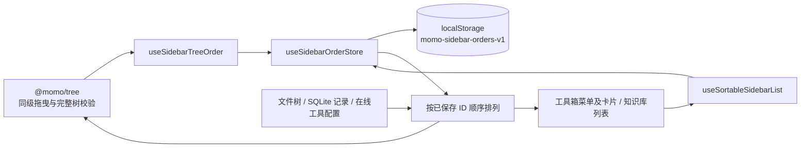

# 侧栏拖曳排序

排序以模块和父节点为键，分别覆盖 `toolbox`、`custom-tools`、`workflows`、`notes`、`knowledge` 和 `prompts`。完整树参与插入位置计算，搜索隐藏条目仍保留；新增条目接在已排序条目后。拖曳仅调整同级顺序，目录移动继续走原有业务接口。

排序是本机界面偏好，不改写工具在线配置、文件内容或业务数据库。先成功写入 localStorage，再更新界面；重载恢复顺序。笔记和自定义工具按路径标识，重命名或移动后映射节点及后代路径。
