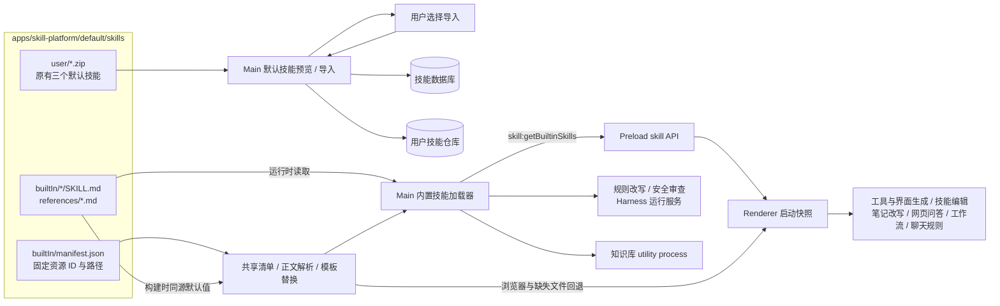
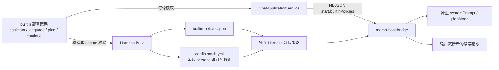
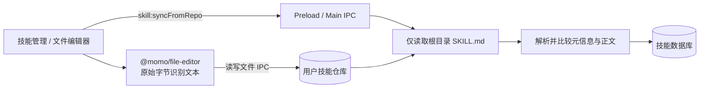

# Skill Platform 技能资源

应用默认技能分为用户可导入的 `default/skills/user` 和系统功能调用的 `default/skills/builtIn`。用户资源进入技能数据库与本地仓库；功能规则由固定清单加载，不进入用户技能管理或 Agent 斜杠资源目录。

`SKILL.md` 去除 YAML 后注入正文；参考文件直接使用正文。`{{参数名}}` 只做一次文本替换，参数中的标记不再展开。预览与导入仅扫描 `user` 的 ZIP，原有 `default://文件名` 来源契约保持兼容。

桌面安装包将整个 `default` 目录复制到应用根目录、ASAR 外。Renderer 启动加载快照，编辑文件后重启即可生效；Main 与知识库进程按请求读取。Harness 使用同源打包快照支持独立运行，并接受宿主每轮传入的当前策略。`--ensure` 同时校验策略快照及替换后的 profile，避免复用过期运行包。

维护位置及模板约定见 [默认技能资源](../../apps/skill-platform/default/README.md)。`.cursor/skills/custom-tool-tech-design` 仅作为开发工具入口，指向 `builtIn` 的唯一规则源。OpenUI 的组件 schema 与系统权限、结果校验仍由代码或第三方库维护。

## 用户技能仓库同步

同步和元信息回写只读取根目录 `SKILL.md`，无需遍历 `agents`、`references` 等辅助文件。通用目录读取跳过遍历期间消失的条目，权限及其他读取错误继续上报。文件编辑按内容识别 UTF-8 文本，详细边界见 [文件编辑器](./file-editor.md)。

`@momo/aichat` 通过宿主注入的引用规则与附件默认任务生成实际请求，发送给模型的业务指令由宿主提供。工作流提供文件正文与来源标签，统一模板负责说明参考方式。
