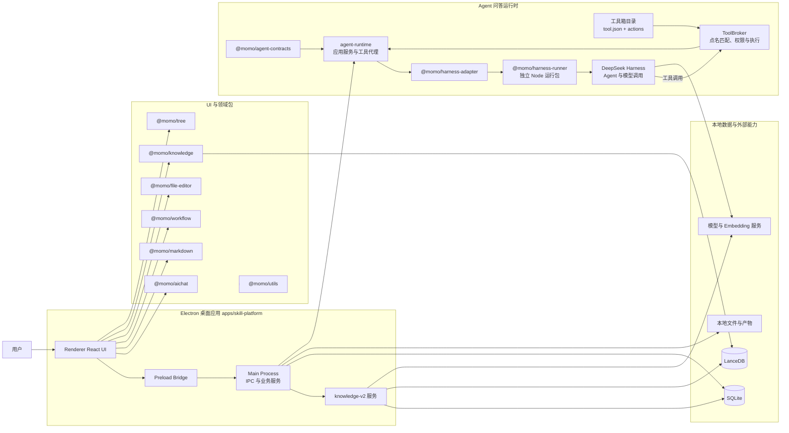
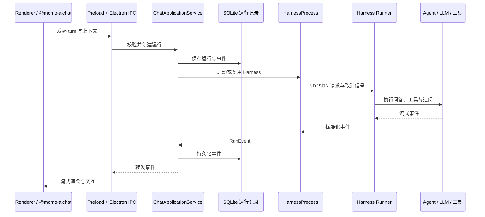
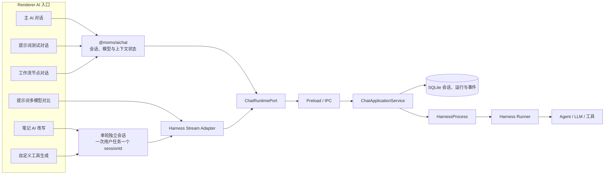
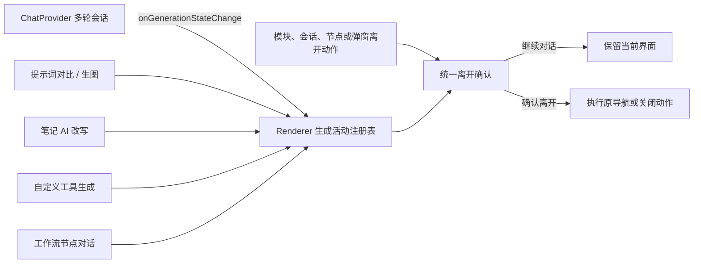
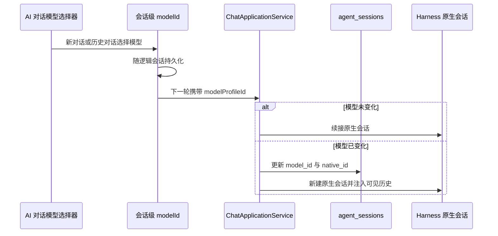
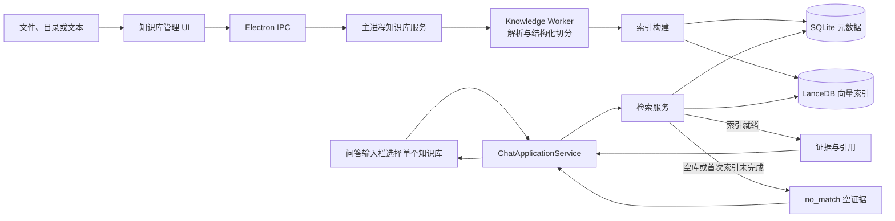

# 系统架构总览

`momo-ai` 是一个以 Electron 桌面应用为入口的 pnpm Monorepo；核心业务在主进程中运行，界面经受控 IPC 调用，并可接入独立的 Agent Harness 与知识库能力。

桌面应用是业务编排入口；各复用包提供界面与领域能力，运行时和知识库分别通过明确的契约、IPC 与本地存储边界协作。

## Agent 问答链路

问答 UI 不直接依赖 Harness 实现；它通过共享契约和 IPC 调用主进程服务，后者负责运行、持久化、工具及生命周期管理。

提示词、规则或已展开 Skill/Command 点名工具箱名称、别名、稳定 ID 或 action 名称时，主进程只把匹配 action 临时加入本轮工具目录；项目策略可长期开放额外 action。所有调用仍经 ToolBroker 完成输入/输出校验、权限审批、执行快照与审计。

### 统一 AI 问答入口

所有用户可见的 AI 问答入口统一进入 Harness。完整对话直接使用 `ChatRuntimePort`；笔记改写和工具生成等单轮编辑器为每次用户任务分配独立 `sessionId`，任务内自动修复复用该会话，下一次发送重新建会话，再通过 Harness Stream Adapter 转为同一运行协议。输入栏中的会话命令不会回落到主对话；日志导出使用当前任务的 `sessionId`，因此上下文、运行日志与其他对话隔离。Renderer 不再保留直连模型、LangGraph 二次问答或隐式回退问答链路。

### 生成中离开保护

`@momo/aichat` 只通过可选回调报告 Provider 内任一会话的生成状态，不依赖宿主导航。Renderer 按业务模块登记多轮与单轮 AI 活动；导航守卫只查询当前可见模块，避免后台仍在完成的任务反复阻塞后续操作。会话列表和工作流步骤切换会进一步使用当前会话或当前节点的状态做精确确认。

### 会话模型切换

模型切换不会混用不同供应商的原生日志：逻辑会话和可见历史保持不变，底层 Harness 原生会话按模型重新建立。

## 知识库链路

知识库以本地元数据和向量索引保存可检索内容。解析、预览和结构化切分统一由 Knowledge Worker 的正式 V2 实现完成，Renderer 中的 `@momo/knowledge` 只保留组件和 UI 类型，不再维护第二套 LangChain 切分链路。用户在对话输入栏选择单个知识库后，主进程在模型调用前检索该集合，并将证据与引用注入问答运行时。`retrieveForChat` 将空库或首次索引未完成归一为 `no_match`，问答继续但必须明确说明没有足够知识证据；知识库管理检索和其他检索故障仍返回结构化错误。
