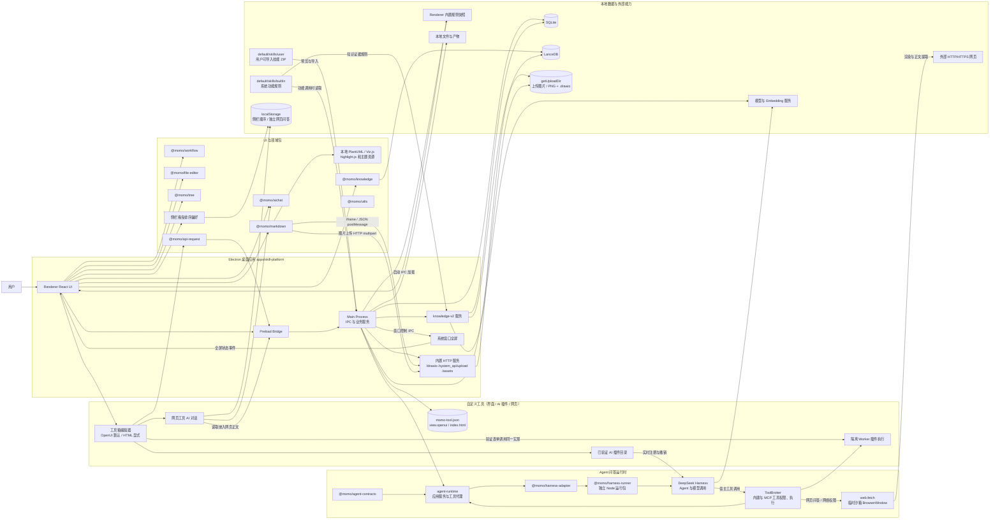
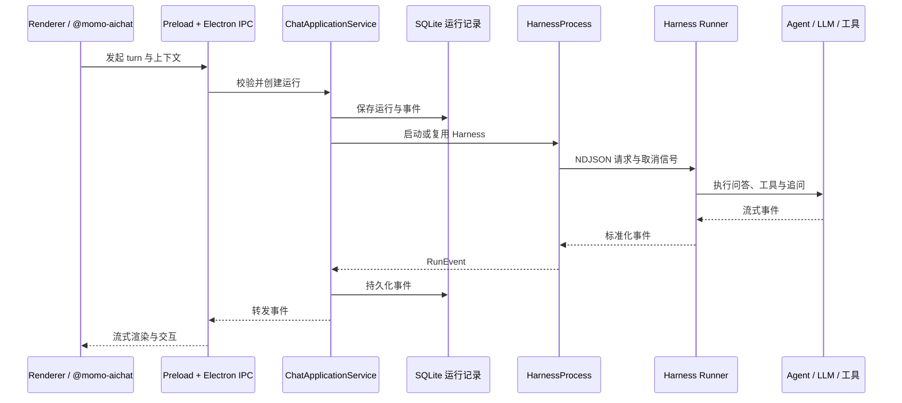
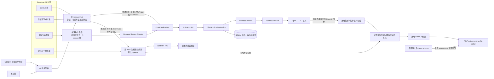
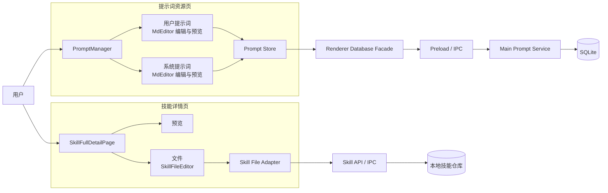
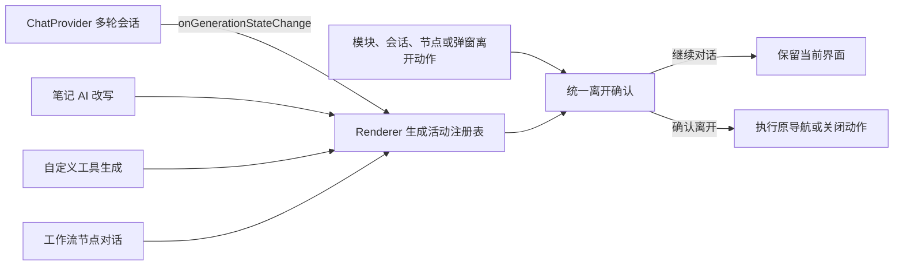
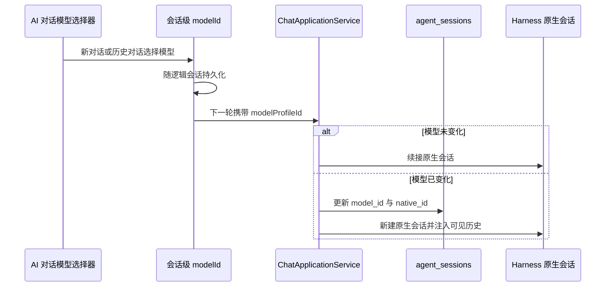
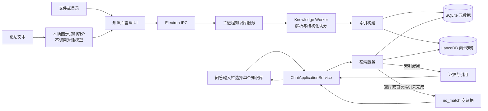
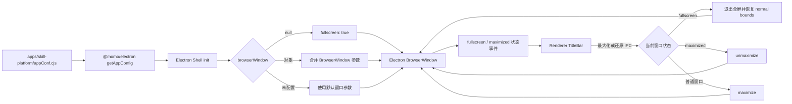

# 系统架构总览

`momo-ai` 是一个以 Electron 桌面应用为入口的 pnpm Monorepo；核心业务在主进程中运行，界面经受控 IPC 调用，并可接入独立的 Agent Harness 与知识库能力。

Renderer 的当前功能入口及内部调用边界见 [Renderer 功能入口](./renderer-entry-points.md)。

开发启动的扫描范围、资源预算及 Vite 到 Electron 的实际服务地址传递见 [Electron 开发启动](./electron-development.md)。

Windows 产品构建将界面依赖编译进前端，运行时 external 依赖归入 `app.asar`，独立 Harness 按实际 profile 依赖闭包生成 tar/Brotli 整块压缩的生产归档，首次使用时流式解出并校验到用户数据缓存；保留原生知识库和完整 Electron 运行能力。详见 [Electron Windows 打包拓扑](./electron-windows-packaging.md)。

默认技能资源拆为 `default/skills/user` 的用户可导入 ZIP 与 `default/skills/builtIn` 的功能规则。Main 加载内置规则，经启动 IPC 提供 Renderer 快照，并将当前部署策略传入 Harness；详情见 [技能资源](./skill-resources.md)。

AI 对话按当前会话或项目草稿绑定目录与多个 Agent 应用，斜杠面板与 Harness 共用所选资源来源。详见 [AI 对话资源引用](./ai-chat-references.md)。

消息中的链接、工作区文件和本轮文件变更统一进入右侧工作面板；文件变更使用实际前后快照，支持保留人工编辑的撤销。详见 [对话工作面板与文件审阅](./chat-workspace-review.md)。

```mermaid
flowchart LR
  User[用户]

  subgraph Desktop["Electron 桌面应用 apps/skill-platform"]
    Renderer[Renderer React UI]
    Preload[Preload Bridge]
    Main["Main Process<br/>IPC 与业务服务"]
    EditorServer["内置 HTTP 服务<br/>/drawio /system_api/upload /assets"]
    KbService["knowledge-v2 服务"]
    Renderer --> Preload --> Main
    Main --> KbService
    Main --> EditorServer
    Window[系统窗口全屏]
    Main -->|窗口控制 IPC| Window
    Window -->|全屏状态事件| Renderer
  end

  subgraph UiPackages["UI 与领域包"]
    AIChat["@momo/aichat"]
    Markdown["@momo/markdown"]
    DiagramRenderer["本地 PlantUML / Viz.js<br/>highlight.js 和主题资源"]
    Workflow["@momo/workflow"]
    FileEditor["@momo/file-editor"]
    Knowledge["@momo/knowledge"]
    Tree["@momo/tree"]
    SidebarOrder[侧栏拖曳排序偏好]
    ApiRequest["@momo/api-request"]
    Utils["@momo/utils"]
  end

  subgraph Runtime["Agent 问答运行时"]
    Contracts["@momo/agent-contracts"]
    RuntimeService["agent-runtime<br/>应用服务与工具代理"]
    WebFetch["web.fetch<br/>临时沙箱 BrowserWindow"]
    ToolBroker["ToolBroker<br/>内建与 MCP 工具权限、执行"]
    Adapter["@momo/harness-adapter"]
    Harness["@momo/harness-runner<br/>独立 Node 运行包"]
    Agent["DeepSeek Harness<br/>Agent 与模型调用"]
    Contracts --> RuntimeService --> Adapter --> Harness --> Agent
    Agent -->|宿主工具调用| ToolBroker --> RuntimeService
    ToolBroker -->|网页问答 / 网络权限| WebFetch
  end

  subgraph CustomViews["自定义工具（界面 / AI 插件 / 网页）"]
    ToolEditor["工具箱编辑器<br/>OpenUI 默认 / HTML 显式"]
    ToolFiles[("momo-tool.json<br/>view.openui / index.html")]
    ToolEditor --> PluginRegistry[已验证 AI 插件目录]
    PluginRegistry -->|实时注册与撤销| Agent
    ToolBroker --> PluginWorker[隔离 Worker 插件执行]
    ToolEditor -->|验证表单调用同一实现| PluginWorker
    ToolEditor --> ApiRequest
    WebAssistant[网页工具 AI 对话]
    ToolEditor --> WebAssistant
  end

  subgraph Storage["本地数据与外部能力"]
    UserSkills["default/skills/user<br/>用户可导入技能 ZIP"]
    BuiltinSkills["default/skills/builtIn<br/>系统功能规则"]
    BuiltinSnapshot[Renderer 内置规则快照]
    SQLite[(SQLite)]
    Lance[(LanceDB)]
    Files[本地文件与产物]
    DiagramAssets[("getUploadDir<br/>上传图片 / PNG + .drawio")]
    Models[模型与 Embedding 服务]
    WebPages[外部 HTTP/HTTPS 网页]
    UiStorage[(localStorage<br/>侧栏顺序 / 独立网页问答)]
  end

  User --> Renderer
  UserSkills -->|预览与导入| Main
  BuiltinSkills -->|功能调用时读取| Main
  Main -->|启动 IPC 加载| BuiltinSnapshot --> Renderer
  BuiltinSkills -->|知识证据规则| KbService
  Renderer --> AIChat
  Renderer --> Markdown
  Markdown --> DiagramRenderer
  Markdown -->|iframe / JSON postMessage| EditorServer
  Markdown -->|图片上传 HTTP multipart| EditorServer
  EditorServer --> DiagramAssets
  Renderer --> Workflow
  Renderer --> FileEditor
  Renderer --> Knowledge
  Renderer --> Tree
  Renderer --> SidebarOrder --> UiStorage
  WebAssistant --> AIChat
  WebAssistant -->|读取嵌入网页正文| Preload
  WebAssistant --> UiStorage
  WebFetch -->|渲染与正文提取| WebPages
  Renderer --> ToolEditor
  ApiRequest --> Preload
  UiPackages --> Utils
  Main --> SQLite
  Main --> Files
  Main --> DiagramAssets
  Main --> ToolFiles
  Main --> RuntimeService
  Knowledge --> Lance
  KbService --> SQLite
  KbService --> Lance
  KbService --> Models
  Agent --> Models
```

桌面应用是业务编排入口；各复用包提供界面与领域能力，运行时和知识库分别通过明确的契约、IPC 与本地存储边界协作。

工具箱、自定义工具、工作流、笔记、知识库和提示词支持同级拖曳，顺序作为本机界面偏好保存，详见 [侧栏拖曳排序](./sidebar-ordering.md)。自定义与系统网页工具共用浮动 AI 对话，Main 从当前 iframe 读取正文，经 `apiInput` 传入实际 Harness 本轮请求；此入口可启用宿主网页抓取工具，以独立临时沙箱窗口读取外部链接。详见 [网页工具 AI 对话](./webpage-assistant.md)。

Markdown 与富文本中的 Mermaid / PlantUML 可进入本地 draw.io 编辑。构建阶段准备固定版本前端资源，桌面运行时由内置 HTTP 服务提供；保存时经 Preload / IPC 将 PNG 与同名 `.drawio` XML 写入 `getUploadDir`，Markdown 仅保留 PNG 地址。详细链路见 [Markdown draw.io 图形编辑](./markdown-drawio-editor.md)。

代码高亮和 PlantUML 预览在 Renderer 内使用打包资源；图表 PNG 下载和 DOCX 导出复用本地 SVG。内置 HTTP 服务通过显式 CSP 父页面来源配置支持桌面与开发页面的 iframe。详见 [Markdown 本地渲染](./markdown-rendering.md)。

图片上传与裁切共用内置 HTTP 上传服务，独立 CJS 路由从服务配置生成静态资源地址，错误响应保留 CORS 响应头。详见 [Markdown 图片上传](./markdown-image-upload.md)。

普通应用内全屏弹框、编辑器和图表查看器由 Renderer 布局管理，覆盖 `--app-titlebar-height` 以下区域。自定义工具的数据展示使用系统窗口全屏：经现有窗口 IPC 调用 Electron `BrowserWindow.setFullScreen`，F11 切换、ESC 退出，状态事件驱动占满屏幕的展示布局；浏览器环境使用 Fullscreen API。详见 [自定义工具视图编辑器](./custom-tool-editor.md)。

文件管理器读取原始字节后按内容识别文本，Markdown 使用分屏编辑，其他 UTF-8 文本使用 CodeMirror，二进制保留专用预览；语言后缀只决定高亮。详见 [文件编辑器](./file-editor.md)。用户技能同步只读取根目录 `SKILL.md`，详见 [技能资源](./skill-resources.md)。

## Agent 问答链路

```mermaid
sequenceDiagram
  participant UI as Renderer / @momo-aichat
  participant IPC as Preload + Electron IPC
  participant Service as ChatApplicationService
  participant Store as SQLite 运行记录
  participant Adapter as HarnessProcess
  participant Harness as Harness Runner
  participant Agent as Agent / LLM / 工具

  UI->>IPC: 发起 turn 与上下文
  IPC->>Service: 校验并创建运行
  Service->>Store: 保存运行与事件
  Service->>Adapter: 启动或复用 Harness
  Adapter->>Harness: NDJSON 请求与取消信号
  Harness->>Agent: 执行问答、工具与追问
  Agent-->>Harness: 流式事件
  Harness-->>Adapter: 标准化事件
  Adapter-->>Service: RunEvent
  Service->>Store: 持久化事件
  Service-->>IPC: 转发事件
  IPC-->>UI: 流式渲染与交互
```

问答 UI 不直接依赖 Harness 实现；它通过共享契约和 IPC 调用主进程服务，后者负责运行、持久化、工具及生命周期管理。

工具箱的“AI 工具”经过 Schema、执行测试与版本校验后进入 Agent 工具目录，以 Cordis 插件挂载到会话；ToolBroker 代理内建、MCP 与自定义 AI 插件。增删改实时刷新已有会话。界面显示与网页入口不注册可执行工具，详见 [自定义工具编辑器](./custom-tool-editor.md)。

### 统一 AI 问答入口

```mermaid
flowchart LR
  subgraph Surfaces[Renderer AI 入口]
    MainChat[主 AI 对话]
    WorkflowChat[工作流节点对话]
    NoteComposer[笔记 AI 改写]
    ToolComposer[自定义工具生成]
  end

  MainChat --> ChatState["@momo/aichat<br/>会话、模型与上下文状态"]
  ChatState -->|未调用 Skill 或 Command 的界面模式| ProtocolStream
  ProtocolStream -->|每轮界面快照| ViewHistory[完整聊天列表 / 既有会话持久化]
  WorkflowChat --> ChatState
  NoteComposer --> ScopedSession[单轮独立会话<br/>一次用户任务一个 sessionId]
  ToolComposer --> ProtocolStream[无 tools 的视图生成流<br/>默认 OpenUI]
  ProtocolStream --> AIHttp[AI HTTP IPC]
  AIHttp --> Model[配置的对话模型]
  Notes[笔记树] --> MentionMenu["@ 引用菜单"]
  WorkspaceFiles[当前项目工作区文件树] --> MentionMenu
  MentionMenu --> ChatState
  ScopedSession --> StreamAdapter[Harness Stream Adapter]
  ChatState -->|普通问答 / 计划 / 显式 Skill 或 Command| RuntimePort[ChatRuntimePort]
  StreamAdapter --> RuntimePort
  RuntimePort --> IPC[Preload / IPC]
  IPC --> Service[ChatApplicationService]
  Service --> Store[(SQLite 会话、运行与事件)]
  Service --> Process[HarnessProcess]
  Process --> Runner[Harness Runner]
  Runner --> Agent[Agent / LLM / 工具]
  Agent -->|技能界面轮次的 OpenUI 围栏| RuntimeView[通用投影 / 共享组件校验]
  RuntimeView --> ViewHistory
  ViewHistory --> ViewPreview[通用 OpenUI 预览]
  ViewPreview --> FilePreview[FilePreview / momo-file-editor]
  SourceStore[会话原文件 Source Store] -->|准入 sourceRefs 读取字节| FilePreview
```

普通问答、计划模式及界面模式中的显式 Skill/Command 调用统一进入 Harness。技能正文附带真实资源目录，Agent 按技能读取参考文件、使用脚本和模板；上传原文件在所有模式中保留。完整对话直接使用 `ChatRuntimePort`；笔记改写等单轮编辑器为每次用户任务分配独立 `sessionId`，再通过 Harness Stream Adapter 转为同一运行协议。提示词资源页只负责编辑和持久化，不再提供测试对话或多模型对比入口。自定义工具中的界面显示与未调用技能或命令的聊天界面请求共用无宿主 tools、无知识库检索的 AI HTTP 文本流，生成 OpenUI Lang（默认）或明确要求的单文件 HTML，并在 Renderer 校验与修复。聊天生成和修复使用简洁展示规则，工具箱使用自身视觉规则。工具箱保存时由 Main 再次校验路径、大小和视图类型；纯聊天界面生成按轮保存预览与源码，保留所有问答记录，详见 [AI 对话界面模式](./ai-chat-interface-mode.md)。主对话输入 `@` 时，未选择工作区仍展示原笔记树；已选择工作区时按“笔记 / 工作区文件”分类展示，只读取当前项目已注册目录内的显式文件引用。输入栏中的会话命令仍明确进入 Harness；Renderer 不保留隐式回退问答链路。

## 提示词与技能资源编辑

```mermaid
flowchart LR
  User[用户]

  subgraph PromptResource[提示词资源页]
    PromptManager[PromptManager]
    UserEditor["用户提示词<br/>MdEditor 编辑与预览"]
    SystemEditor["系统提示词<br/>MdEditor 编辑与预览"]
    PromptStore[Prompt Store]
    PromptManager --> UserEditor
    PromptManager --> SystemEditor
    UserEditor --> PromptStore
    SystemEditor --> PromptStore
  end

  subgraph SkillResource[技能详情页]
    SkillDetail[SkillFullDetailPage]
    SkillPreview[预览]
    SkillFiles["文件<br/>SkillFileEditor"]
    SkillAdapter[Skill File Adapter]
    SkillDetail --> SkillPreview
    SkillDetail --> SkillFiles --> SkillAdapter
  end

  User --> PromptManager
  User --> SkillDetail
  PromptStore --> RendererDb[Renderer Database Facade]
  RendererDb --> IPC[Preload / IPC]
  IPC --> PromptService[Main Prompt Service]
  PromptService --> SQLite[(SQLite)]
  SkillAdapter --> SkillApi[Skill API / IPC]
  SkillApi --> Repositories[(本地技能仓库)]
```

提示词的用户内容与系统内容在界面中等高展示，并复用笔记所用的 Markdown 编辑、预览和附件上传能力；保存仍沿 Prompt Store 与 IPC 写入 SQLite。技能详情只保留预览和文件两个入口，原始文件的查看与修改统一由文件编辑器及其受控适配器完成。

### 生成中离开保护

```mermaid
flowchart LR
  ChatProvider[ChatProvider 多轮会话] -->|onGenerationStateChange| Activity[Renderer 生成活动注册表]
  NoteComposer[笔记 AI 改写] --> Activity
  ToolComposer[自定义工具生成] --> Activity
  WorkflowChat[工作流节点对话] --> Activity
  Navigation[模块、会话、节点或弹窗离开动作] --> Guard[统一离开确认]
  Activity --> Guard
  Guard -->|继续对话| Stay[保留当前界面]
  Guard -->|确认离开| Leave[执行原导航或关闭动作]
```

`@momo/aichat` 只通过可选回调报告 Provider 内任一会话的生成状态，不依赖宿主导航。Renderer 按业务模块登记多轮与单轮 AI 活动；导航守卫只查询当前可见模块，避免后台仍在完成的任务反复阻塞后续操作。会话列表和工作流步骤切换会进一步使用当前会话或当前节点的状态做精确确认。

### 会话模型切换

```mermaid
sequenceDiagram
  participant UI as AI 对话模型选择器
  participant State as 会话级 modelId
  participant Service as ChatApplicationService
  participant Store as agent_sessions
  participant Harness as Harness 原生会话

  UI->>State: 新对话或历史对话选择模型
  State->>State: 随逻辑会话持久化
  State->>Service: 下一轮携带 modelProfileId
  alt 模型未变化
    Service->>Harness: 续接原生会话
  else 模型已变化
    Service->>Store: 更新 model_id 与 native_id
    Service->>Harness: 新建原生会话并注入可见历史
  end
```

模型切换不会混用不同供应商的原生日志：逻辑会话和可见历史保持不变，底层 Harness 原生会话按模型重新建立。

## 知识库链路

```mermaid
flowchart LR
  Source[文件或目录] --> Manager[知识库管理 UI]
  Paste[粘贴文本] --> LocalChunk[本地固定规则切分<br/>不调用对话模型]
  LocalChunk --> Manager
  Manager --> IPC[Electron IPC]
  IPC --> KbService[主进程知识库服务]
  KbService --> Worker[Knowledge Worker<br/>解析与结构化切分]
  Worker --> Index[索引构建]
  Index --> SQLite[(SQLite 元数据)]
  Index --> Lance[(LanceDB 向量索引)]
  Chat[问答输入栏选择单个知识库] --> Runtime[ChatApplicationService]
  Runtime --> Retrieve[检索服务]
  Retrieve --> SQLite
  Retrieve --> Lance
  Retrieve -->|索引就绪| Evidence[证据与引用]
  Retrieve -->|空库或首次索引未完成| NoMatch[no_match 空证据]
  Evidence --> Runtime
  NoMatch --> Runtime
  Runtime --> Chat
```

知识库以本地元数据和向量索引保存可检索内容。解析、预览和结构化切分统一由 Knowledge Worker 的正式 V2 实现完成，Renderer 中的 `@momo/knowledge` 只保留组件和 UI 类型，不再维护第二套 LangChain 切分链路。粘贴入库固定使用本地规则切分，不调用对话或文本切分模型；随后仍调用已配置的嵌入模型生成向量并写入 LanceDB，因此入库完成后可参与向量检索。用户在对话输入栏选择单个知识库后，主进程在模型调用前检索该集合，并将证据与引用注入问答运行时。`retrieveForChat` 将空库或首次索引未完成归一为 `no_match`，问答继续但必须明确说明没有足够知识证据；知识库管理检索和其他检索故障仍返回结构化错误。

## 桌面窗口启动配置

```mermaid
flowchart LR
  AppConf["apps/skill-platform/appConf.cjs"] --> Config["@momo/electron getAppConfig"]
  Config --> Shell["Electron Shell init"]
  Shell --> WindowMode{"browserWindow"}
  WindowMode -->|null| Fullscreen["fullscreen: true"]
  WindowMode -->|对象| Options["合并 BrowserWindow 参数"]
  WindowMode -->|未配置| Defaults["使用默认窗口参数"]
  Fullscreen --> Window[Electron BrowserWindow]
  Options --> Window
  Defaults --> Window
  Window --> StateEvents["fullscreen / maximized 状态事件"]
  StateEvents --> TitleBar[Renderer TitleBar]
  TitleBar -->|最大化或还原 IPC| RestoreMode{"当前窗口状态"}
  RestoreMode -->|fullscreen| ExitFullscreen["退出全屏并恢复 normal bounds"]
  RestoreMode -->|maximized| Unmaximize[unmaximize]
  RestoreMode -->|普通窗口| Maximize[maximize]
  ExitFullscreen --> Window
  Unmaximize --> Window
  Maximize --> Window
```

业务应用通过根目录 `appConf.cjs` 覆盖共享 Electron 壳层配置。`browserWindow` 为对象时继续覆盖窗口参数，为 `null` 时表示应用以操作系统全屏模式启动；未配置时使用共享壳层默认尺寸。主进程向 Renderer 同步全屏和最大化状态，标题栏据此切换最大化/还原图标；还原操作优先退出全屏，再使用 Electron 保存的 normal bounds 或原生 unmaximize 回到此前的位置与宽高。Windows 无边框主窗口保持 `resizable` 和 `thickFrame`，退出全屏后由系统提供四边及四角缩放。

AI 对话的代码执行和生成文件统一使用既有 `temp/<sessionId>`；生成文档经 artifact.create 注册后以真实 sourceRef 进入 momo-file-editor，见 [Harness 集成](./ai-chat-harness-integration-design.md)。界面模式隐藏文件修改统计和记录；标书分析以全宽 Tabs 展示，只有模板 Tab 预览截取的 Word，见 [标书解析技能](./tender-document-parser-skill.md)。自定义工具的全屏控制位于内容区内，悬停显示，全屏时隐藏顶部标题和编辑控件。
