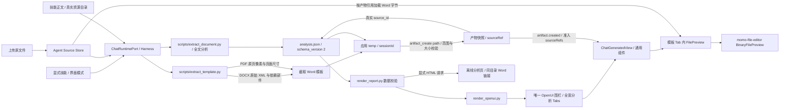

# 标书解析技能架构

`.cursor/skills/tender-document-parser` 把 PDF/DOCX 分析为带原文证据的动态数据；十个一级 Tab 固定，二级 Tab、表头和内容随文档生成。投标模板从原件截取为 Word，分析页不再显示右侧原招采文件预览。

业务布局与显隐由技能维护，宿主不按技能名分支。`template-extraction.md` 定义截取、视觉核验与产物注册步骤；`data-contract.md` 的模板块使用 `document.name/source_id/extraction`，不再用纯文本重建模板，也不再要求原件 sources.json 映射。

DOCX 路径仅裁剪正文 XML，保留原包内样式、编号、关系、图片和有效节属性。PDF 路径以 PyMuPDF 渲染选定物理页，按原尺寸嵌入 Word，明确标注图像内容不可逐字编辑。截取脚本测试校验原件不变、依赖部件字节、节属性、原页像素和尺寸；字体与分页的最终一致性仍需针对实际文件在 momo-file-editor 中视觉核验，未核验时不得宣称完全一致。

所有过程文件和交付文件保存到现有 `temp/<sessionId>`。宿主通过 artifact_create 读取该目录内的真实文件，生成持久化快照和预览引用；OpenUI 只持有引用，不嵌入原文件或 Word 字节。离线 HTML 不模拟宿主阅读器。
