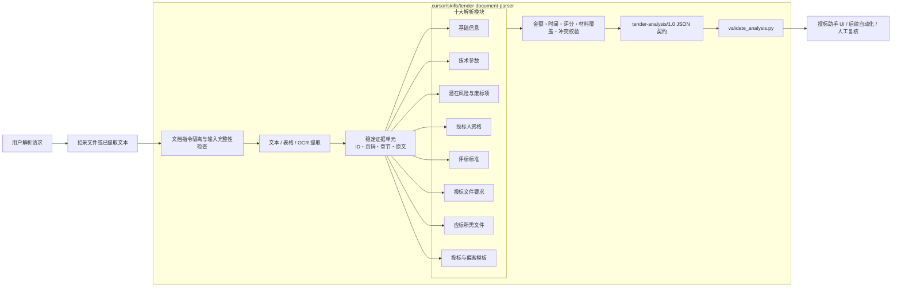

# 标书解析技能架构

`tender-document-parser` 是项目级技能，将 DOCX、PDF、图片或上游文本块转换为带原文证据的统一投标分析 JSON。技能只分析用户指定的招采材料，不主动查询企业信用、证书或其他外部事实。

模块共享同一证据定位，同一条款可以因用途进入不同模块，但不能失去原文来源。固定模块即使无内容也保留空结构；冲突值不静默覆盖，而是进入 `cross_checks.contradictions`。校验器负责阻止缺失模块、嵌套 JSON 字符串、证据结构错误和明显编码损坏进入下游。
