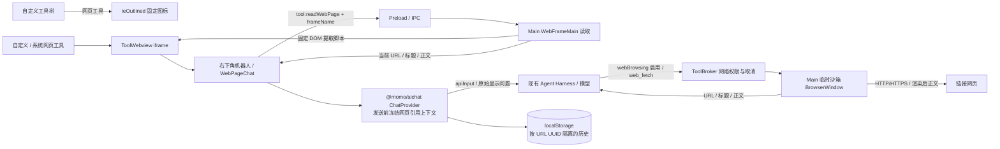

# 网页工具 AI 对话

`ToolWebview` 供自定义网页和系统网页共用。机器人打开右下角宽 50%、高 75%、最小宽度 420px 的对话区。关闭按钮左侧的放大按钮切换至整个网页区域，并可还原；尺寸切换不卸载 iframe 或对话。关闭时隐藏已挂载的对话，保留草稿和进行中的问答。首次打开读取正文并预填总结要求，每次发送重新读取当前页面，引用正文作为用户消息中的资料，显示记录保留用户原始问题。

`@momo/aichat` 将预处理后的正文与问题通过 `RuntimeTurnInput.apiInput` 传递，显示问题仍在 `displayInput` 和 `rawIntent`。Main 以 `apiInput` 进行业务资源预处理，得到实际 Harness 本轮 `prompt`；不能只把网页正文放入 `history`，因为本轮历史会被裁去，续聊也直接沿用 Harness 原生日志。重试复用请求快照中的正文，后续新问答重新读取页面。

Main 只接受宿主主 frame 发起的读取，查找该窗口直接子 frame 中匹配的工具网页，限定 HTTP/HTTPS。提取渲染后 `article`、`main` 或 `body` 的可见文字，排除脚本、表单值与隐藏内容；正文上限 60,000 字并标记截取。无法读取时显示错误并阻止该次发送，避免仅依据 URL 回答。

自定义网页工具统一使用 Ant Design 的 `IeOutlined` 固定图标；Renderer 不请求站点 favicon，Preload 和 Main 不提供图标获取接口。网页中不注入宿主 API。

网页问答入口通过既有 Harness IPC 携带 `webBrowsing: true`，Main 仅为这些轮次注册宿主 `web.fetch`（模型名 `web_fetch`）。它按现有 ToolBroker 网络权限执行，在无 Preload、无 Node 集成的独立临时沙箱窗口加载 HTTP/HTTPS 链接，读取渲染后的正文；不沿用用户登录态，禁止权限请求、下载、弹窗及非 HTTP 重定向。读取最多 60,000 字，加载上限 20 秒；成功、错误、取消与超时均销毁窗口并关闭网络连接。普通问答不增加此工具，自定义工具视图也不注册为执行工具。

网页 URL 通过 UUID v5 生成稳定会话 ID 和独立存储前缀。问答随更新即时持久化，关闭重开、切换工具及重启后恢复该页历史；引用正文保存于请求快照，供后续问答和重试复用。
