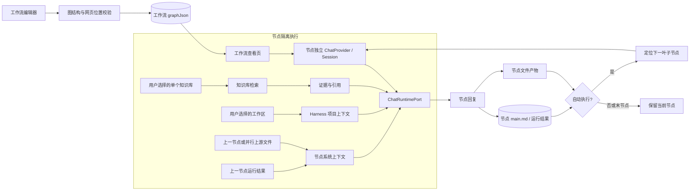
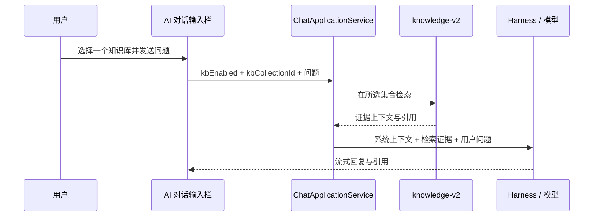

# 工作流执行架构

工作流编辑器以串行宏观步骤组织提示词、技能、网页和并行组。保存时统一校验图结构；网页节点只能位于首个宏观步骤，避免自动执行链路在中途进入必须人工操作的网页节点。

每个非网页节点使用独立的存储前缀和会话，互不继承聊天历史；跨节点只传递明确的上游运行结果、文件上下文，以及用户为当前节点选择的工作区和知识库。自动执行开启后，完成回复会覆盖当前节点运行结果，再按串行及并行子节点顺序创建下一节点的新一轮问答。网页节点始终要求人工填写运行结果，且其自动执行开关不可用。

## 对话知识库选择

知识库选择是单选状态；关闭输入栏中的知识库标签会同时关闭本轮后续检索。
