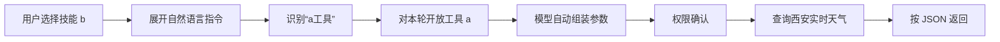

# 自然语言流程：工具 a → 技能 b → AI 对话

这个流程面向普通用户。用户只需记住自己取的名字「a」和「b」，不需要了解工具 ID、action、变量名、JSON Schema 或调用参数。

## 使用前准备

1. 在「设置」中配置一个可用的文本模型，工具的自然语言生成需要使用它。
2. 确认电脑可以访问互联网；天气工具执行时需要联网。
3. 本例使用不需要用户填写密钥的 Open-Meteo 接口。

## 用户最终只需输入三句话

| 在哪里     | 用户输入                              |
| ---------- | ------------------------------------- |
| 创建工具 a | `请显示当前西安的实时天气`            |
| 创建技能 b | `调用a工具，将天气进行JSON化处理返回` |
| AI 对话    | `帮我查一下现在西安的天气`            |

## 第一步：创建工具 a

1. 打开「工具箱」。
2. 点击「新增工具」。
3. 名称填写 `a`，点击「确定」。
4. 系统会直接进入自然语言生成界面。
5. 输入：

```text
请显示当前西安的实时天气
```

6. 点击发送，等待出现「工具文件已生成并保存」。

用户到这里已经完成工具创建。系统会自动：

- 保存工具的内部稳定标识。
- 生成可供 AI 调用的天气查询能力。
- 选择输入和返回数据结构。
- 声明网络权限、超时时间和错误处理。
- 把用户可见名称 `a` 保留为可识别别名。

## 第二步：创建技能 b

1. 打开「我的 Skills」。
2. 点击右上角「新建」。
3. 选择「手动创建」。
4. 技能名称填写 `b`。
5. 在「指令」中只填写：

```text
调用a工具，将天气进行JSON化处理返回
```

6. 点击「创建技能」。

「技能描述」、图标、版本、作者和标签都是可选项，已收起到「更多设置」中。用户不需要把工具的内部 ID 或参数复制到技能里。

## 第三步：在 AI 对话中使用技能 b

1. 打开「AI对话」。
2. 在输入框输入 `/b`。
3. 在弹出列表中选中技能 b，输入框中会出现技能标签。
4. 在标签后输入：

```text
帮我查一下现在西安的天气
```

5. 点击发送。
6. 如果弹出网络/代码执行授权，点击「允许本次」。

模型会根据工具的真实描述自动发起调用。用户不需要知道调用参数。

## 预期结果

每次的天气数值会随实际情况变化，返回形式类似：

```json
{
  "city": "西安",
  "observedAt": "2026-09-19T21:30",
  "timezone": "Asia/Shanghai",
  "temperatureC": 24.1,
  "apparentTemperatureC": 24.6,
  "humidityPercent": 61,
  "precipitationMm": 0,
  "weatherCode": 1,
  "windSpeedKmh": 8.4,
  "source": "Open-Meteo"
}
```

上面的数值只是格式示例，不代表当前实时天气。真正对话时，结果来自工具当次网络查询。

## 系统自动处理的内容



为了让「a工具」、「工具a」、「工具 a」等人类常用说法都能工作，系统会对工具的用户可见名称做空格、大小写和「工具」前后缀归一化。单字母名称只有在「a工具/工具a」这种明确语境中才会匹配，不会因普通文本里出现一个字母 `a` 就开放工具。

## 可运行示例文件

仓库同时保留了一份可运行的开发者示例，用于回归测试：

- `tool-a/tool.json`：工具清单。
- `tool-a/actions/current-weather.mjs`：通过 Open-Meteo 查询西安当前天气。
- `skill-b/SKILL.md`：只保留用户会写的自然语言指令。

实际用户不需要打开或编辑这些文件。

## 常见情况

- 第一次执行时出现网络或代码执行确认：点击「允许本次」，这是正常的安全确认。
- 生成阶段如果模型第一次只给出方案或询问确认：系统会识别为无效工具输出并自动修复一次，用户不需要回复“确认”。
- 工具生成内容没有通过校验：系统不会发布半成品；仍然只需用自然语言补充“请生成可供 AI 对话调用的天气查询能力”后重试。
- 输入 `/b` 后没有候选项：先确认技能创建成功，再重新打开 AI 对话。
- 返回的是解释文字而不是 JSON：确认输入框中已经选中了技能 `b`，然后重新发送问题。
