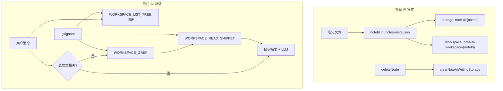

# 笔记 AI 写作按文件隔离 & AI 对话工作区按需检索 — 设计规格

> 日期：2026-06-28  
> 状态：已确认  
> 范围：skill-platform 笔记模块 AI 写作状态隔离；侧栏 AI 对话工作区 gitignore + Grep/Read 检索

---

## 1. 背景与问题

### 1.1 笔记 AI 写作 — 全局共享状态

当前 `NoteAiWritingModal` 使用固定 `storageKeyPrefix: 'skill-platform-note-ai-writing'`，所有笔记共用：

- 对话历史（sessions / currentSessionId）
- 模型选择（CURRENT_MODEL）
- RAG / 高级设置（ADVANCED_SETTINGS：kbEnabled、kbCollectionId、temperature 等）
- 工作区（全局 `chat-workspace-storage` via `useChatWorkspaceBinding`）

`filePath` 仅用于弹窗标题，切换文件后 AI 写作状态不隔离。

### 1.2 AI 对话 — 工作区全量读文件

当前 `buildWorkspaceContext` 在工作区根目录列出最多 30 个文本文件并读入 system prompt（约 8 万字符）。问题：

- 不解析 `.gitignore`，可能读入 `node_modules` 等（虽 list 跳过部分目录，但不完整）
- 无关键词检索，与问题无关的文件也被注入
- 大仓库性能差、上下文浪费

---

## 2. 已确认的产品决策

| 项 | 决策 |
|---|---|
| 笔记 AI 历史绑定 | **B**：稳定 `noteId` 绑定；重命名/移动后历史保留；删除后清理 |
| 工作区检索策略 | **D（混合）**：始终注入目录树摘要；仅相关问题时 Grep + Read 片段 |
| 笔记 AI 隔离范围 | 历史、模型、RAG、工作区均按 `noteId` 独立 |
| AI 对话范围 | 仅侧栏 AI 对话（`createGeneralChatStream` 链路）；笔记 AI 写作、工作流节点对话不在本次范围 |
| 复制笔记 | 新 `noteId`，独立空状态 |

---

## 3. 需求 2：笔记 AI 写作按文件隔离

### 3.1 数据模型 — `.notes-meta.json`

扩展 meta entry：

```typescript
interface INoteMetaEntry {
  noteType: ENoteType;
  noteId: string; // UUID v4，创建时生成
}
```

| 操作 | noteId 行为 |
|------|-------------|
| createFile | 生成新 UUID |
| rename / move | `renameMetaEntry` 迁移 path key，**保留** entry 内 noteId |
| copyFile | 新文件新 UUID |
| deleteNode | 删除文件后清理该 noteId 的 localStorage |
| 存量迁移 | 读取 tree 时为无 noteId 的 entry 补 UUID 并 persist |

### 3.2 持久化键名

| 状态 | 键 / 前缀 |
|------|-----------|
| 对话 / 模型 / RAG | `buildStorageKeys('note-ai-{noteId}')` |
| 工作区 | `note-ai-workspace-{noteId}`（`useChatWorkspaceConfig` 的 storageKey） |

参考工作流节点：`buildWorkflowNodeChatPrefix(workflowId, businessId, nodeId)`。

### 3.3 UI 与组件

- `NoteAiWritingModal` 接收 `noteId` + `filePath`（标题展示）
- `storageKeyPrefix` 动态：`note-ai-${noteId}`
- 工作区：`useChatWorkspaceConfig({ storageKey: 'note-ai-workspace-${noteId}', selectFolder })`，不再用全局 `useChatWorkspaceBinding`
- 切换文件：`key={noteId}` 重挂载 `ChatProvider`，防止内存态串线
- `NoteManager` / note store：selectFile 时解析当前文件的 noteId（IPC 返回或 tree meta）

### 3.4 删除清理

新增 `clearNoteAiWritingStorage(noteId: string)`：

- 移除 `note-ai-{noteId}-sessions`、`-current-session-id`、`-current-model`、`-advanced-settings`
- 移除 `note-ai-workspace-{noteId}`

在 `deleteNode` 成功路径调用（需先读取被删节点的 noteId）。

### 3.5 API 变更

- `INoteTreeNode` 增加可选 `noteId?: string`（文件节点）
- `readFile` / `createFile` 等返回 `noteId`
- 新增 IPC 或通过 listTree meta 暴露 noteId 给 renderer

---

## 4. 需求 3：AI 对话工作区混合检索

### 4.1 主进程 IPC（gitignore 感知）

新增通道（命名示意）：

| 通道 | 职责 |
|------|------|
| `WORKSPACE_LIST_TREE` | 递归目录树，深度上限，**不读文件内容** |
| `WORKSPACE_GREP` | 关键词搜索，返回 `{ filePath, line, column, snippet }[]` |
| `WORKSPACE_READ_SNIPPET` | 按文件 + 行号读取上下文片段 |

**gitignore 规则：**

- 使用 `ignore` 包解析各 workspace root 及其父链 `.gitignore`
- 被 ignore 的路径：list / grep / read **一律拒绝**
- 保留现有硬编码跳过：`.git`、`node_modules`（与 gitignore 叠加）

依赖：`ignore`（添加至 `apps/skill-platform`）。

### 4.2 渲染层 — 上下文组装

替换 `buildWorkspaceContext` 全量读文件逻辑：

**始终注入（工作区 enabled 且有 paths）：**

```
当前工作区：/path/a, /path/b
目录结构（不含文件内容）：
  src/
    components/
  ...
```

**条件注入 — 启发式判定「与工作区相关」：**

满足任一即触发 Grep + Read：

- 路径片段：含 `/` 的文件路径、`*.ts`、`package.json` 等
- 标识符：PascalCase / camelCase 词（长度 ≥ 3）
- 错误/配置：HTTP 路径、`E[A-Z]` 枚举、全大写下划线常量
- 中文开发词：报错、接口、类、函数、配置、实现、模块 等

流程：

1. 从用户最后一条消息提取 1–5 个关键词
2. `WORKSPACE_GREP`（每个 workspace root）
3. 取 Top N 命中（去重文件）
4. `WORKSPACE_READ_SNIPPET` 带 ±8 行上下文
5. 拼接注入 system prompt

**移除：** 现有「读前 30 文件全量注入」逻辑。

### 4.3 限制常量

| 常量 | 值 |
|------|-----|
| `MAX_TREE_DEPTH` | 4 |
| `MAX_TREE_NODES` | 500 |
| `MAX_GREP_HITS` | 20 |
| `MAX_SNIPPET_TOTAL_CHARS` | 24000 |
| `SNIPPET_CONTEXT_LINES` | 8 |
| `MAX_GREP_KEYWORDS` | 5 |

### 4.4 文件布局（主进程）

```
apps/skill-platform/src/main/services/workspace/
  gitignore-filter.ts   # 加载/合并 ignore 规则
  list-tree.ts          # 目录树
  grep.ts               # 文本搜索
  read-snippet.ts       # 片段读取
```

`main/ipc/workspace.ts` 注册新 handler，复用上述模块。

### 4.5 渲染层文件

```
apps/skill-platform/src/renderer/services/workspace/
  context.ts            # 改造：tree summary + 条件 grep
  relevance-heuristic.ts # 关键词提取与相关性判定
  keyword-extract.ts    # 从用户消息抽关键词
  api.ts                # 暴露新 IPC
```

`general-chat-stream.ts` 继续调用 `getEnabledWorkspaceContext()`，内部实现切换为新逻辑。

---

## 5. 架构图



---

## 6. 明确不做（第一版）

- 笔记 AI 写作的工作区 gitignore/Grep（可后续复用 IPC）
- 工作流节点对话的工作区改造
- LLM 二次分类判断是否需要 Grep（仅用启发式）
- 云同步 note AI 状态
- 删除笔记时二次确认是否保留 AI 历史（删除即清）

---

## 7. 验收标准

### 需求 2

1. 打开笔记 A 的 AI 写作，对话后关闭；切换到笔记 B，历史为空（或 B 自有历史）
2. 笔记 A 选模型 X、启用 RAG 集合 Y、绑定工作区 Z；切换回 A 仍保留 X/Y/Z
3. 重命名笔记 A 后，AI 写作历史与设置仍在
4. 删除笔记 A 后，localStorage 中无 `note-ai-{noteId}` 相关键

### 需求 3

1. 工作区含 `node_modules` 且 `.gitignore` 忽略它：目录树与 Grep 均不出现其下文件
2. 问「这个项目怎么跑」：仅有目录树摘要，无大段文件内容
3. 问「`NoteAiWritingModal` 在哪」：Grep 命中并注入相关代码片段
4. 侧栏对话响应时间：Grep 路径不明显劣于旧版全量读（大仓库应更快）

---

## 8. 实现计划索引

- 需求 2：`docs/superpowers/plans/2026-06-28-note-ai-per-file.md`
- 需求 3：`docs/superpowers/plans/2026-06-28-workspace-grep-retrieval.md`

两计划可独立实施、独立验收；建议先完成需求 2（改动面小），再完成需求 3。
