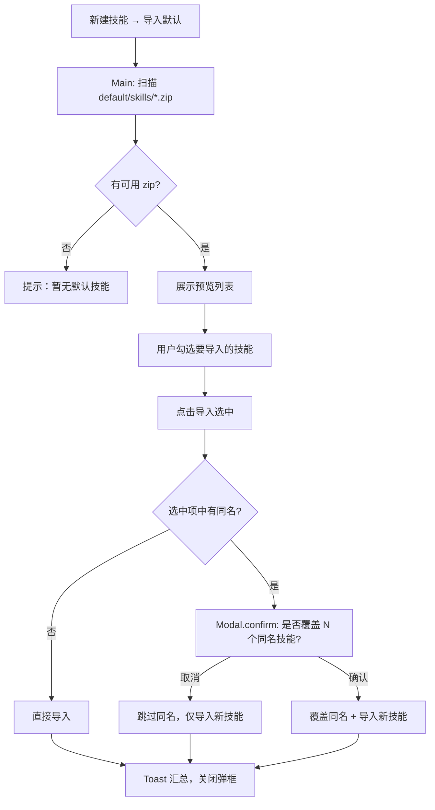

# 默认技能包导入 — 设计规格

> 日期：2026-06-30  
> 状态：已确认  
> 范围：skill-platform 新建技能弹框新增「导入默认」；内置 zip 批量解压导入到「我的技能」

---

## 1. 背景与目标

用户首次使用或需要快速获得常用技能时，应能从应用内置的默认技能包一键导入，而无需手动创建或从 GitHub / 本地扫描。

**目标：**

- 在 `apps/skill-platform/default/skills/` 放置内置 zip 技能包
- 在「新建技能」弹框增加「导入默认」入口
- 先预览列表，用户勾选后导入
- 若选中项中存在与库中**同名**技能，导入前一次性询问是否全部覆盖

---

## 2. 已确认的产品决策

| 项 | 决策 |
|---|---|
| 同名冲突 | **B**：选中项含同名时，弹一次确认「是否全部覆盖」；确认 → 覆盖全部选中同名项；取消 → 跳过同名、仅导入新技能 |
| 交互流程 | **B**：先展示预览列表，用户勾选后再导入（非一键直接导入） |
| 已存在标识 | 按**技能名称**（不区分大小写）与库中比对 |
| 默认勾选 | 未存在的技能默认勾选；已存在的默认不勾选，用户可手动勾选以参与覆盖 |
| 预览 UI | 复用 `SkillScanPreview` 模式，隐藏「重新扫描 / 自定义路径」 |

---

## 3. 目录与打包

```
apps/skill-platform/
└── default/
    └── skills/
        ├── skill-creator.zip
        └── ...
```

| 项 | 说明 |
|---|---|
| Zip 格式 | 与现有 `exportZip` 一致：根目录或单层根文件夹内含 `SKILL.md` 及附属文件 |
| 运行时路径 | `path.join(getProjectRoot(), 'default', 'skills')` |
| 开发环境 | 与 `configureElectronBasePaths` 一致，`getAPPRootPath()` 指向 `apps/skill-platform` |
| 打包 | `electron-builder.json` 的 `files` 增加 `"default/**/*"` |

---

## 4. 用户流程



**覆盖确认文案：**

> 选中的技能中有 **N** 个与库中已有技能同名，是否覆盖？  
> 覆盖将替换本地文件和 SKILL.md 内容，此操作不可撤销。

---

## 5. 架构

### 5.1 Main 服务

新增 `apps/skill-platform/src/main/services/skill/default-skills.ts`：

| 方法 | 职责 |
|------|------|
| `getDefaultSkillsDir()` | 返回 `default/skills` 绝对路径 |
| `listDefaultSkillPreviews(db)` | 读取所有 `.zip` → 解压到临时目录 → 解析 SKILL.md → 标记是否已安装 |
| `importDefaultSkills(db, zipFileNames, { overwrite })` | 按选择与覆盖策略导入 |

解压逻辑复用 `skillhub-archive.ts` 中的 `normalizeZipEntryPath`、`stripCommonZipRootPrefix`、`findSkillMdFile` 模式（可抽公共 util 或内联复制最小子集）。

### 5.2 数据结构

```typescript
interface IDefaultSkillPreview {
  zipFileName: string;
  name: string;
  description: string;
  version?: string;
  author: string;
  tags: string[];
  instructions: string;
  /** 解压后的临时目录，供 import 复用 */
  extractDir: string;
  isInstalled: boolean;
  existingSkillId?: string;
}

interface IDefaultSkillImportResult {
  imported: number;
  overwritten: number;
  skipped: number;
  failed: Array<{ zipFileName: string; reason: string }>;
}
```

预览数据映射为 `IScannedSkill` 供 `SkillScanPreview` 使用：

- `localPath` = `default:${zipFileName}`（唯一键）
- `filePath` = `${extractDir}/SKILL.md`

### 5.3 导入逻辑

**新技能（未存在）：**

1. `db.create({ name, description, instructions, content, ... })`
2. `saveToLocalRepo(name, extractDir)`
3. `db.update(id, { local_repo_path: repoPath })`

**覆盖（已存在 + 用户确认覆盖）：**

1. `db.update(existingSkillId, { description, instructions, content, version, author, original_tags, ... })`
2. `saveToLocalRepo(name, extractDir)` — 已有逻辑会先删除旧目录再复制

**跳过：** 选中但用户拒绝覆盖的同名项 → `skipped++`

### 5.4 IPC

| 通道 | 说明 |
|------|------|
| `SKILL_LIST_DEFAULT_SKILLS` | `listDefaultSkillPreviews()` |
| `SKILL_IMPORT_DEFAULT_SKILLS` | `importDefaultSkills(zipFileNames, { overwrite })` |

注册于 `crud-handlers.ts` 或新建 `default-skills-handlers.ts`。

### 5.5 UI 改动

| 文件 | 改动 |
|------|------|
| `CreateSkillModeSelect.tsx` | 新增「导入默认」按钮 |
| `types.ts` | `ECreateMode` 增加 `'default'` |
| `useCreateSkillModal.ts` | default 模式：加载预览、导入 handler、覆盖确认 |
| `CreateSkillModal/index.tsx` | 渲染 default 模式 intro + `SkillScanPreview` |
| `SkillScanPreview/index.tsx` | 可选 props：`variant='default-import'` 隐藏路径/重扫面板；支持按名称判断已安装 |

### 5.6 Renderer API / Store

- `preload/api/skill.ts`：暴露 `listDefaultSkills`、`importDefaultSkills`
- `renderer/services/skill/api/index.ts`：封装调用
- `useCreateSkillModal` 直接调用 API，或轻量 store action（与 scan 模式一致，优先 hook 内调用）

---

## 6. 边界与错误处理

| 场景 | 处理 |
|------|------|
| `default/skills` 不存在或为空 | 提示「暂无默认技能包」 |
| zip 内无 SKILL.md | 预览阶段跳过，不参与列表 |
| zip 损坏 | 预览跳过并 console.warn；若有部分失败，汇总计入 `failed` |
| 部分导入失败 | Toast：`成功 X，覆盖 Y，跳过 Z，失败 W` |
| 用户未勾选任何项 | 导入按钮 disabled |
| 临时目录 | 预览解压到 `<appTemp>/default-import/<zipBaseName>/`；导入完成后可选清理（YAGNI：保留至会话结束或下次 list 时重建） |

**安全：** zip 仅来自应用内置目录，不接受用户指定路径。

---

## 7. 不在本次范围

- 默认技能包的在线更新机制
- 逐项覆盖（每个同名技能单独确认）
- 安全扫描（内置包视为可信；后续可按需加 static scan）
- 用户自定义 default 目录

---

## 8. 验收标准

1. 新建技能弹框可见「导入默认」入口
2. 点击后展示 `default/skills` 下所有有效 zip 的预览列表
3. 库中已有同名技能显示「已存在」徽章，默认不勾选
4. 选中含同名项并点击导入时弹出覆盖确认
5. 确认后同名技能内容与本地 repo 被替换；取消后仅导入新技能
6. 打包后安装版能正确读取内置 default 目录
