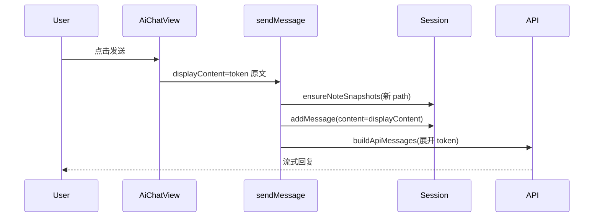

# AI 对话 @ 笔记引用（只读 + 会话快照）— 设计规格

> 日期：2026-07-01  
> 状态：已确认  
> 范围：`@momo/aichat` 笔记引用多轮上下文；全场景 AI 对话只读引用

---

## 1. 背景与问题

### 1.1 已有能力

项目已实现 @ 笔记引用的输入与展示链路：

- 输入 `@` → `NoteReferencePopover` 选择笔记
- 消息存储格式：`@[note:path/to/note.md]`
- UI 渲染：`NoteReferenceChip` / `NoteReferenceText`
- 发送时：`AiChatView` 调用 `resolveNoteMentionsInContent` 展开**当前消息**正文

宿主层 `createNoteReferencesConfig()` 已通过 `buildSharedAiChatServices` 注入侧栏对话、工作流节点对话、笔记 AI 写作、Skill 对话等场景。

### 1.2 待解决问题

| 问题 | 说明 |
|------|------|
| 多轮上下文丢失 | `useChatSessions.sendMessage` 构建 API 历史时使用 `message.content`（token 形式），仅当前发送消息被展开，后续追问 AI 无法看到笔记正文 |
| 无快照语义 | 每次发送若重新读盘，与「引用时点的笔记版本」不一致；重复读盘浪费 I/O |
| 大笔记无保护 | 全量注入可能撑爆上下文窗口 |

---

## 2. 已确认的产品决策

| 项 | 决策 |
|---|---|
| 引用能力 | **只读**：AI 读取笔记回答/总结/对比/给修改建议；用户手动编辑笔记 |
| 适用场景 | **所有 AI 对话**（侧栏、工作流节点、笔记 AI 写作、Skill 等，凡 `buildSharedAiChatServices`） |
| 多轮策略 | **首次 @ 时会话级快照**，同 path 后续复用，不重新读盘 |
| 大笔记 | **单篇上限截断**，默认 20,000 字符，超出追加截断提示 |
| 写回笔记 | **不在本期**（已有独立的「保存到笔记」按钮，与 @ 引用无联动） |

---

## 3. 数据模型

### 3.1 笔记快照

```typescript
/** 笔记引用快照（会话级，path 为笔记相对路径，/ 分隔） */
interface INoteSnapshot {
  path: string;
  content: string;
  snapshotAt: number;
  isTruncated: boolean;
  originalLength: number;
}
```

### 3.2 会话扩展

```typescript
interface IChatSession {
  // ...existing fields
  /** 本会话内首次 @ 引用的笔记快照，key = normalizeNotePath(path) */
  noteSnapshots?: Record<string, INoteSnapshot>;
}
```

### 3.3 消息不变

- `IChatMessage.content` 继续存储含 `@[note:path]` 的展示文本
- 不新增 `resolvedContent`，避免双份正文

### 3.4 常量

| 常量 | 值 |
|------|-----|
| `NOTE_SNAPSHOT_MAX_CHARS` | `20_000` |
| 截断后缀 | `（笔记过长，已截断至前 20000 字符，完整内容请打开笔记查看）` |

---

## 4. 核心流程

### 4.1 发送消息



1. `AiChatView` 不再在发送前调用 `resolveContent`；仅传 `displayContent`（token 原文）
2. `sendMessage` 扫描当前消息 mentions
3. 对 `session.noteSnapshots` 中**不存在**的 path：调用宿主 `readContent` → 截断 → 写入快照
4. 持久化 session（含 `noteSnapshots`）
5. 构建 `chatMessages` 时，每条 user/assistant 消息的 user 侧内容对 user 消息执行 `expandNoteMentionsWithSnapshots`

### 4.2 API 消息展开

新增纯函数 `expandNoteMentionsWithSnapshots(content, snapshots)`：

- 将 `@[note:path]` 替换为：

```
--- 笔记: {displayPath} START ---
{snapshot.content}
--- 笔记: {displayPath} END ---
```

- path 无快照：替换为 `[笔记 {displayPath} 未找到快照]`
- 读盘失败（首次 @ 时）：替换为 `[笔记 {displayPath} 读取失败]`，不写入快照

### 4.3 CLI Agent 路径

CLI prompt 使用与 LLM 相同的展开逻辑（`expandNoteMentionsWithSnapshots`），保证首条 prompt 含笔记正文。

### 4.4 惰性补快照（存量兼容）

构建 API 时若历史 user 消息含 token 且 path 不在 `noteSnapshots`：

- 尝试 `readContent` 一次并写入快照（视为 retroactive 首次 @）
- 失败则展开为读取失败占位，不阻断发送

---

## 5. 宿主配置扩展

`INoteReferencesConfig` 新增：

```typescript
interface INoteReferencesConfig {
  listTree: () => Promise<INoteReferenceNode[]>;
  /** 按 path 读取笔记正文（快照来源） */
  readContent: (path: string) => Promise<string>;
  /** @deprecated 发送前展开改由 sendMessage 统一处理；保留兼容，不再从 AiChatView 调用 */
  resolveContent?: (content: string) => Promise<string>;
}
```

`apps/skill-platform/.../note-reference-config.ts` 暴露 `readContent`（复用现有 `readNoteFile`）。

---

## 6. UI / 体验

| 项 | 行为 |
|---|---|
| placeholder | 有 `noteReferences` 时：`输入消息，@ 引用笔记` |
| chip 展示 | 保持现有样式 |
| chip 点击跳转 | 本期不做 |
| 截断提示 | 仅注入 API，UI 不展示 |

---

## 7. 边界与错误处理

| 场景 | 行为 |
|------|------|
| 读盘失败 | 不写入快照；展开为 `[笔记 path 读取失败]` |
| 笔记删除后 | 已有快照保留；用户 B 策略接受 stale 内容 |
| 同 path 再次 @ | 复用快照，不读盘 |
| 编辑用户消息 | 新 mentions 补快照；已有 path 复用 |
| 重试助手回复 | 不新增快照；API 历史仍用已有快照展开 |
| 云端同步 | 快照随 session JSON 本地持久化；云端仅 sync display 时客户端依赖本地快照 |

---

## 8. 改动范围

| 模块 | 改动 |
|------|------|
| `packages/momo-aichat/src/types/chat.ts` | `INoteSnapshot`、`IChatSession.noteSnapshots` |
| `packages/momo-aichat/src/types/note-reference.ts` | `readContent` |
| `packages/momo-aichat/src/utils/note-mention.ts` | 截断、快照展开、ensure 辅助函数 |
| `packages/momo-aichat/src/hooks/useChatSessions.ts` | 发送/API 构建/CLI prompt |
| `packages/momo-aichat/src/components/AiChatView/index.tsx` | 移除发送前 resolveContent |
| `packages/momo-aichat/src/components/ChatInputPanel/index.tsx` | placeholder |
| `apps/skill-platform/.../note-reference-config.ts` | `readContent` |
| `packages/momo-aichat` 测试 | `note-mention` 单测 |

**不在本期：** 写回笔记、文件夹级 @、chip 跳转、手动刷新快照、快照大小 UI 指示。

---

## 9. 验证标准

1. 侧栏对话 @ 笔记 → AI 能基于正文回答  
2. 连续 3 轮追问（不再 @）→ AI 仍能引用笔记内容  
3. 同会话再次 @ 同一笔记 → 不触发二次读盘  
4. 超过 2 万字符的笔记 → API payload 含截断提示  
5. 工作流节点 / 笔记 AI 写作 / Skill 对话行为一致  
6. 旧会话（无 `noteSnapshots`）发送新消息 → 惰性补快照后多轮正常  

---

## 10. 方案选型记录

采用 **会话级快照表**（`IChatSession.noteSnapshots`），而非消息级 `resolvedContent` 或外置存储：

- 符合「首次 @ 快照」语义
- 同笔记多次 @ 不重复占存储
- 改动集中在 `momo-aichat`，宿主仅补 `readContent`
