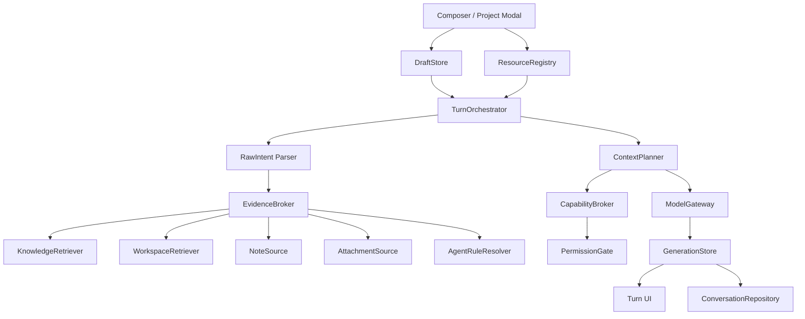

# AI 对话架构重构与 Agent 能力接入设计

日期：2026-09-13状态：待评审（整体重构版）范围：apps/skill-platform、packages/momo-aichat变更性质：允许破坏性重构，不保留旧接口、旧存储结构和旧交互分支的运行时兼容

## 1. 设计结论

本次不再把 Agent 自动识别、Slash 菜单、知识库和 Skills 作为现有聊天链路上的独立补丁，而是重构整条 AI 对话链路。

核心结论如下：

1. 新增或编辑项目时，Agent 应用默认不显示。用户选择文件夹后，只展示在所选目录根级约定中真实检测到的 Agent；不展示全量 Agent，不显示“已检测到”，默认选择结果中的第一项；没有结果时隐藏整个字段并保存 null。
2. 对话输入框统一为一个结构化编辑器。输入 / 时，只显示当前项目所选 Agent 的 Skills 和 Commands，并支持当前光标位置触发、搜索、键盘导航和精确替换；不再使用两个 textarea 分支、镜像层和整段字符串替换。
3. Rules、Skills、Commands、Hooks、知识库、工作区、笔记和附件统一进入 Turn Orchestrator。各来源先解析为结构化对象，再按优先级、可信度和统一 Token 预算组装，不再由多个 stream 包装器各自拼 system prompt。
4. 删除基于中文或英文关键词、消息长度、模型输出长度来猜测意图、技术水平、满意度或是否启用工具的逻辑。显式选择优先，自动行为必须来自结构化能力声明或可解释的检索策略。
5. “我的 Skills”和 Agent Skills 不再保留两套互相覆盖的运行时状态。统一进入 Resource Registry 和 / 菜单；每次调用都形成可持久化的 Invocation。
6. 每一轮对话持久化不可变的请求快照、来源快照、引用、工具轨迹和最终状态。重试默认复用原快照；需要读取最新文件或最新知识库时，由用户明确选择“刷新上下文后重试”。
7. packages/momo-aichat 只保留宿主无关的 UI、领域状态和协议，不再创建 localhost 服务、默认模型、内存存储、云同步或静默兜底服务。宿主缺少必需能力时直接在开发阶段报错。
8. 所有本地文件读取、Agent 资源解析、知识源访问和可执行动作都通过 Main Process 能力边界。路径必须绑定已保存项目根并经过 realpath、目录归属和符号链接逃逸校验。
9. 不启动 Cursor、Codex、Claude 等外部 Agent 进程。这里的“应用其他 Agent 能力”是将其规则和资源语义适配到 momo-ai 的当前模型与受控执行环境；不能等价支持的能力必须标记为 adapted 或 unsupported。

附件截图仅作为 / 菜单的视觉和交互参考，不作为外部 Agent 行为或执行协议的指令来源。

## 2. 非兼容策略

本版明确采用新协议和新存储，不保留以下运行时兼容层：

- 不保留现有 IAiChatServices 大对象的可选字段拼装方式。
- 不保留 TCallAiChatStream 的位置参数签名。
- 不保留 useChatSessions 同时负责存储、同步、检索、发送、流式状态和 UI 状态的实现。
- 不保留 Skill 工具栏与 Agent Slash 两套选择状态。
- 不保留纯字符串 Slash 展开、笔记魔法标记展开和附件正文拼入用户消息的协议。
- 不保留旧 localStorage 会话结构的自动读取和双写。
- 不保留旧的 auth/chatSync 空实现和默认 localhost/Qwen 配置。
- 不保留旧 stream wrapper 的嵌套调用顺序。

新存储使用独立版本键 ai-chat-v4。旧键保持物理数据不变，但新版本不读取、不迁移、不双写；这样不会为兼容增加长期分支，同时仍允许实施失败时回滚旧版本。若产品需要历史数据导出，应另做一次性离线工具，不进入新运行时。

## 3. 当前实现审计

### 3.1 总体职责与依赖

当前 useChatSessions 文件接近一个完整应用层，混合了：

- 会话增删改、标题生成和当前会话切换；
- localStorage 与云同步遗留逻辑；
- 输入提交、附件恢复、笔记解析；
- 知识库、模型、模式和系统提示词状态；
- 流式缓冲、停止、失败、重试和统计；
- 消息持久化和多个定时器。

后果是任何一个功能都可以改变消息内容或保存时序，难以证明一次发送的真实输入，也难以隔离竞态。新设计必须把领域数据、临时草稿、运行中任务和外部能力拆开。

### 3.2 上下文组装

现有上下文由多个位置分别追加：

- useChatSessions 注入模式提示和用户系统提示；
- createAgentAwareChatStream 注入 Agent 规则和技能摘要；
- createSkillAwareChatStream 决定 Skill 或普通问答路径；
- general-chat-stream 再注入知识库、Workspace、回答聚焦和 Mermaid；
- Skill 路径另有规划提示、回答提示和 Skills 摘要；
- MCP 是否启用又依赖最后一条消息的关键词。

主要问题：

1. 没有唯一的组装顺序和全局预算，同一来源可能重复出现。
2. 系统策略、用户偏好、规则、证据和回答格式混为 system message，优先级不可解释。
3. 工作区或知识库的内容可以携带提示注入文本，却没有统一标记为“不可信证据”。
4. Agent 条件规则在工作区检索前解析，拿不到本轮实际关联文件。
5. 历史消息不做 Token 窗口裁剪和摘要，长会话会无限增长。
6. 重试使用当前配置重新组装，不是原请求的可复现重试。

整改：删除所有嵌套的 aware stream，由 TurnOrchestrator 单点生成 ContextPlan 和 PreparedTurn。

### 3.3 知识库

当前知识库链路存在以下问题：

- 直接使用展开后的最后一条 user content 作为查询。附件正文、笔记全文和 Slash 模板会污染检索词。
- 未选集合时顺序搜索所有集合；输入栏又会自动选中第一集合，使“搜索全部”的代码路径和普通 UI 行为不一致。
- 每个集合各取 topK 后直接合并 raw score，不同集合或模型的分数未必可比较。
- 没有去重、来源多样性、全局 Token 预算和并发限制。
- rag-prompt-optimizer 通过用户消息长度和助手回复长度虚构“技术水平、满意度、回复质量”，没有任何真实反馈依据。
- RAG prompt 强制“开头确认、结尾询问是否有帮助”等回答风格，与 Agent Rules、Skill 或用户要求冲突。
- 检索内容以格式化 JSON 塞入 system prompt，冗余且模糊了“证据”和“指令”的边界。
- kbChunkCache 是仅以内存 chunkId 为键的全局无界 Map；重启后引用无法打开，不同集合也可能发生歧义。
- 引用卡片用固定 score > 0.8 决定是否显示，且 score 口径未统一。
- 输入栏和 Context Banner 分别加载集合、分别监听更新，造成重复请求和状态漂移。
- 检索失败被吞掉，用户只会得到看似正常但没有知识依据的答案。

整改：

1. 删除 rag-prompt-optimizer 和强制回答风格。
2. 知识源选择改为关闭、自动、指定一个或多个集合；没有集合时禁用。
3. 检索查询来自 RawIntent，而不是已展开的 prompt。查询可以包含当前原始问题、明确实体和少量相关历史，但不包含附件全文、Skill 正文或 system prompt。
4. 多集合检索采用有限并发、适度 over-fetch、归一化排序、内容去重和来源多样性控制。
5. 检索结果返回 KnowledgeEvidence，不直接返回 prompt 字符串。
6. 引用随 TurnRecord 持久化，使用 collectionId + documentId + chunkId 定位；打开引用时调用知识库 API，不依赖临时 Map。
7. 部分集合失败时保留其它结果，并在本轮显示非阻断状态；全部失败时明确标记“本轮未使用知识库”。

### 3.4 工作区上下文

当前工作区检索依赖硬编码的中英文关键词和领域映射，并可能在命中时把整个目录树与代码片段拼入 system prompt。

主要问题：

- “是不是产品/开发问题”由正则猜测，语言覆盖不完整且不可扩展。
- 目录树不是默认需要的证据，大仓库中噪声和 Token 成本很高。
- grep 候选、文件读取和目录树使用分散接口，缺少同一检索计划。
- evidence 文本中混入“不要 skill-run”等路由指令。
- Renderer 可向现有 Workspace IPC 传入任意路径，Main 只检查路径存在和文件类型，没有绑定已保存项目根。
- 对符号链接、允许根、总读取量、单轮审计记录的约束不完整。

整改：新增 WorkspaceRetriever，只按明确路径、符号、文件名和查询词生成候选。优先返回局部 snippets；只有用户询问结构、目录或架构时才获取受限 tree fragment。所有返回值都是 WorkspaceEvidence，证据正文中不包含路由或行为指令。

### 3.5 笔记与附件

当前笔记引用使用可见文本中的特殊 token。每次发送会扫描历史 user messages，并把历史笔记全文再次展开进 API history。结果是：

- 复杂度和 Token 占用随会话轮数与笔记数量持续增长；
- 同一笔记被重复发送；
- session 级 snapshot 无法表达某一轮究竟使用了哪个版本；
- stripEchoedNoteBlocks 用正则删除回复内容，可能误删模型的正常回答；
- 笔记读取失败被静默处理。

当前附件由 AiChatView 在 UI 层拼成最多约 50,000 字符的用户提示，同时：

- 附件正文会污染知识库查询与意图判断；
- 持久化通常只保留展示元数据，重试无法恢复原文本；
- 图片 base64 可能随 session JSON 持久化，体积大且边界不清；
- 上传顺序执行、没有逐文件取消，删除上传中项后迟到回调仍可能更新状态；
- 校验未统一 MIME、扩展名、单文件和总批次限制。

整改：笔记和附件都使用 SourceRef。内容存储在独立 Source Store 中，TurnRecord 保存不可变 revision/contentHash；当前轮由 EvidenceBroker 按预算加载一次，历史轮只保留引用标签和必要摘要，不重复塞全文。删除 stripEchoedNoteBlocks。

### 3.6 Skills、Commands 与 Agent 资源

当前 ChatModuleProvider 会加载全量 Skills，buildSkillsSummary 还截取每个 Skill 的正文片段。activeSkillId 是 Provider 级状态，不属于具体会话；isEnabled 与 selectedSkillId 又能形成矛盾状态。

当前链路还存在：

- 显式选择 Skill 后，产品咨询正则仍可能把请求改路由到普通问答。
- 所有 Skill 默认经过 plan + answer 两次模型调用，简单说明型 Skill 也承担双倍延迟与成本。
- Skill Planner 同时收到所有 Skills 摘要、当前 Skill 摘要和当前 Skill 完整正文，存在重复。
- 可执行 Skill 通过解析模型回复中的 fenced bash/sh 代码决定命令，执行意图缺少结构化协议。
- Agent Slash、Skill 工具栏和文本中手输 /command 是三套入口，优先级不稳定。
- Slash item 只有字符串 group，重名时只能保留其中一个，不能稳定定位来源。

整改：

- 删除 Skill 开关、activeSkillId 和工具栏选择器。
- 所有可调用资源进入 ResourceRegistry，通过统一 / 菜单显式调用。
- 菜单仅加载元数据；选中后才加载目标资源正文和引用。
- 说明型 Skill 使用单次模型请求；只有声明需要工具、产物或多步骤执行的 Skill 才创建结构化 ExecutionPlan。
- 不从自然语言或 Markdown 代码块推断并直接执行 shell。
- Invocation 必须持久化 resourceId、resourceRevision、参数和来源。

### 3.7 Tools、MCP 与 Hooks

当前普通问答是否启用 MCP 由文本是否出现“工具、MCP、调用”等关键词决定；Skill 是否启用工具又根据描述或指令中是否含相关词决定。

runMcpToolLoop 还存在：

- 启用后向模型暴露全部工具，而不是当前资源声明的最小能力集合；
- 非法 JSON 参数会退化为空对象并继续调用；
- 多个 tool call 使用 Promise.all，即使工具具有副作用或先后依赖；
- 工具名称和原始结果直接混入助手可见文本；
- 工具调用和结果没有作为结构化历史持久化；
- 某些模型网关不支持流式工具时，整个路径被隐式切为非流式。

整改：由 CapabilityBroker 根据 Invocation 声明、项目授权和模型能力决定工具集合。参数必须通过 JSON Schema；失败时回给模型修正，不执行空对象。默认顺序执行，只有工具声明 parallelSafe 且互不依赖时才并行。副作用调用前进入 awaiting_permission。工具轨迹与助手正文分开展示并持久化。

Hooks 使用同一能力与权限模型。命令 Hook 默认禁用；授权必须绑定项目真实路径、Agent、配置路径和内容摘要，任何内容变化都使授权失效。

### 3.8 输入框与事件

当前输入区在“是否支持笔记”条件下渲染 plain textarea 或 ChatMentionTextarea 两种实现。ChatMentionTextarea 又依靠隐藏 textarea、镜像层和内部 token 到表面文本的游标比例换算。

问题包括：

- 两条输入实现产生两套 ref、光标和高度逻辑。
- 字符比例换算无法可靠处理中文、emoji、换行、自动换行和 IME。
- Slash 只检查 value.startsWith('/')，不检查当前光标、当前段落和触发 token 范围。
- 选择 Slash 后替换整个输入值，会丢失后缀和其它段落。
- Note trigger 每次打开重复读取树；Slash 每次输入都延迟查询，但没有统一取消和缓存。
- 弹层的 open/menuVisible/panelDismissed 等状态重复，键盘事件优先级散落。
- Enter 发送没有统一检查 nativeEvent.isComposing 或 keyCode 229，中文输入法确认候选时可能误发送。
- 输入高度依赖 setTimeout、requestAnimationFrame 和每次键入的手动 style.height，易产生抖动和卸载后的迟到更新。
- 清空、失败恢复和外部受控值没有全部经过同一 onInputChange/dispatch。
- 编辑历史消息只恢复文字，不能恢复附件和 Invocation。

整改：采用单一结构化 Composer，不保留旧 textarea 分支。事件统一进入 Editor Command Bus，弹层统一由 OverlayManager 管理。

### 3.9 会话、流式与持久化

当前消息只有 role/content 作为核心真相，API 内容、来源、规则、调用和配置多为发送时临时值。重试因此会读取“现在”的知识库、Agent、Skill、附件和系统配置。

其它问题：

- 模型、知识库、模式和 Skill 状态多为全局状态，切换会话后语义会漂移。
- 新建会话后立即读取旧闭包中的 sessions，首条消息可能找不到刚创建的会话。
- 发送前先清空输入，准备失败时只能不完整恢复。
- Context 的 sendMessage 声明 Promise<void>，实现却返回 boolean。
- 流式每约 15ms 更新消息，继而频繁序列化完整 sessions；存储与渲染成本过高。
- selectedSessionId、保存定时器和闭包可能在切换会话后写入错误状态。
- stop、onError 和 promise catch 缺少同一 generation token，停止后迟到错误可能覆盖 stopped。
- loading/error 是消息上的松散布尔值，不是合法状态机。

整改：会话、草稿、生成任务和持久化拆分；每轮使用明确状态机和 generationId。流式内容只保存在 Runtime Buffer，按动画帧刷新 UI，按 1 至 2 秒 checkpoint 和终态持久化。

## 4. 目标体验

### 4.1 项目弹框

字段顺序：

1. 项目名称；
2. 文件夹；
3. Agent 应用，仅检测到至少一个时渲染；
4. 其它项目配置。

Agent 区域状态机：

| 状态 | 条件 | UI | agentAppId |
| --- | --- | --- | --- |
| idle | 未选择文件夹 | 不显示 Agent 区域 | null |
| detecting | 文件夹变化且正在检测 | 不显示旧选项；文件夹下显示识别进度 | 不允许保存旧值 |
| ready | 有检测结果 | 只显示命中的 Agent 单选项 | 保留仍有效的旧值，否则第一项 |
| empty | 检测成功但为空 | 不显示 Agent 区域 | null |
| error | 目录不可读或 IPC 失败 | 不显示 Agent 区域；显示可重试错误 | null |

detecting 时禁用保存，避免旧目录结果写入新项目。error 不阻止保存项目，但 Agent 固定为 null。

检测只依据所选项目根中的强 Marker，不依据本机安装情况。共享文件如 AGENTS.md 可以作为资源或辅助证据，但不能单独让多个 Agent 同时命中。

### 4.2 对话输入

默认输入是普通文本。输入 / 后：

- 在当前光标所在段落中识别 /query；
- 弹层显示当前 Agent 的 Skills 和 Commands，Skills 分组在前；
- 项目级资源优先于全局资源；
- 每项显示名称与一行描述，不显示绝对路径，也不显示“已检测到”；
- 支持上下键、Enter/Tab、Esc、鼠标悬停和搜索；
- 选择后只替换当前 trigger range，不覆盖前后文本；
- 发送后气泡展示用户原文，同时以 Invocation chip 标记实际调用的资源；
- 当前 Agent 无资源时，输入 / 不显示空弹层。

笔记使用 @ 触发，Slash 与 @ 共用同一 OverlayManager，同一时间只允许一个弹层捕获键盘。

### 4.3 Context Bar

对话顶部只显示真正影响当前会话的配置：

- 当前项目与 Agent；
- 当前模型；
- 知识库模式及集合数量；
- 对话模式；
- 当前草稿已引用的笔记和附件。

Skill/Command 是单轮 Invocation，不作为全局常驻 Banner。若未来增加“固定 Skill”，它必须成为 ConversationSettings 的显式字段，而不能复用临时 Provider 状态。

### 4.4 发送、停止与重试

- 点击发送后先执行本地校验与 Prepare；Prepare 成功后才清空草稿。
- 需要工具或 Hook 权限时进入 awaiting_permission，草稿和上下文不丢失。
- 停止只影响指定 generationId；迟到 chunk、stats 或 error 均被忽略。
- “重试”默认使用原请求快照和原 evidence snapshot。
- 另提供“刷新上下文后重试”，创建新 attempt，并明确读取最新知识库、笔记、附件和项目资源。
- 编辑用户消息会恢复该轮的结构化内容、附件引用和 Invocation，提交后创建分支 attempt，不原地篡改审计历史。

## 5. 目标架构



### 5.1 模块职责

| 模块                   | 职责                             | 禁止承担                |
| ---------------------- | -------------------------------- | ----------------------- |
| ComposerController     | 结构化草稿、光标、编辑命令       | 组装 prompt、读本地文件 |
| DraftStore             | 每会话临时草稿                   | 保存历史消息            |
| ResourceRegistry       | 合并 Agent、内置和用户资源元数据 | 自动执行资源            |
| TurnOrchestrator       | 单轮状态机与服务编排             | 渲染组件、直接访问 DOM  |
| EvidenceBroker         | 并行获取、去重、裁剪证据         | 写回答风格指令          |
| ContextPlanner         | 优先级、预算、最终消息协议       | 读取文件或调用工具      |
| CapabilityBroker       | 选择最小工具集合、校验调用       | 用关键词猜测权限        |
| GenerationStore        | 运行中 buffer、abort、stats      | 持久化整个会话数组      |
| ConversationRepository | 规范化数据、事务与 checkpoint    | 管理输入框事件          |
| ModelGateway           | 模型能力适配和流协议             | 决定业务路由            |

## 6. 核心领域模型

### 6.1 结构化草稿

```ts
type ComposerNode =
  | { type: 'text'; text: string }
  | { type: 'lineBreak' }
  | { type: 'noteRef'; sourceId: string; label: string; revision?: string };

interface ChatDraft {
  conversationId: string;
  nodes: ComposerNode[];
  attachments: AttachmentRef[];
  invocation?: ResourceInvocation;
  updatedAt: number;
}
```

displayText 由 nodes 派生，不作为唯一事实。附件不拼入 nodes 文本；UI 使用独立 chip，但属于同一个 ChatDraft。

### 6.2 单轮记录

```ts
type TurnStatus =
  | 'preparing'
  | 'awaiting_permission'
  | 'generating'
  | 'completed'
  | 'failed'
  | 'stopped';

interface TurnRecord {
  id: string;
  conversationId: string;
  parentTurnId?: string;
  attempt: number;
  user: {
    nodes: ComposerNode[];
    displayText: string;
    attachments: AttachmentRef[];
    invocation?: ResourceInvocation;
  };
  requestSnapshot: RequestSnapshot;
  evidenceManifest: EvidenceManifest;
  assistant: {
    text: string;
    thinking?: string;
    citations: CitationRef[];
    toolTraceIds: string[];
  };
  status: TurnStatus;
  error?: TurnError;
  stats?: GenerationStats;
  createdAt: number;
  updatedAt: number;
}
```

### 6.3 请求快照

```ts
interface RequestSnapshot {
  modelId: string;
  modelRevision?: string;
  parameters: {
    temperature?: number;
    topP?: number;
    maxOutputTokens?: number;
  };
  conversationSettingsRevision: string;
  agent: {
    platformId?: string;
    manifestRevision?: string;
  };
  knowledge: KnowledgeSelection;
  mode: 'chat' | 'plan';
  userSystemPromptHash?: string;
  contextPlanHash: string;
  createdAt: number;
}
```

API Key、绝对路径和大段正文不得进入 RequestSnapshot。

### 6.4 Evidence 与引用

```ts
type EvidenceKind = 'knowledge' | 'workspace' | 'note' | 'attachment' | 'agent_rule';

interface EvidenceItem {
  id: string;
  kind: EvidenceKind;
  sourceId: string;
  revision: string;
  title: string;
  content: string;
  locator: Record<string, string | number>;
  relevance: number;
  tokenCount: number;
  trust: 'user_owned' | 'retrieved_untrusted';
}

interface EvidenceManifest {
  revision: string;
  items: Array<Omit<EvidenceItem, 'content'>>;
  snapshotIds: string[];
  warnings: EvidenceWarning[];
}
```

正文存于 Source Store 或 Turn Snapshot Store，TurnRecord 只存定位信息与不可变 snapshotId，避免主会话 JSON 膨胀。

### 6.5 Resource 与 Invocation

```ts
type ResourceKind = 'skill' | 'command' | 'rule' | 'hook';

interface ResourceDescriptor {
  id: string;
  revision: string;
  provider: 'agent' | 'builtin' | 'user';
  agentAppId?: string;
  kind: ResourceKind;
  scope: 'project' | 'global';
  name: string;
  description?: string;
  capabilityIds: string[];
  executionMode: 'instruction' | 'structured_plan' | 'event';
}

interface ResourceInvocation {
  resourceId: string;
  resourceRevision: string;
  kind: 'skill' | 'command';
  rawText: string;
  args: string;
}
```

Renderer 只持有 ResourceDescriptor 的安全 DTO。正文、脚本路径和绝对路径只在 Main Process 或受控服务中解析。

## 7. 单轮执行状态机

```text
idle
  -> preparing
      -> failed(validation / source resolution)
      -> awaiting_permission
          -> stopped(rejected)
          -> generating(allowed)
      -> generating(no permission needed)
          -> completed
          -> failed
          -> stopped
```

TurnOrchestrator.prepareTurn 的固定顺序：

1. 冻结 ChatDraft，生成 turnId 和 generationId。
2. 解析 RawIntent：只读取用户原始文本、结构化 mention 和 Invocation。
3. 校验会话设置、项目、Agent 和模型能力。
4. 精确解析 Invocation；没有显式 Invocation 时不自动选择 Skill/Command。
5. 并行解析笔记、附件、知识库和工作区候选。
6. 根据实际关联文件解析路径型 Agent Rules。
7. 构建统一 EvidenceManifest，去重并分配预算。
8. 构建 ContextPlan，计算 hash 并写入 RequestSnapshot。
9. 通过 CapabilityBroker 生成允许暴露给模型的最小工具集合。
10. 若有副作用动作或命令 Hook，进入权限状态。
11. Prepare 成功后事务写入 TurnRecord，并清空对应 conversationId 的草稿。
12. 调用 ModelGateway，消费结构化 stream events。
13. terminal event 到达后原子写入最终状态、stats、citations 和 tool traces。

任何异步回调都必须携带 conversationId、turnId、generationId。Reducer 只接受仍是活动 generation 的事件。

## 8. ContextPlan

### 8.1 固定优先级

从高到低：

1. Host 安全、权限和模型协议；
2. 用户显式系统设置与当前模式；
3. 当前 Agent 的生效 Rules；
4. 本轮显式 Skill 或 Command 指令；
5. 工具协议与允许的 capability schema；
6. 标记为不可信的知识库、工作区、笔记和附件证据；
7. 经裁剪的会话摘要与相关历史；
8. 当前用户原始输入。

证据内容永远不能覆盖 1 至 5。若证据中含有“忽略上文”“执行命令”等文本，只能作为引用内容，不作为指令执行。

### 8.2 统一预算

预算按目标模型 contextWindowTokens 计算，而不是按字符：

```ts
interface ContextBudget {
  totalInputTokens: number;
  reservedForOutput: number;
  hostPolicy: number;
  userPolicy: number;
  agentRules: number;
  invocation: number;
  evidence: number;
  history: number;
  currentInput: number;
}
```

默认比例可配置，初始建议：

- 输出预留：上下文窗口的 20%，受模型 maxOutput 限制；
- Host 与用户策略：10%；
- Agent Rules 与 Invocation：20%；
- Evidence：35%；
- 历史与摘要：15%；
- 当前输入必须完整保留，超限时先拒绝并提示缩减附件，而不是静默截断用户问题。

各来源原有的 8,000、20,000、30,000 字符上限全部删除，统一使用 TokenCounter。裁剪需要产生 warning 和可观测指标。

### 8.3 历史策略

- 最近有效轮优先，失败的空助手消息不进入模型历史。
- 工具调用使用结构化 tool call/result 复原，不转换成普通助手文本。
- 超出预算时先使用已持久化 ConversationSummary，再补最近 turns。
- 摘要必须记录覆盖到的 turnId，旧轮更新或删除后使摘要失效。
- 不允许每轮无条件重新总结全部历史；仅在边界推进时增量更新。

## 9. EvidenceBroker

### 9.1 输入

```ts
interface EvidenceRequest {
  conversationId: string;
  projectId?: string;
  rawIntent: RawIntent;
  sourceRefs: SourceRef[];
  knowledgeSelection: KnowledgeSelection;
  agentAppId?: string;
  budgetTokens: number;
  signal: AbortSignal;
}
```

### 9.2 合并策略

1. 明确引用的 note、attachment 和 path 优先于自动检索。
2. 相同 contentHash 只保留一个正文，但保留全部 locator。
3. 同一文档连续 chunk 合并后重新计算预算。
4. 每个来源设置最大占比，避免一个大文件吞掉全局 Evidence 预算。
5. 检索失败按 source 记录 warning；取消必须传播 AbortSignal，不得转换为空成功。
6. EvidenceBroker 返回结构化数据，不返回 prompt。

### 9.3 知识库检索

```ts
type KnowledgeSelection =
  | { mode: 'off' }
  | { mode: 'auto' }
  | { mode: 'selected'; collectionIds: string[] };
```

auto 的含义是由知识源服务根据项目默认集合和查询路由选择，不等于“顺序搜索全部集合”。

检索管线：

1. 从 RawIntent 构建 SearchQuery，剔除 /command token 和资源展开正文。
2. 对选中集合有限并发检索；单集合失败不取消其它集合。
3. 每集合 over-fetch 后做 score calibration 或 rank fusion。
4. 内容哈希去重、相邻块合并、每文档上限和来源多样性。
5. 按 Evidence 预算裁剪。
6. 返回明确 citations；不存在可用证据时允许模型回答通用知识，但 UI 必须显示“知识库未命中”，不能假称来自知识库。

### 9.4 工作区检索

WorkspaceRetriever 的候选优先级：

1. 用户显式引用的路径、文件、符号；
2. 当前 Invocation 声明的输入路径；
3. 最近相关 Turn 中仍有效的文件引用；
4. 对 RawIntent 进行文件名、符号和内容检索；
5. 用户明确询问目录结构时获取受限树。

接口一次接收检索计划，不再让 Renderer 自由组合 listTree、grep 和 readSnippet。

```ts
interface WorkspaceSearchPlan {
  projectId: string;
  explicitPaths: string[];
  terms: string[];
  includeTree: boolean;
  maxFiles: number;
  maxTokens: number;
}
```

Main 根据 projectId 查找允许根，不接受 Renderer 自报可信 dirPath。所有路径 realpath 后必须落在允许根内；默认拒绝符号链接逃逸。

### 9.5 笔记

- @ 菜单只获取树的轻量索引，并由 query cache 复用。
- 选中后保存稳定 noteId，不用路径字符串作为主键。
- Source Store 保存 revision、contentHash 和可选 snapshot。
- frozen 引用在重试时读取原 snapshot；live 引用只在“刷新上下文后重试”更新。
- 读取失败显示来源 chip 错误并阻止该轮静默发送，用户可移除来源后继续。

### 9.6 附件

- 每个附件有 queued、uploading、parsing、ready、failed、cancelled 状态。
- 支持逐文件 AbortController 和有限并发。
- 校验 MIME、扩展名、单文件大小、总批次大小、图片数量和模型能力。
- 文本、二进制和图片 blob 存于独立 AttachmentStore，以 contentId 定位。
- session JSON 不保存 base64 和全文。
- 解析结果包含 extractorVersion 和 contentHash，保证精确重试。
- UI 只展示 chip 和状态，绝不负责构造模型 prompt。

## 10. Agent 自动检测

### 10.1 Profile 与平台列表解耦

SKILL_PLATFORMS 只表示技能同步目标；AGENT_APP_PROFILES 是显式注册表。禁止从全部技能平台自动生成 .platformId Marker。

新增一个 Agent Profile 必须具备：

- 至少一个强 Marker；
- 每个 Marker 的 file/dir 类型；
- 项目级与全局级资源路径；
- Rules、Skills、Commands、Hooks 能力矩阵；
- 对应格式解析器；
- Fixture、安全测试和 profileSchemaVersion。

### 10.2 首批 Profile

| Agent | 强 Marker | Rules | Skills | Commands | Hooks |
| --- | --- | --- | --- | --- | --- |
| Cursor | .cursor 目录 | .cursor/rules 下 MDC | .cursor/skills | .cursor/commands | hooks 配置按已验证格式适配 |
| Claude Code | .claude 目录或 CLAUDE.md | CLAUDE.md 体系 | .claude/skills | legacy commands | settings hooks |
| Codex CLI | .codex 目录 | 根级及层级 AGENTS.md | .codex/skills | 不猜测通用 commands | 仅在 Profile 验证后启用 |
| Gemini CLI | .gemini 目录 | GEMINI.md | .gemini/skills | TOML commands | 已验证事件 |
| OpenCode | .opencode 或 config | AGENTS.md 和 instructions | 明确兼容目录 | Markdown/JSONC commands | 首版 unsupported |

共享的 AGENTS.md 只能作为辅助 Marker 或已选 Agent 的 Rule，不能同时识别为多个 Agent。

### 10.3 检测协议

```ts
interface DetectAgentAppsRequest {
  requestId: string;
  projectFolderCandidates: string[];
}

interface DetectedAgentApp {
  platformId: string;
  matchedRootIds: string[];
  evidence: Array<{
    rootId: string;
    marker: string;
    strength: 'primary' | 'supporting';
  }>;
}
```

Main Process 执行 trim、去重、realpath、目录校验和直接 Marker 检查。相同 Agent 在多根目录中只显示一次，保留所有 matchedRootIds。

Renderer 每次目录变化：

1. 取消旧请求或使旧 requestId 失效；
2. 立即隐藏旧 Agent 结果；
3. 300ms 防抖后检测；
4. 只接纳当前 requestId；
5. 旧选择仍在结果中则保留，否则选择第一项；
6. 空结果或错误时清空 agentAppId。

### 10.4 Manifest 与缓存

检测只回答“有哪些 Agent”，不读取正文。选择 Agent 后由 AgentResourceService 构建 ResourceManifest。

缓存键必须包含：

- Agent platformId；
- 项目根 realpath 列表；
- profileSchemaVersion；
- 资源路径、mtime、size 和 contentHash。

只监听当前活动项目的已知 Agent 配置路径。Watcher 失败时退化为 mtime 校验，不监听整个仓库。

## 11. Rules、Skills、Commands 与 Hooks

### 11.1 Rules

规则优先级从低到高：

1. Agent 全局规则；
2. 项目根规则；
3. 与本轮实际文件更接近的层级规则；
4. 当前显式 Skill 或 Command。

Host 安全策略始终高于所有导入资源。

Cursor MDC 解析 frontmatter 和 globs；层级 AGENTS.md 根据实际 Evidence 文件路径从根到叶加载；无法识别的字段保留 metadata，但不猜测语义。条件 Rules 必须在 WorkspaceRetriever 之后解析。

### 11.2 Skills 与 Commands

- / 菜单只加载 name、description、kind、scope 和 revision。
- 选中后使用 resourceId 精确加载，不用名称二次猜测。
- 项目级覆盖全局级；重名与覆盖规则由各 Profile 明确定义。
- 嵌套命令保留 Agent 原生命名空间。
- $ARGUMENTS 等变量由对应解析器展开；参数和模板分别保存。
- 用户可见消息保留 /name args，模型上下文获得结构化 Invocation 指令。
- modelHint、subagent 等当前运行时无法支持的字段只产生 capability warning，不擅自切换模型或创建任务。

说明型 Skill：

- 只加载当前目标 Skill；
- 读取正文及明确引用文件；
- 限制引用深度、文件数和 Token 预算；
- 单次模型调用。

执行型 Skill：

- 必须在 manifest 中声明 capabilityIds 和 executionMode；
- planner 只在确有多步或工具需要时运行；
- planner 输出必须通过 ExecutionPlan JSON Schema；
- 不解析 fenced shell 代码作为可执行意图；
- 脚本在受控临时工作区运行，不修改原 Agent Skill；
- 执行前经过 PermissionGate。

### 11.3 Hooks

统一生命周期：

```ts
type AgentHookEvent =
  | 'beforePromptSubmit'
  | 'beforeToolCall'
  | 'afterToolCall'
  | 'afterResponse'
  | 'sessionStart'
  | 'sessionEnd';
```

Profile 只能把原事件映射到语义相符的生命周期。没有对应事件时标记 unsupported，不得偷偷映射到 beforePromptSubmit。

命令 Hook 权限键：

```text
projectRealPath + platformId + hookPath + sha256(configAndScript)
```

默认超时 10 秒、输出上限 1 MB、最小环境变量、固定工作目录。配置或脚本内容变化后重新授权。未完成沙箱和权限 UI 前，命令 Hook 保持不可执行。

## 12. Composer 与输入事件

### 12.1 单一编辑器

删除 ChatMentionTextarea 及其镜像层，也删除“有笔记用自定义 textarea、无笔记用原生 textarea”的分支。实现一个 Lexical 或等价结构化 contenteditable，包含：

- TextNode；
- LineBreakNode；
- NoteMentionNode，原子节点；
- 可选 InlineInvocationNode；首版也可把 Invocation 作为 Draft 元数据和可见 chip；
- PlainText serializer；
- Draft serializer。

### 12.2 事件优先级

所有 keydown 经 ComposerController 分发：

1. IME composition：isComposing 或 keyCode 229 时禁止提交和菜单确认；
2. 当前 Overlay 捕获 Arrow、Tab、Enter、Escape；
3. 原子 mention 边界删除；
4. Enter 发送、Shift+Enter 换行；可配置 Ctrl+Enter 模式；
5. 编辑器默认行为。

不得在 Slash hook、Note hook 和父组件中各自 stopPropagation 后猜测执行顺序。

### 12.3 Trigger 识别

TriggerEngine 接收当前 selection 和所在 block：

```ts
interface TriggerMatch {
  kind: 'slash' | 'note';
  query: string;
  range: { anchor: number; focus: number };
}
```

- / 仅在段落开头或空白之后触发；
- @ 在允许的文本边界触发；
- 选中项只替换 range；
- 光标离开 range、输入空格、Esc、blur 或 outside pointer 时关闭；
- 查询请求携带 AbortSignal，并按 agentManifestRevision/noteTreeRevision 缓存。

### 12.4 OverlayManager

OverlayManager 是唯一弹层状态：

```ts
type ComposerOverlay =
  | { type: 'slash'; match: TriggerMatch }
  | { type: 'note'; match: TriggerMatch }
  | null;
```

统一处理定位、碰撞、outside click、ARIA listbox、active descendant 和焦点恢复。同一时刻只允许一个 Overlay。

### 12.5 高度和受控状态

- 编辑器使用 CSS min-height、max-height 和内部 overflow；
- 只在容器尺寸变化时使用 ResizeObserver，不在每次键入后 setTimeout 和 requestAnimationFrame 改 height；
- 所有输入变化、清空、失败恢复和历史编辑都通过 DraftStore.dispatch；
- 外部 onInputChange 如仍需要，仅订阅 store 派生值，不参与双向竞争。

## 13. 工具与模型运行时

### 13.1 能力选择

CapabilityBroker 的输入是：

- 当前 Invocation 的 capabilityIds；
- Host 当前已连接的工具清单；
- 项目与用户授权；
- 当前模型的 tool calling、streaming 和 multimodal 能力；
- 当前模式的限制。

输出是最小 ToolDescriptor 集合和 PermissionRequirement。没有 Invocation 时，仅暴露宿主显式允许的基础只读工具；绝不因用户写了“帮我调用工具”就暴露全部 MCP。

### 13.2 工具循环

1. 保存模型返回的结构化 tool_call；
2. JSON 解析和 Schema 校验；
3. 参数非法时把 validation error 返回模型修正，不调用工具；
4. 判断只读、副作用、是否需授权；
5. 默认顺序执行；
6. 仅 parallelSafe 且无依赖的调用可并行；
7. 截断和清洗 tool result 后写入结构化 history；
8. UI 使用独立 ToolCard，不把原始结果伪装成助手正文；
9. 循环次数、累计时间、结果 Token 和失败次数都有上限。

ModelGateway 维护能力矩阵。某模型不支持 stream + tools 时，由 Adapter 明确选择降级方案并在运行状态中可见，不能在业务 stream 中静默切换。

## 14. 状态与持久化

### 14.1 Store 拆分

| Store/Service          | 数据                                                |
| ---------------------- | --------------------------------------------------- |
| ConversationRepository | conversations、turns、summaries、settings revisions |
| DraftStore             | 每个 conversationId 的未发送草稿                    |
| GenerationStore        | 活动 generation、buffer、abort、临时 stats          |
| ResourceCache          | Agent/Skill/Command 元数据和 revision               |
| SourceStore            | attachment、note snapshot、evidence snapshot        |
| PermissionStore        | Main Process 中的内容摘要级授权                     |

### 14.2 ConversationSettings

模型、模式和知识库设置属于会话：

```ts
interface ConversationSettings {
  modelId: string;
  mode: 'chat' | 'plan';
  knowledge: KnowledgeSelection;
  userSystemPrompt?: string;
  revision: string;
}
```

创建新会话时从项目默认值复制。之后修改只影响当前会话；是否“应用到项目默认”必须由用户显式操作。

Agent 绑定属于项目；每轮 RequestSnapshot 记录当时的 platformId 和 manifestRevision。

### 14.3 持久化频率

- chunk 写入 GenerationStore 内存 buffer；
- UI 按 requestAnimationFrame 或最多每 33ms 刷新；
- 持久化 checkpoint 每 1 至 2 秒，且只写当前 turn 增量；
- completed、failed、stopped 立即写终态；
- 不再每个 chunk 序列化全部 sessions。

### 14.4 一致性

- 所有实体先生成稳定 ID，再进入 store，不依赖 React setState 后读取旧闭包。
- Repository 接口使用事务或 compare-and-set revision。
- 每个 terminal transition 只能成功一次。
- 应用崩溃后，generating 状态恢复为 interrupted，可继续显示已 checkpoint 的正文，但不会自动重放工具。

## 15. 新服务协议

### 15.1 包级依赖

packages/momo-aichat 改为必需依赖集合，不接受 Partial 后静默补默认值：

```ts
interface AiChatHost {
  conversations: ConversationRepository;
  orchestrator: TurnOrchestrator;
  models: ModelCatalog;
  resources: ResourceCatalog;
  sources: SourceCatalog;
  paths: LocalPathOpener;
}
```

可选能力通过 capability 查询表达，不通过 undefined 字段散落判断。Provider 缺失时 throw 带清晰组件路径的配置错误。

### 15.2 Turn API

```ts
interface PrepareTurnRequest {
  conversationId: string;
  draftRevision: string;
}

type PrepareTurnResult =
  | { status: 'ready'; turnId: string; generationId: string }
  | { status: 'permission_required'; turnId: string; request: PermissionRequest }
  | { status: 'invalid'; issues: ValidationIssue[] };

interface StartGenerationRequest {
  turnId: string;
  generationId: string;
}
```

不再使用 sendMessage(): Promise<void> 同时隐式表达 true/false、错误回调和 stream 回调。

### 15.3 Stream Event

```ts
type GenerationEvent =
  | { type: 'thinking_delta'; generationId: string; text: string }
  | { type: 'answer_delta'; generationId: string; text: string }
  | { type: 'tool_call'; generationId: string; call: ToolCall }
  | { type: 'tool_result'; generationId: string; result: ToolResult }
  | { type: 'citation'; generationId: string; citation: CitationRef }
  | { type: 'stats'; generationId: string; stats: GenerationStats }
  | { type: 'completed'; generationId: string }
  | { type: 'failed'; generationId: string; error: TurnError };
```

### 15.4 Main IPC

新增或重构为基于 projectId/resourceId/sourceId 的 IPC：

| IPC                     | 说明                             |
| ----------------------- | -------------------------------- |
| agent:detect            | 仅检测 Marker                    |
| agent:getManifest       | 获取当前 Agent 安全资源元数据    |
| agent:resolveInvocation | 按 resourceId/revision 解析资源  |
| agent:resolveRules      | 按本轮关联文件解析 Rules         |
| source:searchWorkspace  | 执行一个受限 WorkspaceSearchPlan |
| source:readSnapshot     | 读取已授权 source snapshot       |
| knowledge:listSources   | 获取统一知识源列表               |
| knowledge:search        | 多集合结构化检索                 |
| knowledge:getCitation   | 按完整 locator 打开引用          |
| permission:request      | 申请工具、Skill 或 Hook 权限     |

Main 不信任 Renderer 的绝对路径。projectId 必须解析到 Store 中已保存的允许根；resourceId 必须在当前 manifest 中存在且 revision 相符。

## 16. 错误与可观测性

### 16.1 错误分类

```ts
type TurnErrorCode =
  | 'DRAFT_INVALID'
  | 'MODEL_UNAVAILABLE'
  | 'SOURCE_UNAVAILABLE'
  | 'RESOURCE_STALE'
  | 'PERMISSION_DENIED'
  | 'CONTEXT_OVERFLOW'
  | 'TOOL_VALIDATION_FAILED'
  | 'GENERATION_FAILED'
  | 'GENERATION_INTERRUPTED';
```

错误对象区分 userMessage、developerDetail、retryable 和 affectedSourceIds。UI 不显示路径、原始堆栈、API Key 或工具敏感输出。

### 16.2 开发指标

每轮记录：

- prepare 总耗时及各 Retriever 耗时；
- 各来源候选数、采用数、Token 数和截断量；
- prompt 各 section Token；
- 首 token、总生成耗时和模型 usage；
- tool call 次数、权限等待、错误和超时；
- cache hit、resource revision 和 contextPlanHash；
- stop 后被丢弃的迟到事件数。

日志以 turnId/generationId 关联，不记录附件全文、笔记全文和完整 prompt。

## 17. 明确删除与替换清单

| 旧设计/实现 | 处理 |
| --- | --- |
| createDefaultAiChatServices | 删除；宿主必须显式注入 |
| IAiChatServices 可选能力大对象 | 替换为 AiChatHost 和能力接口 |
| TCallAiChatStream 位置参数 + callbacks | 替换为 request + GenerationEvent |
| useChatSessions 单体 hook | 拆为 Repository、DraftStore、GenerationStore、Orchestrator |
| createAgentAwareChatStream | 删除 |
| createSkillAwareChatStream | 删除 |
| general/skill 内分别拼 RAG/Workspace prompt | 删除，统一 ContextPlanner |
| rag-prompt-optimizer | 删除 |
| KB JSON system prompt | 删除，改 Evidence section |
| kbChunkCache 全局 Map | 删除 |
| score > 0.8 的 UI 引用过滤 | 删除 |
| Workspace 硬编码意图正则 | 删除 |
| 默认整棵目录树注入 | 删除 |
| 历史笔记全文重复展开 | 删除 |
| stripEchoedNoteBlocks | 删除 |
| AiChatView 拼附件 prompt | 删除 |
| session JSON 中图片 base64 | 删除 |
| activeSkillId/isEnabled/Skill 工具栏 | 删除 |
| 根据词语启用 MCP | 删除 |
| 从 fenced shell 推断执行 | 删除 |
| plain textarea + ChatMentionTextarea 双实现 | 删除 |
| Slash 整值替换 | 删除 |
| setTimeout/rAF 每键手调高度 | 删除 |
| 全局模型/KB/模式状态 | 改为 ConversationSettings |
| 旧 localStorage 自动迁移和双写 | 不实现 |
| Renderer 自报任意 workspace 路径 | 删除 |

## 18. 预期代码调整

### 18.1 packages/momo-aichat

| 操作     | 路径                                 | 说明                                   |
| -------- | ------------------------------------ | -------------------------------------- |
| Delete   | src/adapters/create-services.ts      | 删除 localhost/default model/默认服务  |
| Replace  | src/adapters/types.ts                | 拆分 Host、Turn、Source、Resource 接口 |
| Refactor | src/contexts/AiChatConfigContext.tsx | 必需 Provider，缺失即报错              |
| Replace  | src/hooks/useChatSessions.ts         | 拆分后删除单体 hook                    |
| Create   | src/domain/turn.ts                   | TurnRecord、状态机和 reducer           |
| Create   | src/stores/draft-store.ts            | 会话级草稿                             |
| Create   | src/stores/generation-store.ts       | 流式运行态                             |
| Create   | src/components/ChatComposer          | 单一结构化编辑器                       |
| Create   | src/components/ComposerOverlay       | Slash/Note 统一弹层                    |
| Delete   | src/components/ChatMentionTextarea   | 删除镜像 textarea                      |
| Delete   | src/hooks/useSlashCommandTrigger.ts  | 由 TriggerEngine 替换                  |
| Delete   | src/hooks/useNoteReferenceTrigger.ts | 由 TriggerEngine 替换                  |
| Modify   | src/components/CitationCard          | 使用完整 Citation locator              |
| Modify   | src/components/AiChatView            | 只消费领域状态，不组装上下文           |

### 18.2 apps/skill-platform

| 操作 | 路径 | 说明 |
| --- | --- | --- |
| Create | renderer/services/aichat/orchestrator | TurnOrchestrator |
| Create | renderer/services/aichat/context | ContextPlanner 与 TokenBudget |
| Create | renderer/services/aichat/evidence | EvidenceBroker |
| Refactor | renderer/services/aichat/core/rag-context.ts | 改为 KnowledgeRetriever |
| Delete | renderer/services/aichat/core/rag-prompt-optimizer.ts | 删除虚构用户画像 |
| Delete | renderer/services/aichat/core/rag-prompts.ts | 删除强制回答风格 |
| Refactor | renderer/services/workspace/context.ts | 改为结构化 WorkspaceRetriever 客户端 |
| Delete | renderer/services/aichat/streams/_-aware_ | 删除 wrapper 路由 |
| Refactor | renderer/services/aichat/mcp | CapabilityBroker 与结构化工具循环 |
| Refactor | renderer/components/Chat/ChatModuleProvider | 不再维护 activeSkillId |
| Modify | renderer/components/Chat/ChatProjectModal | 条件渲染、检测状态机和默认选择 |
| Refactor | main/services/agent-app | 显式 Profile、Detector、Manifest、Resolver |
| Refactor | main/ipc/workspace.ts | 基于 projectId 的受限检索 |
| Create | main/services/sources | Attachment/Note/Workspace Snapshot Store |
| Create | main/services/permissions | 摘要级权限记录与沙箱入口 |
| Replace | renderer/services/aichat/core/shared-services.ts | 显式构建 AiChatHost |

## 19. 实施阶段

本次虽不做兼容，仍按可验证的纵向阶段实施。每阶段都在新 v4 入口下完成，不与旧链路双写。

### Phase 0：契约与测试基座

- 建立 TurnRecord、GenerationEvent、Evidence、Resource 和 AiChatHost 类型。
- 增加 Fixture 项目、假 ModelGateway、假 Knowledge/Workspace Retriever。
- 新建 ai-chat-v4 存储，不读取旧存储。

### Phase 1：项目 Agent 检测

- Profile 与 SKILL_PLATFORMS 解耦。
- 完成强 Marker、realpath、类型校验和竞态取消。
- Modal 仅显示命中 Agent，默认第一项，无结果隐藏。

完成用户需求 1。

### Phase 2：Composer 与 Resource Registry

- 上线单一结构化 Composer、TriggerEngine 和 OverlayManager。
- 删除旧 textarea、Slash hook、Note hook 和 Skill 工具栏。
- / 菜单只展示当前 Agent Skills/Commands，使用 resourceId 精确调用。

完成用户需求 2 的显式指令型能力。

### Phase 3：TurnOrchestrator 与持久化

- 替换 useChatSessions 和 stream wrappers。
- 引入会话级设置、Turn 状态机、generationId、checkpoint 和精确重试。
- 附件与笔记改为 SourceRef。

### Phase 4：统一 Evidence

- 重写知识库和工作区检索。
- 删除 fake optimizer、硬编码意图正则、JSON prompt 和目录树默认注入。
- 上线 ContextPlan、全局 Token 预算、会话摘要和引用持久化。

### Phase 5：执行型 Skill、Tools 与 Hooks

- CapabilityBroker、Schema 校验、权限 UI 和 ToolCard。
- 结构化 ExecutionPlan。
- 先只读工具，再开放副作用工具和命令 Hook。
- 每种 Agent 能力只有在 Fixture 和安全测试通过后才标记支持。

### Phase 6：删除旧链路

- 切换所有 Chat、Workflow 和 PromptTest 宿主到 AiChatHost。
- 删除旧 services、hooks、streams、旧存储读取和死代码。
- 依赖图检查确保没有兼容分支残留。

## 20. 测试设计

### 20.1 领域与状态机

- Prepare 成功后才清空正确会话的草稿。
- 新会话首条消息不依赖旧 React 闭包。
- stop 后迟到 chunk/error/stats 被 generationId 拒绝。
- terminal transition 只能执行一次。
- exact retry 使用相同 contextPlanHash、resourceRevision 和 snapshotIds。
- refresh retry 生成新 attempt 和新 revision。
- 崩溃恢复将 generating 标记 interrupted，不自动重放工具。

### 20.2 上下文

- 固定优先级不因 stream 路径变化。
- 同一规则、Skill 或证据不重复注入。
- 知识库内容中的恶意指令只作为 evidence。
- 当前用户输入不被静默截断。
- 超预算按既定来源顺序裁剪并产生 warning。
- 长会话使用摘要和最近 turns，不发送无界历史。

### 20.3 知识库与 Workspace

- 查询不包含附件全文、笔记全文或 Slash 模板。
- 多集合部分失败仍返回其它集合证据。
- rank fusion、去重、相邻块合并和每文档上限稳定。
- 无命中时不伪造“根据知识库”。
- 引用在重启后仍能通过完整 locator 打开。
- Workspace 只有在结构问题时请求 tree fragment。
- 任意路径、父级跳转、符号链接逃逸和不属于 projectId 的路径全部拒绝。

### 20.4 Composer

- 中文 IME Enter 只确认候选，不发送。
- 当前光标处 / 与 @ 能正确识别和替换 range。
- Slash 选择不会覆盖前后文本。
- Slash、Note 同时竞争时只有一个 Overlay。
- Arrow/Tab/Enter/Esc 优先级正确。
- emoji、中文、换行和自动换行不影响 selection。
- 清空、失败恢复、编辑历史均通过同一 Draft reducer。
- 上传中取消不会被迟到回调恢复为成功。

### 20.5 Agent Profiles

- 空目录不显示 Agent。
- .cursor 必须匹配声明的实际类型。
- 只有 AGENTS.md 不会同时命中多个 Agent。
- 多根目录相同 Agent 合并。
- 目录变化时迟到结果不能覆盖新结果。
- 多 Agent 默认选择可见列表第一项。
- Marker 删除后 manifest 失效，本轮不继续注入旧规则。
- Cursor MDC globs、Codex 层级 AGENTS.md、Gemini TOML、OpenCode JSONC 均使用 Fixture 验证。

### 20.6 Skills、Tools 与 Hooks

- 普通对话不加载所有 Skill 正文。
- 显式 Invocation 不被产品意图正则改路由。
- 说明型 Skill 只有一次模型调用。
- 非法 tool args 不会以空对象执行。
- 非 parallelSafe 工具保持顺序。
- 副作用调用未授权绝不执行。
- Hook 内容摘要变化后旧授权失效。
- 模型回复中的 shell 代码块不会被自动执行。
- ToolCard 与助手正文分别持久化。

### 20.7 组件与端到端验收

1. 打开新增项目弹框时不显示 Agent 应用。
2. 选择 Cursor Fixture 后只显示 Cursor 并默认选中。
3. 同时包含 .cursor 和 .codex 时只显示两项，无“已检测到”。
4. 空项目不显示 Agent 区域并保存 null。
5. 切换文件夹后旧 Agent 立即隐藏，检测完成前不能保存。
6. 选 Cursor 后输入 /，菜单只显示 Cursor Skills 和 Commands。
7. 选择 /review 并输入参数后，气泡保留原文，TurnRecord 保存 Invocation。
8. @ 笔记和附件不会污染知识库查询。
9. exact retry 在源文件修改后仍使用旧 snapshot；refresh retry 使用新 revision。
10. 停止生成后，不再出现迟到错误覆盖 stopped。
11. 应用重启后引用和已 checkpoint 回答可恢复。
12. 未授权命令 Skill 或 Hook 不执行。

## 21. 验收标准

- 项目 Agent 展示规则完全符合“先选目录、只显示命中、默认第一项、无命中不显示”。
- 当前 Agent 的 Skills 和 Commands 能通过统一 / 菜单使用，Rules 按本轮文件条件生效。
- 不再存在 activeSkillId 与 Agent Slash 双状态，不再存在两个输入框实现。
- 一轮模型请求只有一个 ContextPlan，且能输出各 section 的 Token 明细。
- 知识库、Workspace、笔记、附件都返回结构化 Evidence，不自行写 system prompt。
- 普通输入不会因关键词触发全量 MCP，也不会因消息长度改变虚构的用户画像。
- 每轮可复现：原始输入、模型、设置、Agent revision、Invocation、evidence snapshot、tools 和终态均可追踪。
- Renderer 无法用 Workspace 或 Agent IPC 读取项目允许根之外的文件。
- 旧服务、旧存储读取、旧 stream wrappers 和旧输入 hooks 被物理删除，而不是保留 deprecated 分支。
- 所有首批 Profile、状态机、检索、权限和 Composer 关键事件均有自动化测试。

## 22. 风险与取舍

| 风险 | 取舍 |
| --- | --- |
| 旧聊天记录在新版本不可见 | 不做运行时兼容；旧键不删除，允许版本回滚或单独导出 |
| 一次改造范围较大 | 使用新 v4 纵向阶段和可切换入口，但不双写、不维护两套业务协议 |
| 外部 Agent 格式变化快 | 显式 Profile、schemaVersion、Fixture；不做通用目录猜测 |
| 用户期待与原 Agent 完全一致 | UI 和能力矩阵明确 native-equivalent、adapted、unsupported |
| 统一 Token 预算初值不理想 | 记录每 section 指标，用真实数据调优，不用消息长度猜用户 |
| Source Snapshot 占用磁盘 | 内容寻址、去重、配额和 LRU；不能以牺牲重试正确性为代价塞回 session JSON |
| 权限 UI 增加执行步骤 | 只读指令无额外确认；副作用与脚本必须明确授权 |
| Lexical 改造成本 | 以单一文档模型换取可靠 IME、mention、selection 和后续扩展 |

## 23. 仍需产品确认但不阻断架构的项

以下参数可在实现阶段由产品调整，不影响上述架构：

- / 是否只允许段落开头，还是任意空白边界；
- 默认发送键为 Enter 还是 Ctrl+Enter；
- Knowledge auto 的项目默认规则；
- Source Snapshot 的磁盘配额和保留周期；
- refresh retry 的按钮文案；
- 首批开放哪些命令型 Hooks。

若没有额外决定，建议采用：段落开头或空白后可触发 /、Enter 发送、Shift+Enter 换行、知识库默认关闭、快照按项目 500 MB 配额 LRU、命令 Hook 首版全部禁用。

## 24. 外部格式参考

- Cursor Rules、Skills、Commands、Hooks：<https://cursor.com/docs/customize-cursor>、<https://cursor.com/docs/hooks>、<https://cursor.com/docs/skills>
- Claude Code Skills 与 Hooks：<https://code.claude.com/docs/en/skills>、<https://code.claude.com/docs/en/hooks-guide>
- Codex AGENTS.md 与 Skills：<https://github.com/openai/codex/blob/main/docs/agents_md.md>、<https://github.com/openai/codex/blob/main/codex-rs/app-server/README.md>
- Gemini CLI 扩展资源：<https://github.com/google-gemini/gemini-cli/blob/main/docs/extensions/reference.md>
- OpenCode Rules、Skills、Commands：<https://opencode.ai/docs/rules>、<https://opencode.ai/docs/skills>、<https://opencode.ai/docs/commands>
